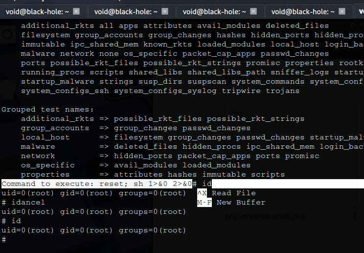

# _**Gallery CTF**_


## _**Enumeração**_
**DISCLAIMER**: _Você encontrará a maioria das respostas ao longo das imagens e textos deste write-up_  
Primeiro, vamos começar com um scan <mark>Nmap</mark>
> ```bash
> nmap -p- --open -A [ip_address]
> ```


Acessando o site, temos uma página de login
Tentando alguns nomes e senhas comuns, não conseguimos acesso  
Na tentativa de ```' || '1'='1';-- -``` em _username_ e também em _password_, temos login  
Agora que temos login, vamos tentar descobrir diretórios com <mark>Gobuster</mark>
> ```bash
> gobuster dir --url [ip_address]:8080 -w ../seclists/Discovery/Web-Content/common.txt --status-codes-blacklist 200
> ```


Vasculhando os diretórios e a própria página, encontramos um lugar que aceita upload de imagens  
Vamos tentar realizar upload de um _reverse shel_ em PHP  
Clicando na imagem, obtemos um _reverse shell_ com sucesso!  


## _**Ganhando acesso**_
Transferindo e executando <mark>LinPeas</mark> na máquina alvo, temos o seguinte resultado interessante  


Encontramos uma senha  
Temos 2 usuários além de _root_, mas iremos tentar no principal  
Digitamos o comando ```su mike``` e inserimos a senha quando pedido  
Sucesso! Agora somos o usuário **mike** e temos a sua senha  

## _**Escalando privilégios**_
Digitando o comando ```sudo -l```, temos o seguinte  


Verificando edições, não podemos  
Verificando seu conteúdo, é possível observar que temos a leitura de um arquivo através de ```nano```  
Investigando um pouco em GFTOBins, temos que ao digitar os seguintes comandos, podemos obter _root_  
> ```bash
> ctrl + z
> stty raw -echo;fg
> reset
> xterm
> export TERM=xterm
> sudo /bin/bash /opt/rootkit.sh (read)
> ctrl + r
> ctrl + x
> reset; sh 1>&0 2>&0
> ```


Agora, basta ir atrás das flags  
Quanto ao CMS, pesquisando, foi identificado no início da página de login  
Este CMS possui a [seguinte CVE](https://www.exploit-db.com/exploits/50214)  
Para a _hash_ do usuário, foi necessário pesquisar como executar, não estava conseguindo seguindo as instruções  
Investigando onde era possível encontrar o _hash_, foi possível com este comando
> ```bash
> sqlmap -r test.req -D gallery_db -T users -C id,username,firstname,password --dump
> ```


