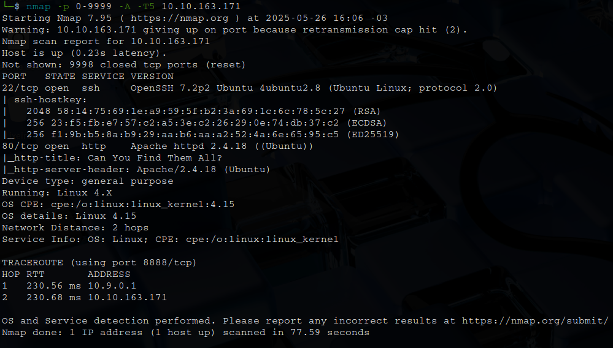
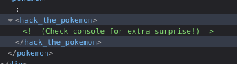
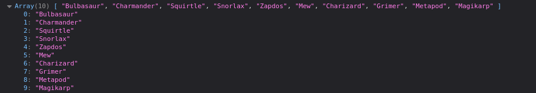
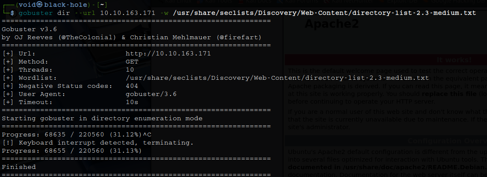
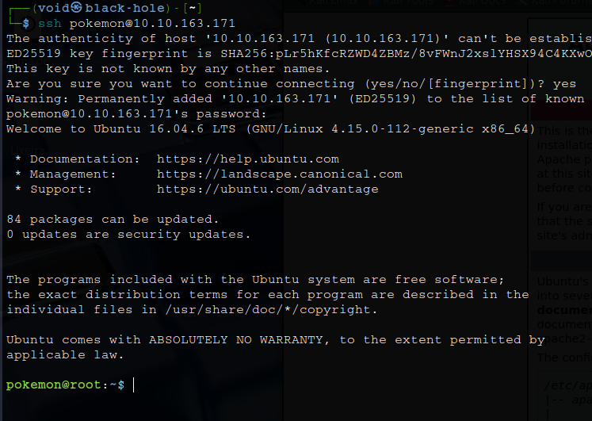
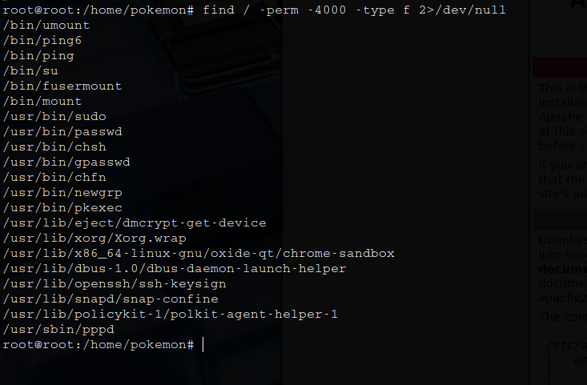

# _**Gotta Catch'em All! CTF**_


## _**Enumeração**_
Primeiro, vamos começar com um scan <mark>Nmap</mark>
> ```
> nmap -p 0-9999 -A -T5 [ip_address]
> ```


Parece que temos um _website_  
Vamos verificar o código da página  
Descobrimos algumas dicas!  





Temos alguns nomes de _pokemons_, mas podemos buscar mais  
Vamos realizar um scan com <mark>Gobuster</mark>
> ```bash
> gobuster dir --url [ip_address] -w ../seclists/Discovery/Web-content/directory-content-2.3-medium.txt
> ```


## _**Ganhando acesso**_
Após muito tempo, parece que não chegaremos a nenhum resultado  
Pensando um pouco, algo parece estranho de onde encontramos a dica para verificarmos o console  
* **pokemon**
* **hack_the_pokemon**
Parece ser usuário e senha
Vamos tentar login via SSH



Sucesso!  

## _**Escalando privilégios**_
Vamos investigar o usuário com alguns comandos  
Com o comando ```find / -perm -4000 -type f 2>/dev/null```, encontramos um arquivo bem interessante: <mark>/usr/bin/pkexec</mark>  
Sua versão, 0.105  
Podemos explorar com _**PwnKit**_  
E obtemos _root_  



Temos _root_, basca buscarmos as flags em:
* <mark>fire-type:</mark> ```find / -type f -iname "*fire-type*" 2>/dev/null``` | está criptografado em base64
* <mark>grass-type:</mark> /home/pokemon/Desktop | basta extrair o zip e traduzir o conteúdo do arquivo que está em hexadecimal
* <mark>water-type:</mark> /var/www/html | está critptografado, verifique o conteúdo e tente cifra de césar
* <mark>root-type:</mark> /home | um ```cat``` deve resolver
