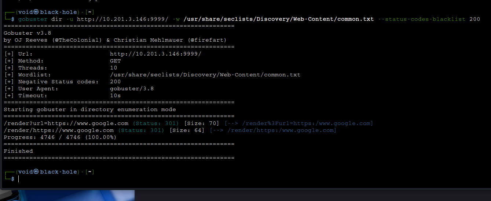
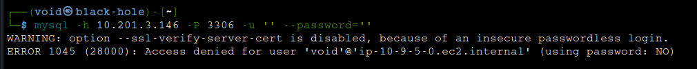
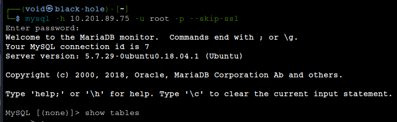
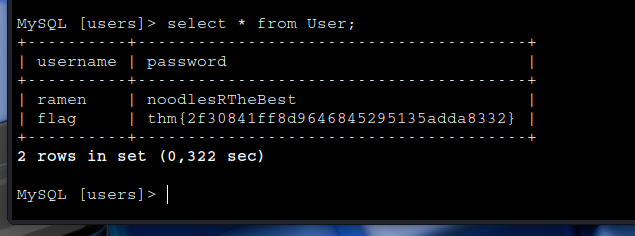
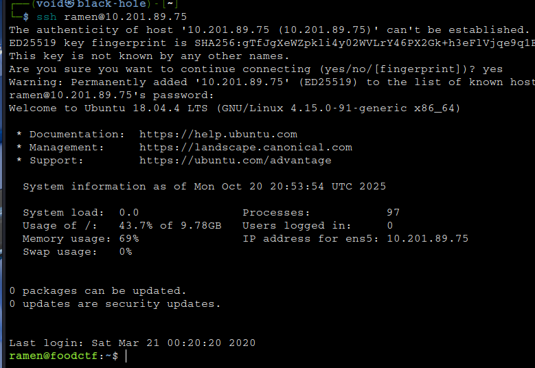
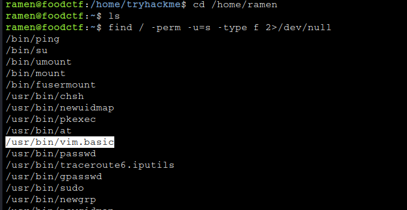
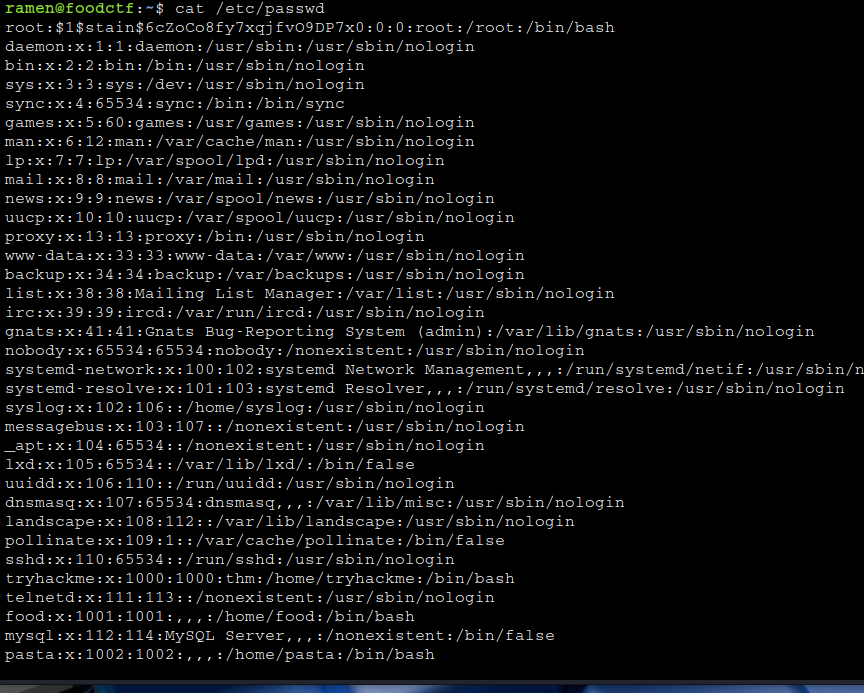
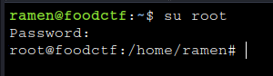
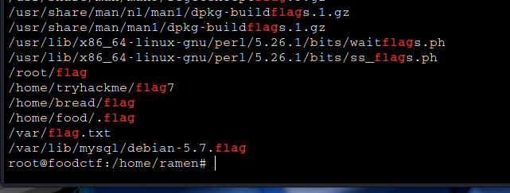

## Koth CTF ##


## _**Enumeração**_
Primeiro, vamos começar com um scan <mark>Nmap</mark>
> ```bash
> nmap --open -A -T4 [ip_address]
> ```


Parece que temos alguns serviços
* shh
* mysql
* website

Vamos primeiro investigar o website  
Temos uma palavra: <mark>king</mark>  
Seguindo, utilizamos <mark>Gobuster</mark> para buscar diretórios escondidos no website
> ```bash
> gobuster dir --url http://[ip_address]:9999 -w ../seclists/Discovery/Web-Content/common.txt
> ```


Parece que não encontramos nada de útil  
Vamos tentar um login anônimo via <mark>MySQL</mark>  
> ```bash
> mysql -h [ip_address] -P 3306 -u '' --password=''
> ```


Tentanto encontrar alguma vulnerabilidade conhecida também não nos levou a nada  
Vamos tentar alterar para outros nomes de usuário como _king_ e _root_  
Conseguimos acesso! A senha, após algumas tentativas para _root_, era **root**  



Investigando o banco de dados, temos algumas tabelas e dentro de **users**, encontramos a primeira flag!



Não apenas isso, mas também um usuário e sua senha  
Vamos tentar realizar login via SSH e MySQL  
Conseguimos login via **SSH**  



## _**Escalando privilégios**_
Para conseguirmos ter controle total sobre a máquina, precisamos escalar privilégios  
Vamos começar com alguns comandos básicos como ```sudo -l```  
Após alguns comandos, conseguimos perceber um arquivo suspeito após ```find / -perm -u=s -type f 2>/dev/null```  



Este arquivo permite executar o <mark>Vim</mark> e alterar arquivos como **/etc/passwd** ou **/etc/sudoers** e muito mais  



E assim, realizamos login como _root_  



Para encontrar todas as flags, vamos utilizar o comando ```find / | grep 'flag'```



A maioria pode não ser flag, mas basta filtrar por nome e buscar e terá o resultado
