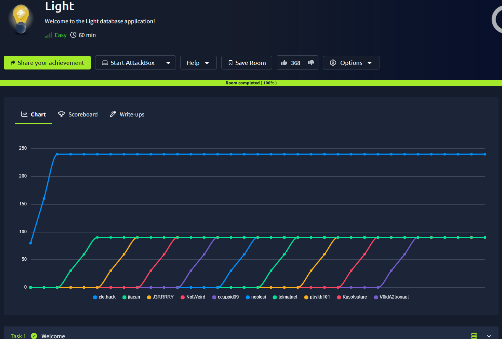
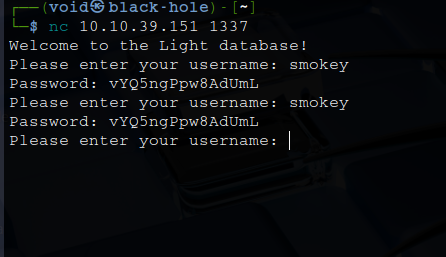
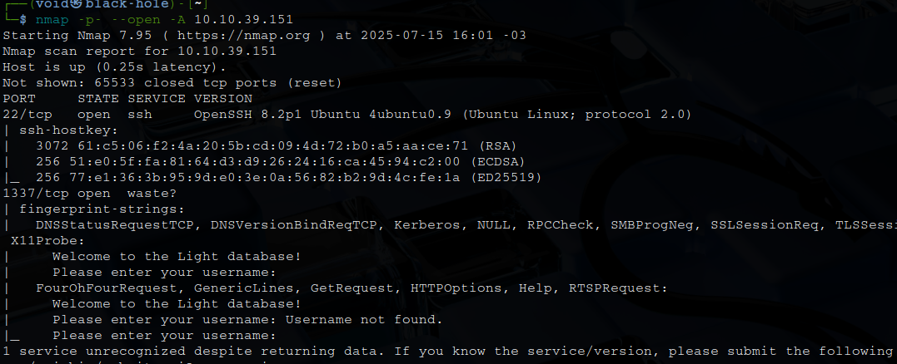
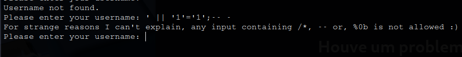
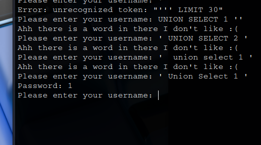
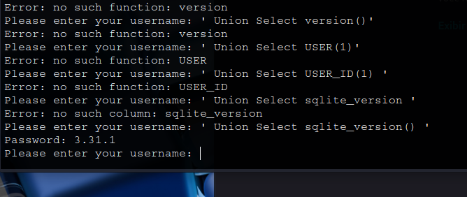
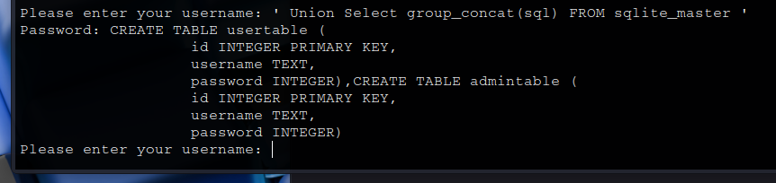

# _**Light CTF**_


Na descrição da sala, temos que é preciso de conectar na porta 1337 via <mark>netcat</mark>  
Vamos fazer isso com ```nc [ip_address] 1337```  
Tentamos utilizar o nome dado e temos este retorno  



## _**Enumeração**_
Vamos tentar buscar por versões e vulnerabilidades com <mark>Nmap</mark>
> ```bash
> nmap -p- --open -A [ip_address]
> ```


Parece que não temos nenhuma informação útil a não ser que existe uma porta aberta para conexão SSH  
Vamos gerar um script em **bash** para testar alguns nomes de usuários e ver qual o retorno  
Temos um outro nome válido com retorno de senha: **john**  
Com estas credenciais, surge a ideia de uma conexão SSH  
Na tentativa, nada funciona  
O que podemos tentar é uma SQL injection, por se tratar de um banco de dados  
Utilizando ```' || '1'='1';-- -```



Temos um retorno diferente  
Vamos tentar alguns outros caracteres  
E temos um retorno com sucesso de UNION INJECTION



Podemos tentar recuperar qual _database_ está sendo utilizado e qual sua versão  
E temos retorno após alguns comandos  



Podemos nos utilizar do seguinte _payload_ para descobrir a estrutura: ```' Union Select group_concat(sql) FROM sqlite_master '```  



Agora que temos a estrutura, vamos montar um payload para obtermos o que queremos  
> ```bash
> ' Union Select group_concat(username || ":" || password) FROM admintable '
> ```

Com esta linha, foi possível obter o nome de administrador, senha e flag!
