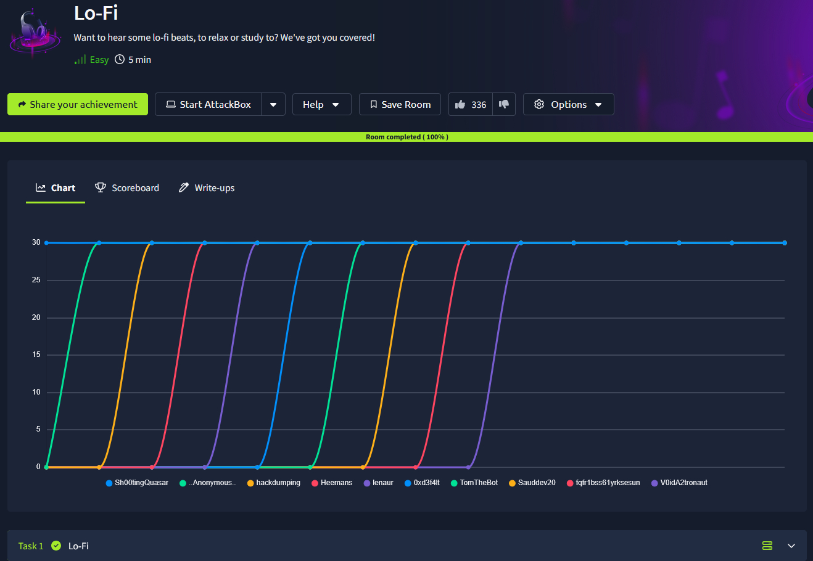
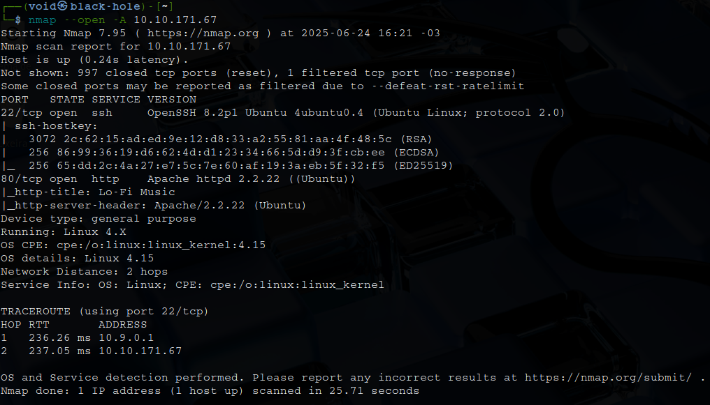
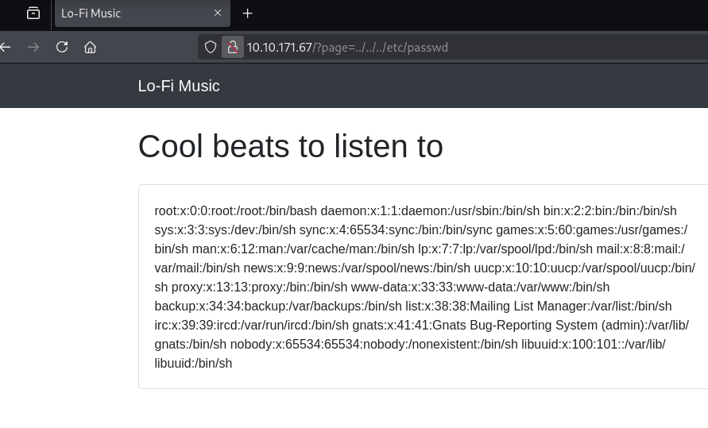

# _**Lo-Fi CTF**_


## _**Enumeração**_
Vamos começar com um simples scan <mark>Nmap</mark>
> ```bash
> nmap --open -A [ip_address]
> ```


Temos um website  
Por dica da sala, este desafio está relacionado com LFI e _Path Traversal_  
Vamos tentar com ```../../../etc/passwd```  



Vamos tentar ```../../../flag.txt```
Sucesso! Obtemos a flag
