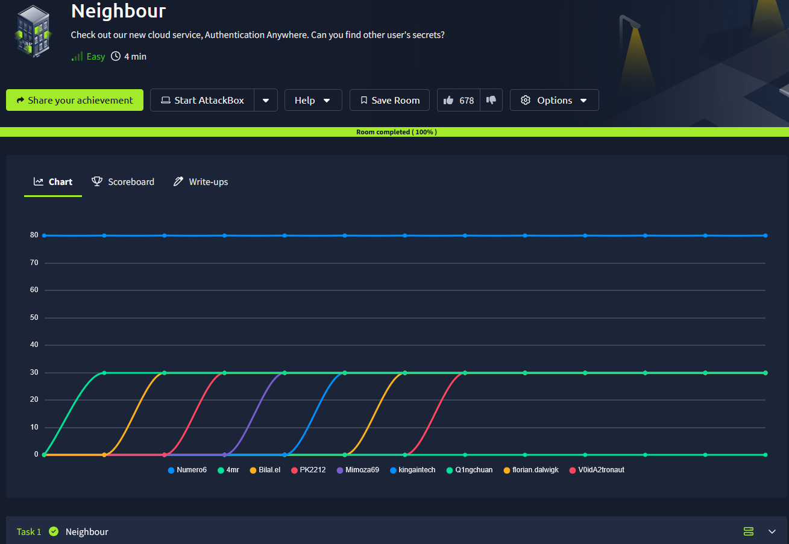
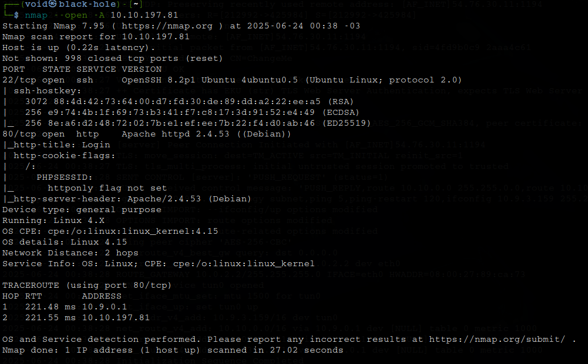
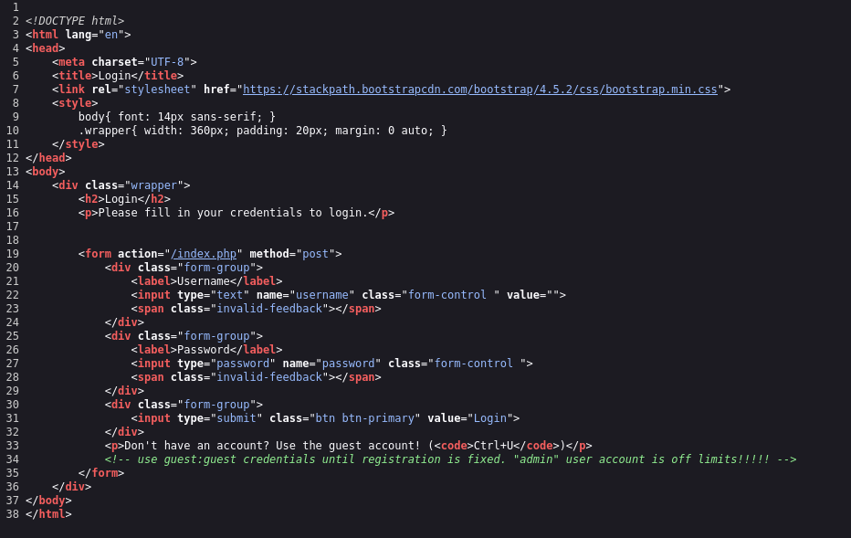
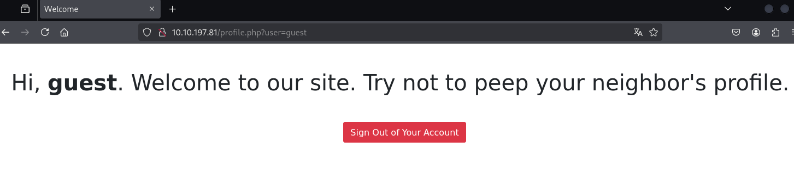

# _**Neighbour**_


## _**Enumeração**_
Primeiro, vamos realizar um rápido scan <mark>Nmap</mark>
> ```bash
> nmap --open -A [ip_address]
> ```


Temos um website, vamos investigar  
Logo de cara, temos uma sugestão, _ctrl+u_  
Cliclamos e chegamos na seguinte página  

  

Acessamos  

  

Por referência da sala, temos tentativa de IDOR
Sabemos que o outro usuário é _admin_  
Com a troca correta na URL, temos acesso a flag!
