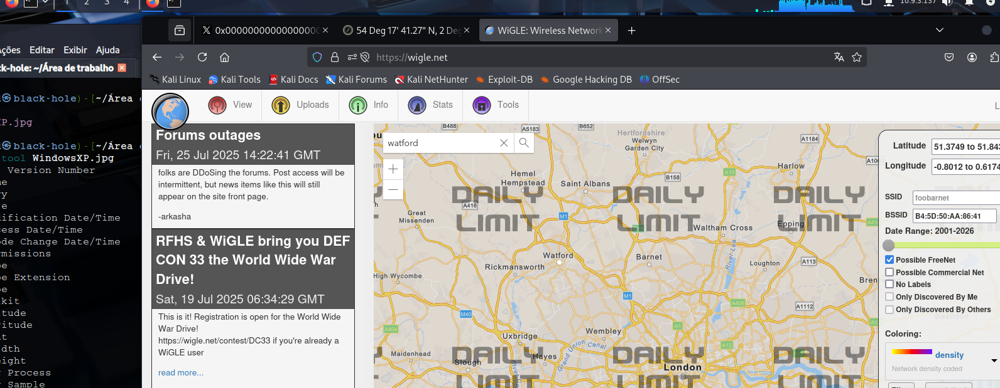

# _**OhSINT CTF**_


## _**Estudando o arquivo**_
Vamos realizar o download do arquivo dado e analisarmos  
Utilizando ```exiftool```, podemos encontrar o nome do dono da imagem e pesquisar no google  
Encontramos seu twitter  


Vamos para o BSSID  
Utilizando o site [wigle](https://www.wigle.net/) e as informações disponíveis, conseguimos encontrar a cidade  



Utilizando a busca avançada, conseguimos encontrar o nome da rede Wi-Fi  


Ainda no google com a pesquisa do _username_, encontramos seu Github  
No github, temos o seu endereço de e-mail  
Subsequentemente, foi possível encontrar seu site _wordpress.com_ e para onde ele foi no feriado  
Como a senha só pode estar no site, verificamos o código da página  
Após algum tempo, conseguimos encontrar  


