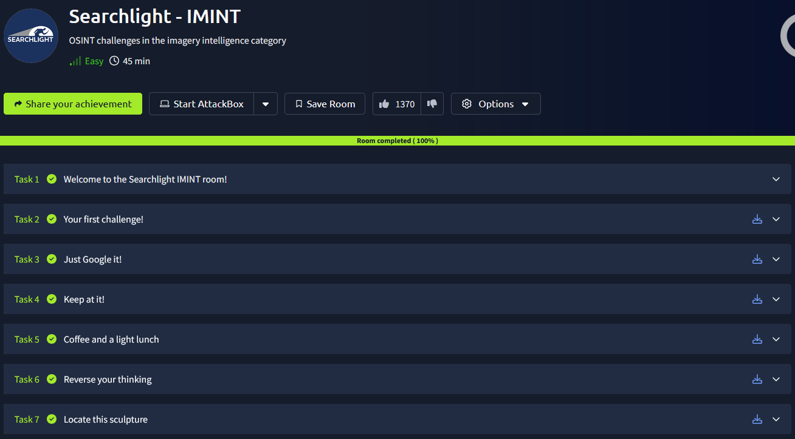

# _**Searchlight CTF**_

## _**Primeiro desafio**_
_Before we can apply a tool or a methodology for finding the location of an image, we should use our eyes to scan the image for important information_  
_Extracting key data points from the image will allow you to apply the right tool, craft a good Google search or identify which part of the world the image might have been taken in_  
_There are 5 elements of IMINT that you should consider when looking at an image_  
* Context
* Background
* Map markings
* Trial and error

O nome da rua está disposto na própria imagem

## _**Segundo desafio**_
_If you see anything in the image that can be extracted into a keyword, phrase, a company name, telephone number or any other question you may have as a result of scanning the image up and down: GOOGLE IT_  
Vamos então dar um **google**  
Podemos descobrir que está relacionado a _piccadilly circus_  
Pesquisando mais sobre, encontramos o ano de abertura e também o número de plataformas  

## _**Teceiro desafio**_
Pesquisando por **YVR connects**, encontramos de onde a "foto" foi retirada  
Na verdade se trata de um vídeo feito no **aeroporto internacional de Vancouver**, no **Canadá**  
Pesquisando pela cidade, temos **Richmond**  

## _**Quarto desafio**_
Conseguimos extrair o nome do outro lado da rua! **The Edinburg Woolen Mill**  
Pesquisando no google imagens, encontramos onde está localizado: **Blairgowrie**  
Então, procurando por ambos no google maps, podemos localizar onde está a loja, seu nome, rua, número de telefone, endereço de e-mail na página do facebook e também seu sobrenome  

## _**Quinto desafio**_
_One of the methods for geolocating an image is to do an image reverse search_  
_This means that we are searching for the image itself online, and if the image has been indexed by search engines we may find the exact image or we can do a visual search or crop search to help us find similar images_  
Utilizando o motor de busca _bing_, encontramos o restaurante onde a foto foi tirada  
Para a segunda questão, foi necessário apenas uma busca com o _Gemini_  

## _**Sexto desafio**_
Pesquisando por _motorcycle deer sculpture_, na primeira página temos o nome da escultura e o nome do criador  
A parte complicada foi encontrar o nome do autor da foto, foi preciso ir até o local através do maps para verificar

## _**Sétimo desafio**_
Para este, foi preciso utilizar o google lens  
Primeiro, sabemos que é uma estátua da _lady justice_  
Segundo, após utilizar a ferramenta, conseguimos ir até o local através do street view e ver qual era o nome do edifício do outro lado da rua  

## _**Oitavo desafio**_
Olhando o vídeo, é possível observar um prédio bem famoso ao fundo de **Singapura**
Outro ponto de referência é _riverside point_  
Cruzando informações, conseguimos chegar através do street view exatamente na frente de _riverside point_  
Olhando para o outro lado e buscando mais informações, é possível saber qual é o hotel!: _novotel singapore clarke quay_

