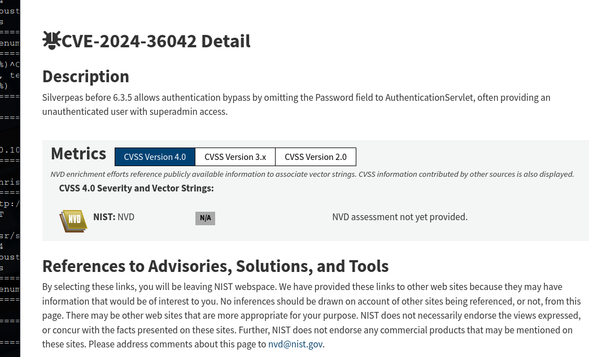

# _**Silver Platter CTF**_


## _**Enumeração**_
Primeiro, vamos começar com um scan <mark>Nmap</mark>
> ```bash
> nmap -p- --open -A [ip_address]
> ```


Temos um website, vamos investigar
Parece que temos pouca informação  
Vamos realizar um scan com <mark>Gobuster</mark>
> ```bash
> gobuster dir --url [ip_address] -w ../seclists/Discovery/Web-Content/common.txt
> ```


Dois dos diretórios não temos acesso, com código 403  
Pensando um pouco, podemos investigar o conteúdo da porta 8080  
Vamos realizar um scan com <mark>Gobuster</mark>
Temos outros 2 diretórios  
Tentando acessar _/console_, temos um redirecionamento  
Tentando acessar _/website_, temos código 403  
Voltando para o website principal e buscando por mais informações ou pistas ignoradas, temos isso  


Tentanndo no website, nada foi encontrado  
Tentando na porta 8080, nada também  
Ainda é uma aplicação que não foi encontrada, mas esse parece ser o caminho  
Novamente, mas com a primeira letra minúscula, temos uma página de login  


Investigando o website nas ferramentas de desenvolvedor, não temos nenhuma informação relevante  
Porém, temos o nome da aplicação, **silverpeas**  
Encontramos o seguinte  



Detalhes do exploit [encontram-se aqui](https://gist.github.com/ChrisPritchard/4b6d5c70d9329ef116266a6c238dcb2d)  
Conseguimos realizar um _byaspass_ de usuário e senha  


Após obter login, investigamos o site  
Encontramos a seguinte informação  


Realizando login, podemos procurar como escalar privilégios  
Primeiro, começamos com o comando ```find / -perm -4000 -tpye f 2>/dev/null```  
Encontramos alguns arquivos interessantes, mas nada que possa ser realmente explorado  
Vamos transferir <mark>LinPeas</mark> para a máquina e executar  
Após um tempo, temos nenhuma informação relevante  
Verificando diretórios comuns como _/home_ e _/opt_, novamente nada  
Verificando nosso ID, percebemos que somos do grupo **adm**  
O grupo adm é normalmente usado para tarefas de monitoramento do sistema  
Os membros deste grupo têm permissão para ler arquivos de log em /var/log, o que pode fornecer informações valiosas sobre as atividades do sistema e potenciais vulnerabilidades  
Executando o comando ```grep -r "tyler" .```, o segundo usuário presente na máquina  


Tentando login via SSH, temos resultado no usuário **tyler**  
Vamos executar ```sudo -l```  


Basta executar ```sudo su``` e somos _root_  
Agora é ir atrás das flags!