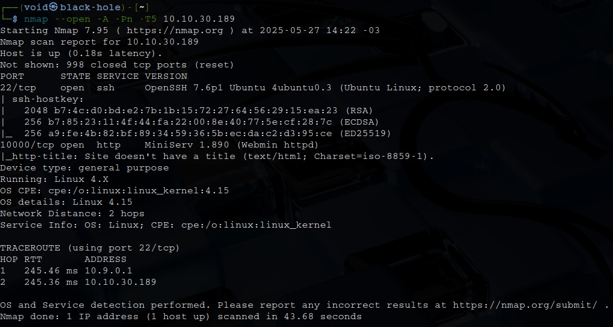
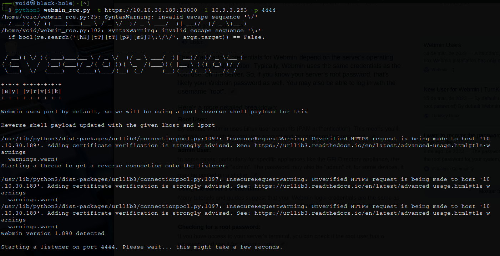

# _**Source CTF**_


## _**Enumeração**_
Primeiro, vamos começar com um scan com <mark>Nmap</mark>
> ```bash
> nmap -p 0-9999 -A -T5 [ip_address]
> ```


## _**Ganhando acesso & Escalando privilégios**_

Parece que temos um serviço web na porta 10.000  
Investigando, o site usa certificado SSL (Secure Socket Layer)  
Acessando o endereço com ```https```, temos uma página de login  
Pesquisando sobre a versão, encontramos a seguinte possível vulnerabilidade: [CVE-2019-15107](https://nvd.nist.gov/vuln/detail/CVE-2019-15107)  
E também encontramos um [exploit disponível no github](https://github.com/ruthvikvegunta/CVE-2019-15107)  
Realizando o _download_ e dando as permissões necessárias, executamos  



Sucesso!
Parece que somos _root_  
Basta ir atrás das flags e terminar
