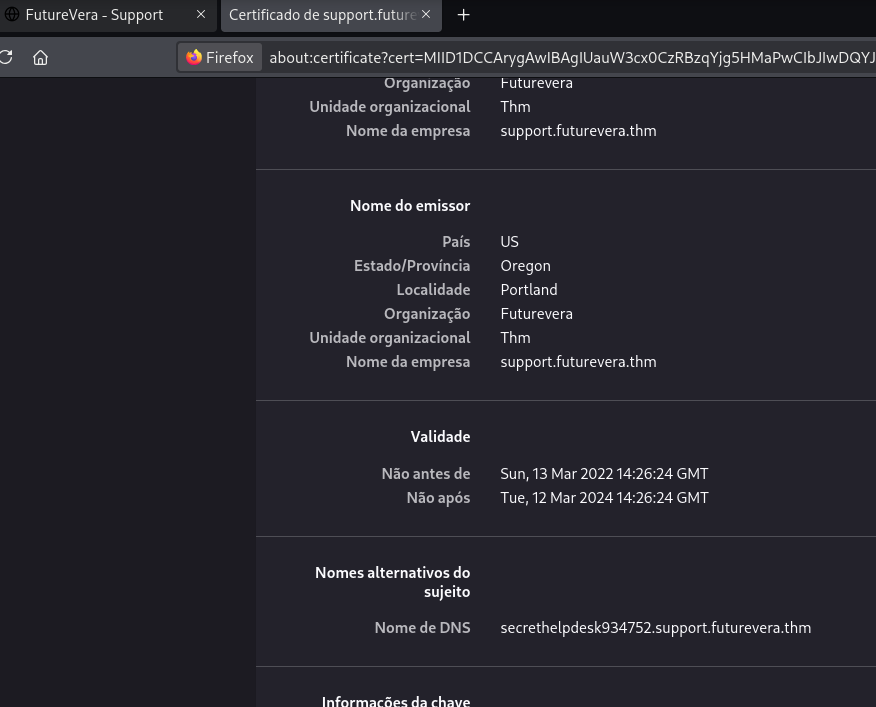

# _**TakeOver CTF**_


## _**Enumeração**_
Este CTF é baseado em enumeração de subdomínios  
Adicionamos como indicado no início da sala para _/etc/hosts_  
Vamos utilizar a ferramenta <mark>ffuf</mark> para conseguirmos atingir o objetivo
> ```bash
> ffuf -w ../wordlists/dirb/common.txt -u "http://[ip_address]" -H "Host: FUZZ.futurevera.thm" -fw 1
> ```


Parece que encontramos!  
Visitando o site, temos a mensagem  


Vamos tentar enumerar novamente, mas agora com https
> ```bash
> ffuf -w ../wordlists/dirb/common.txt -u "https://[ip_address] -H "Host: FUZZ.futurevera.thm" -fw 1511
> ```


Temos duas novas páginas  
Adicionamos ela em nosso arquivo _/etc/hosts_  
Sabemos que _support_ é importante devido a descrição da sala  
Buscando por informações adicionais, encontramos algo no certificado  



Adicionamos para _/etc/hosts_ e acessamos primeiro com **HTTPS**, mas não encontramos nada  
Tentamos via **HTTP** e temos nossa flag na URL
