# _**Tech_Supp0rt: 1 CTF**_
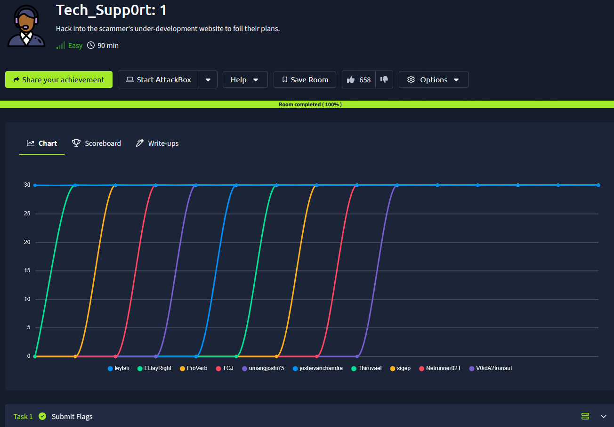

## _**Enumeração**_
Primeiro, vamos começar com um scan <mark>Nmap</mark>
> ```bash
> nmap -p- --open -A [ip_address]
> ```
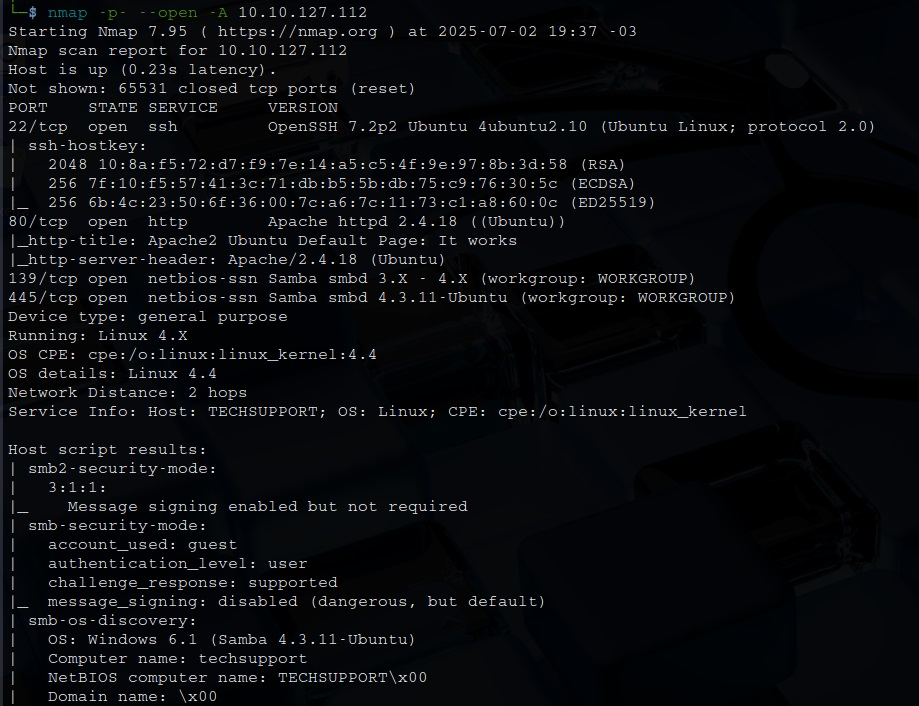

Parece que temos um website e um serviço SMB  
Primeiro, vamos tentar enumerar o website com <mark>Gobuster</mark>
> ```bash
> gobuster dir --url [ip_address] -w ../seclists/Discovery/Web-Content/common.txt
> ```
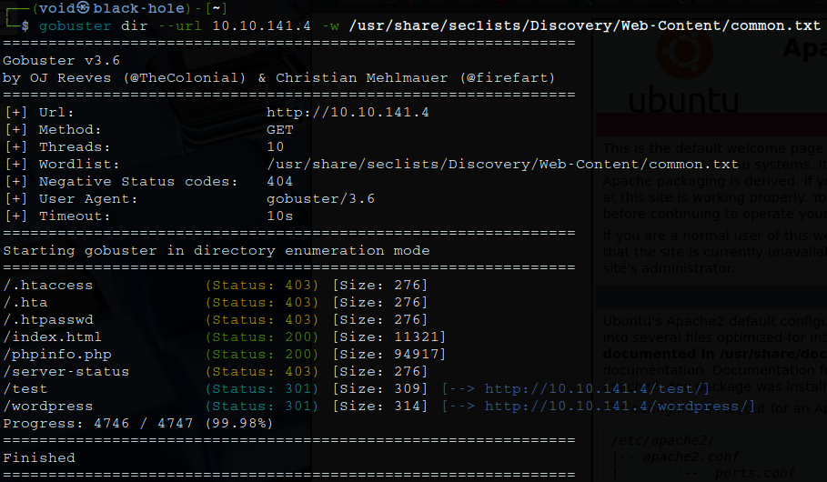

Também vamos tentar enumerar o serviço SMB via <mark>enum4Linux</mark>
> ```bash
> enum4linux -A [ip_address]
> ```
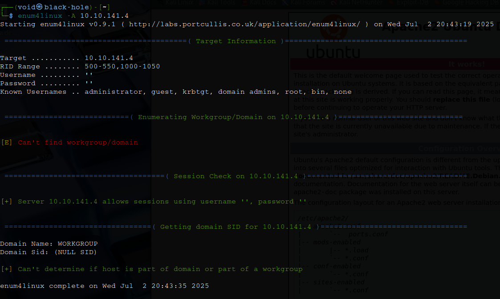

Primeiro, investigando os diretórios descobertos, temos alguns pontos interessantes:
* **versão PHP**: 7.2.34
* uma página com alertas de vírus
* uma página com _wordpress_

Segundo, investigando o resultado da enumeração SMB, temos login com usuário e senha  
Vamos tentar via <mark>smbclient</mark> com o comando ```smbclient //10.10.141.4 -N```  

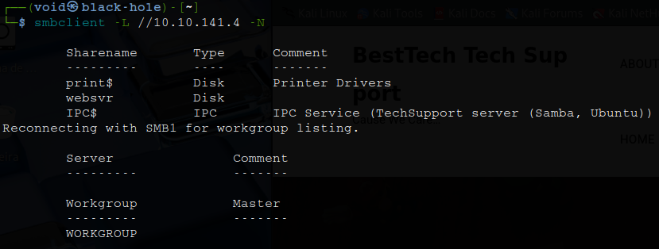

Temos um diretório interessante! ```websvr```  
Vamos acessar com o comando ```smbclient //[ip_address]/websvr -N```  


Sucesso!  
Vamos investigar este diretório  
Temos um arquivo, vamos transferi-lo para nossa máquina e ler  
Lendo o arquivo, temos um diretório para acessar, CMS (subrion), usuário e senha subrion, da qual parece estar criptografada  
Outras informações pertinentes:
* um site fake com popups está online (provavelmente: ip_address/test)
* /subrion não funciona, editar diretamente do painel
* editar website wordpress

## _**Ganhando acesso**_
Como nos dito, _/subrion_ não está disponível  
Vamos tentar então próximos diretórios como _/panel_  

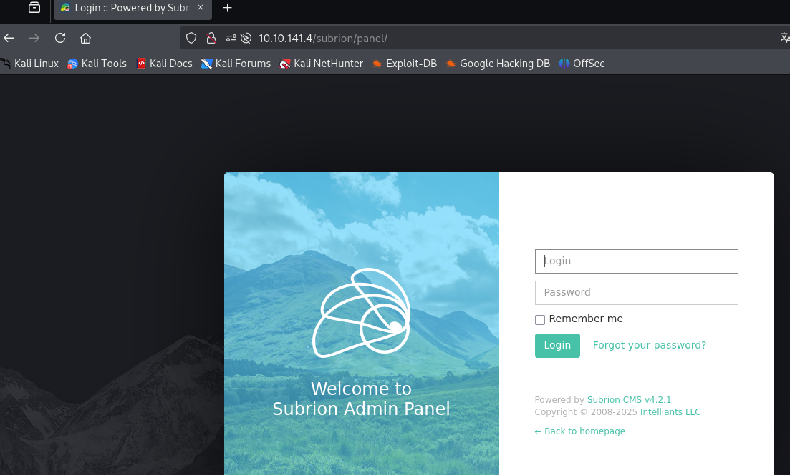

Temos um diretório de login!  
Jogando a senha em [cyberchef](https://gchq.github.io/CyberChef/), ele nos facilmente dá a senha clicando em apenas 1 botão  
Realizamos login!  

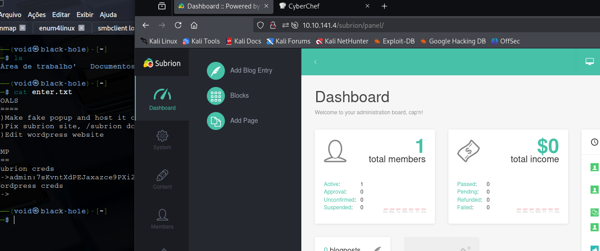

Procurando pela versão do Subrion, encontramos a 4.2.1, da qual tem a [seguinte CVE](https://nvd.nist.gov/vuln/detail/CVE-2018-19422)  
O diretório _/panel/uploads_ permite que a execução de código PHP arbitrário por meio de um arquivo .pht ou .phar  
Encontramos um [exploit no github](https://github.com/hev0x/CVE-2018-19422-SubrionCMS-RCE)  
Executamos o _exploit_ e temos shell  

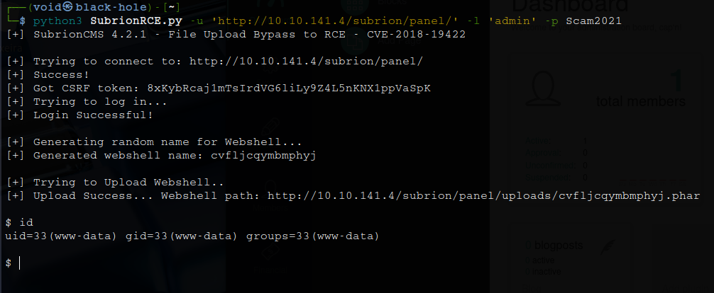

## _**Escalando privilégios**_
Nosso próximo passo é encontrar uma maneira de escalar privilégios  
Primeiro, vamos investigar manualmente os arquivos _wordpress_  
Encontramos usuário e senha em: _wp-config_  
Vamos buscar outros usuários dentro da máquina-alvo verificando o arquivo _/etc/passwd_  
Temos o usuário _scamsite_  
Tentando as credenciais encontradas, temos login via ```su```  
Também é possível realizar login via SSH  

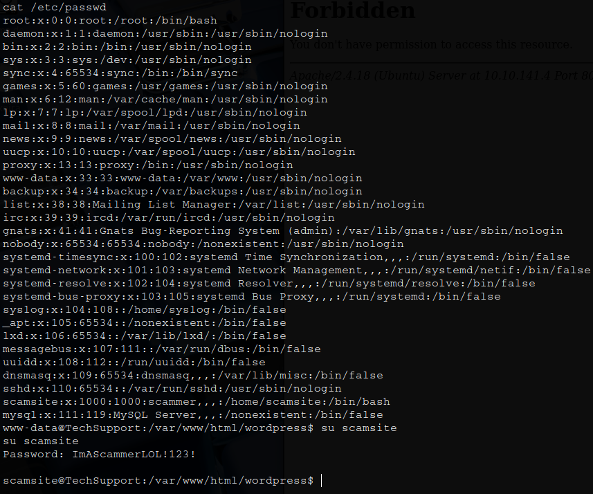

Para escalarmos com o novo usuário, vamos tentar alguns comandos básicos como ```sudo -l```  

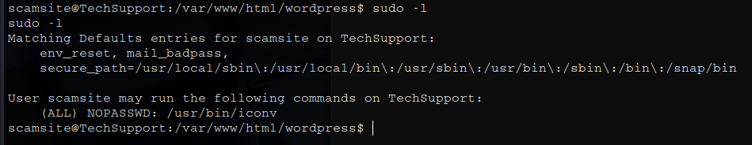

Parece que podemos executar _/usr/bin/iconv_ sem a necessidade de senha  
Encontramos via [GFTOBins](https://gtfobins.github.io/gtfobins/iconv/)  

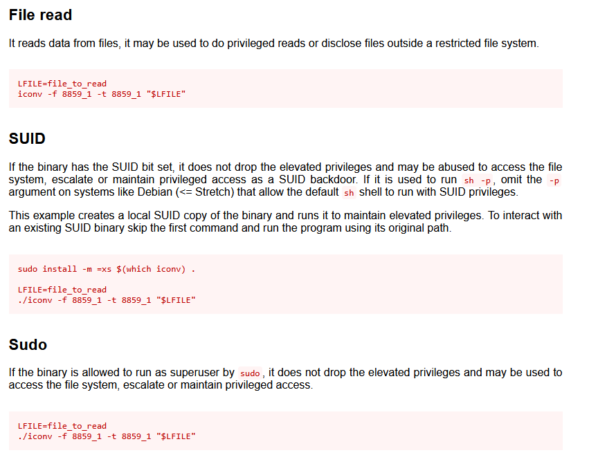

Podemos escalar privilégios ou realizar a tentativa que eu fiz, ler ```/root/root.txt```
