# _**VulnNet: Internal CTF**_
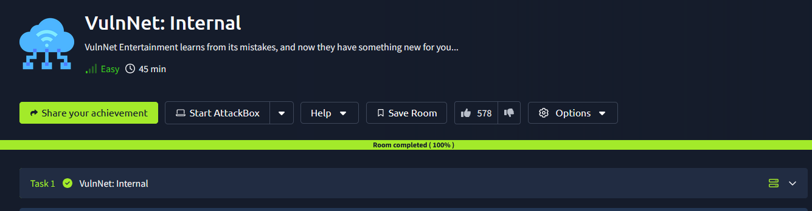

## _**Enumeração**_
Primeiro, vamos começar com um scan <mark>Nmap</mark>
> ```bash
> nmap -p- --open -A [ip_address]
> ```
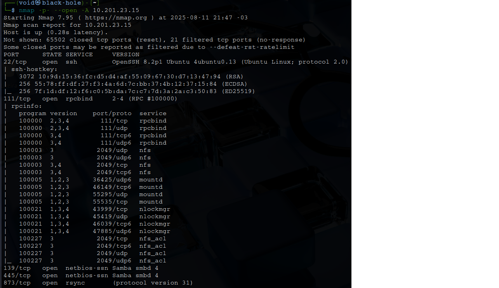

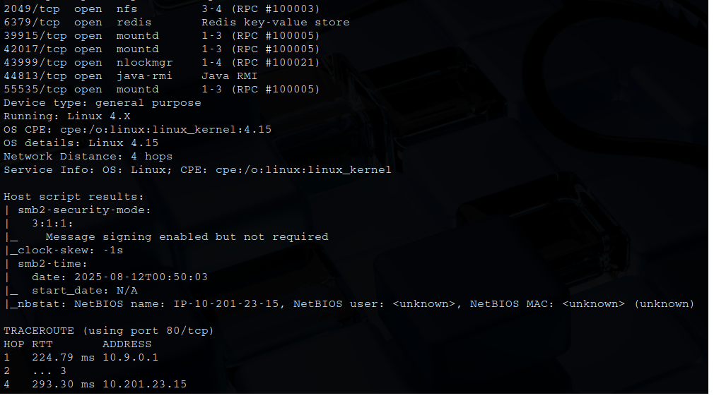

Está sendo usado o serviço **SAMBA**  
Vamos utilizar a ferramenta <mark>Enum4Linux</mark> para tentar enumerar o serviço  

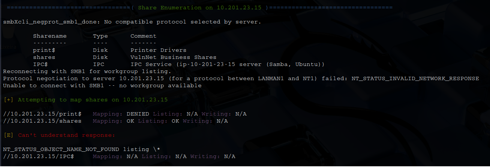

Encontramos o seguinte  
Parece ter uma pasta compartilhada em _shares_  
Vamos tentar uma conexão sem credenciais, isto é, login anônimo  

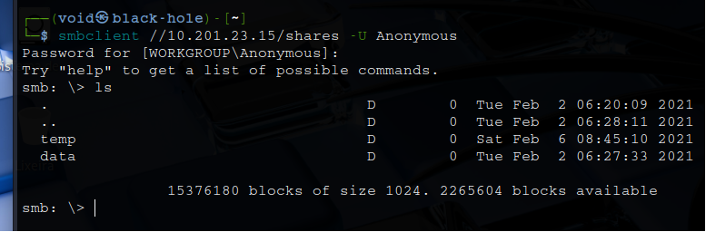

Conseguimos  
Investigando, encontramos 3 arquivos entre os diretórios  
Utilizamos ```mget``` para obter os arquivos e ler em nosso computador  
Neles, algumas frases nada muito interessantes e também uma flag!  

Continuando  
Vamos montar um diretório remoto em nosso computador com ```showmount```  
Utilizamos ```showmount -e [ip_address]```
Para conseguirmos montar o diretório em nosso computador, vamos executar os seguintes comandos
> ```bash
> sudo mkdir /mnt/conf
> sudo mount -t nfs [ip_address]:/opt/conf /mnt/conf -o nolock
> cd /mnt/conf
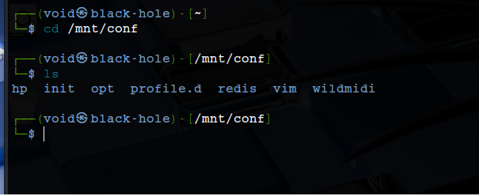

Investigando e pesquisando sobre os diretórios, podemos encontrar o arquivo de configuração _redis.conf_ no diretório **redis**  

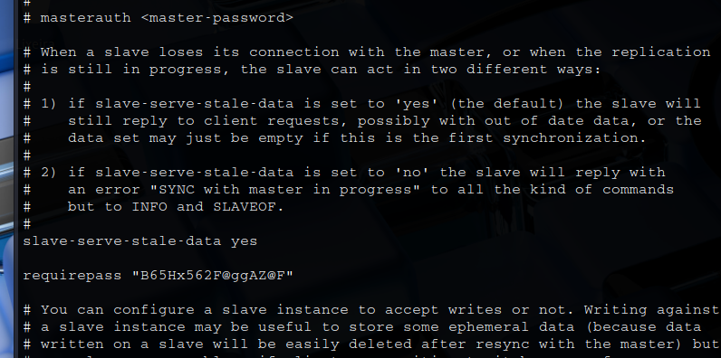

Sabendo que **redis** está na porta 6379, vamos utilizar o comando ```redis-cli -h [ip_address] -p 6379``` para nos conectarmos  
Pesquisando como realizar login, agora com a senha obtida, digitamos ```auth [password]```  
Vamos investigar  
Primeiro, pesquisamos comandos disponíveis para este _bando de dados_  
Em seguida, mostramos os arquivos disponíveis  
Terceiro, vamos obter a segunda flag  

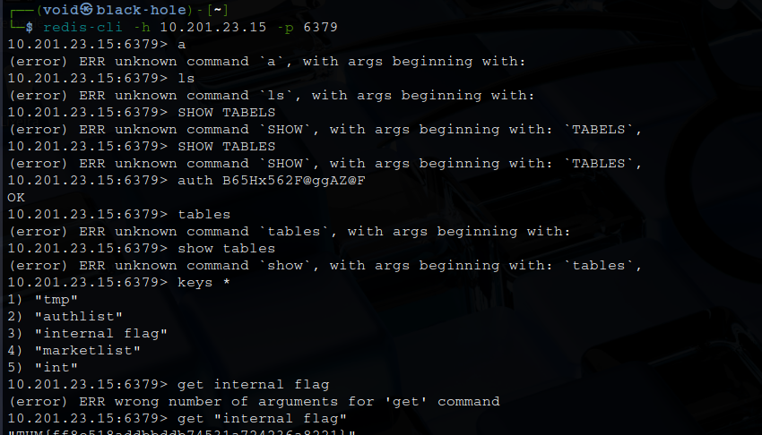

Também temos um arquivo com nome _authlist_  
Tentando ```type authlist```, temos o retorno _list_  
Para obtermos informações, vamos utilizar o comando ```lrange``` ao invés de ```get```: **lrange authlist 0 10**  
Investigando, são 4 _strings_ idênticas codificadas em _bae64_  
Decodificando, temos a frase: **Authorization for rsync://rsync-connect@127.0.0.1 with password [password]**  
No geral, **rsync** é um utilitário para copiar e sincronizar arquivos e diretórios remotamente e localmente em sistemas Linux/Unix  
Vamos primeiro enumerar com o comando ```rsync --list-only rsync://[ip_address]```  

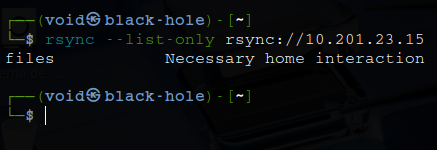

Parece que temos um módulo de arquivos  
Em seguida, transferimos todos os arquivos deste módulo para nossa máquina local com o comando ```rsync -av rsync://rsync-connect@[ip_address]/files ./rsyn_shared```  
Temos a senha que descriptografamos da lista  
Após a transferência e a investigação dos diretórios, foi possível encontrar o arquivo _user.txt_  

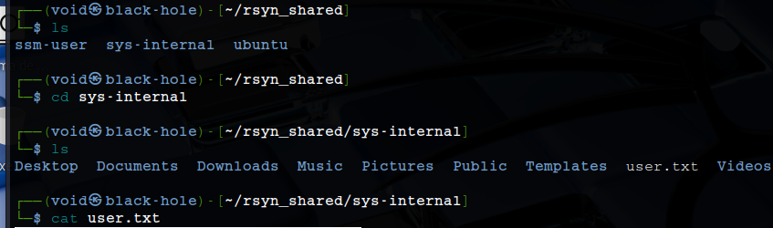

Durante a transferência, foi possível observar o arquivo _.ssh_  
Podemos investigar para obter informações sigilosas  
Com a flag _-a_ que adicionamos no comando **rsync** acima, garantimos que os arquivos sejam transferidos no modo de arquivamento, o que garante que links simbólicos, dispositivos, atributos, permissões, propriedades, etc  
Embora ainda não contenha nenhuma chave que possamos usar, uma maneira de obter acesso à máquina é usar o rsync para carregar nossa própria chave pública em um arquivo _authorized_keys_ dentro do diretório _.ssh_  
Primeiro, vamos executar o comando ```ssh-keygen -t rsa```  
Em seguida, alterar o arquivo ```id_rsa.pub``` gerado para _authorized_keys_  
Agora, transferimos este mesmo arquivo com o comando ```rsync -av authorized_keys  rsync://rsync-connect@[ip_address]/files/sys-internal/.ssh```  
Por fim, damos ```chmod 600 id_rsa``` e realizamos login via **SSH**  

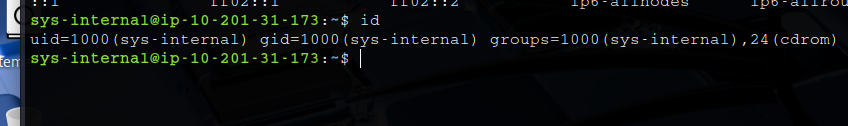

Vamos investigar  
Não há nada mais interessante no diretório do usuário
Verificarmos o diretório _/_ e podemos encontrar um diretório chamado _TeamCity_  
Com um pouco de pesquisa, o serviço TeamCity está escutando na porta 8111  
Para acessá-lo, podemos usar _port forwarding_ SSH com o comando ```ssh -L 9999:localhost:8111 sys-internal@[ip_address]```  
Em seguida, em nossa máquina, navegamos para **localhost:9999/login.html**  

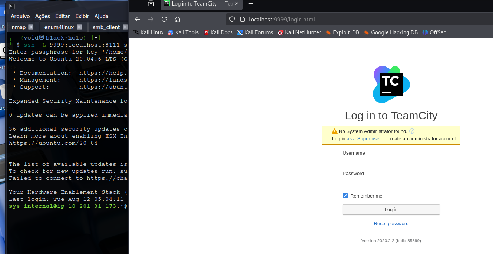

Tentando algumas credenciais comuns e investigando o próprio site, nada foi encontrado  
Clicando no link para realizar login como _superusuário_, fomos direcionados a uma página que pede um token de autenticação  
Voltando para o diretório de **TeamCity** e vasculhando por _logs_ com o comando ```grep -ir 'token' 2>/dev/null```  

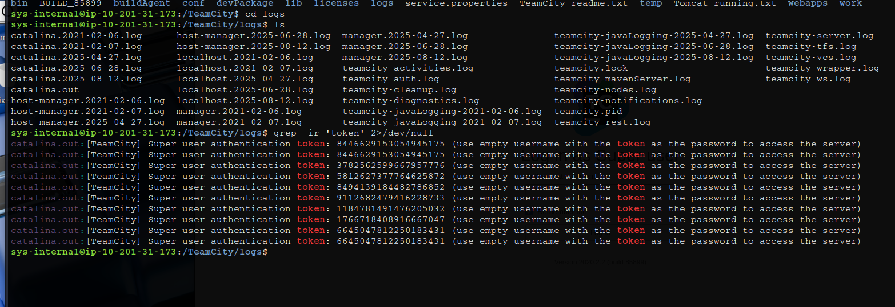

Tentando os tokens encontrados, conseguimos login!  
Normalmente, com esses tipos de servidores de gerenciamento de compilação, queremos encontrar um ponto onde possamos inserir comandos para o servidor executar durante a compilação  
Se conseguirmos executar código remotamente, podemos fazer coisas como abrir um shell reverso  
Primeiro, vamos criar um novo projeto  
Em seguida, em 'Etapas de construção' na barra lateral esquerda, podemos adicionar uma nova etapa de construção e escolher Python como o tipo de executor  
Nas opções, em Comando, escolhemos **Script personalizado** para que possamos fornecer nosso próprio código  
Por fim, ligamos nosso netcat, clicamos em _run_ no canto superior direito da tela e temos shell!  

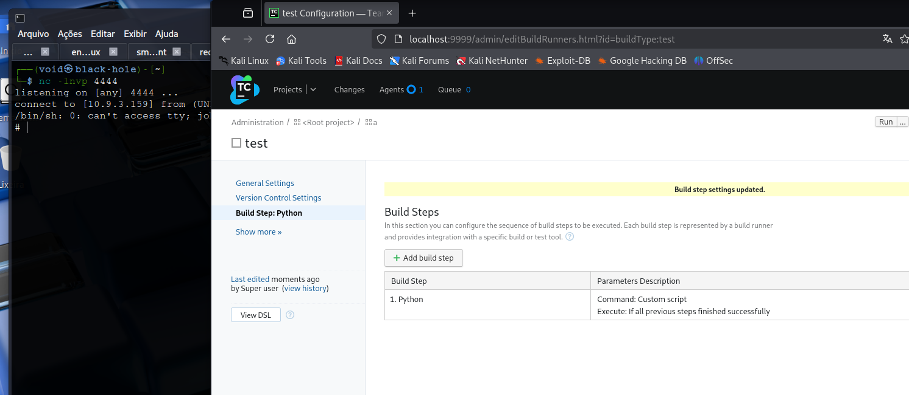

Agora, só ir atrás da flag!
