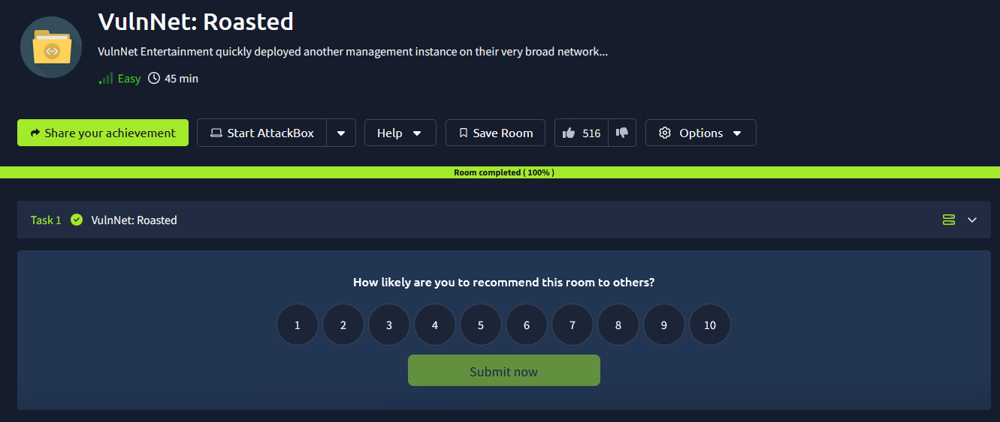
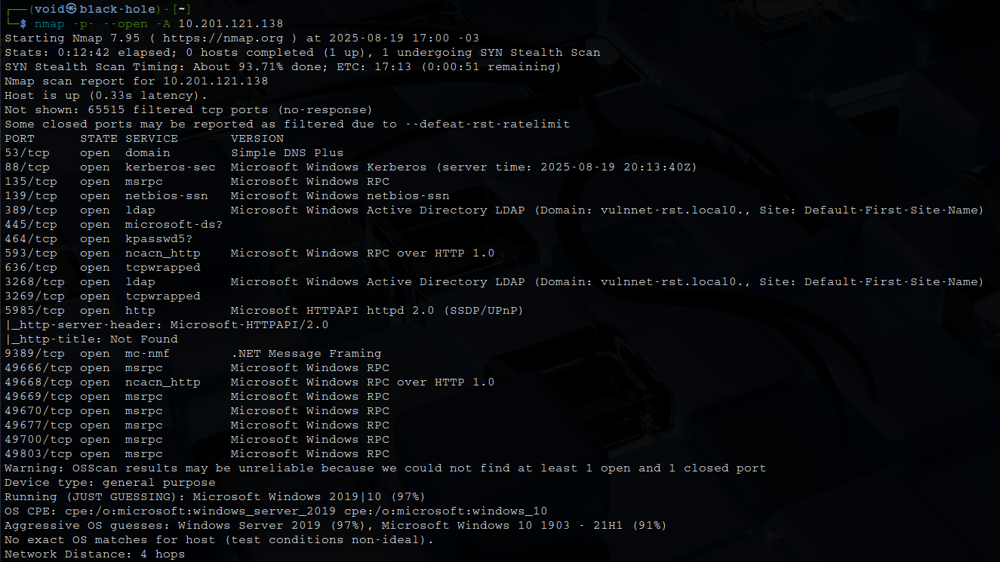
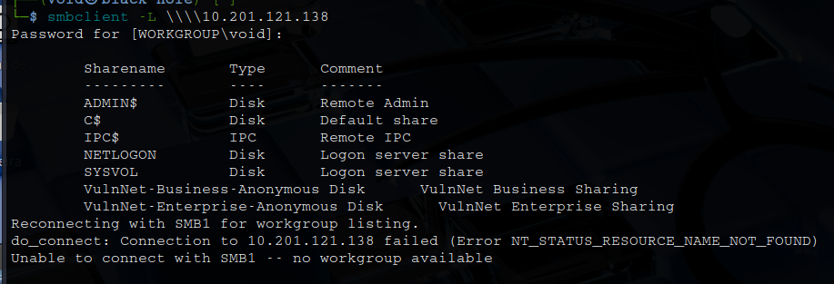
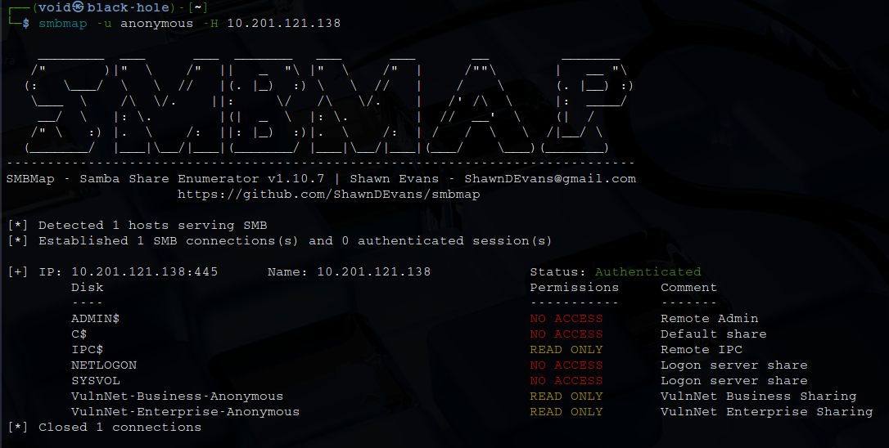

# _**VulnNet: Roasted CTF**_


## _**Enumeração**_
Primeiro, vamos começar com um scan <mark>Nmap</mark>
> ```bash
> nmap -p- --open -A -T5 [ip_address]
> ```


Informações importantes que podemos extrair deste scan
* Domain: vulnnet-rst.local0.
* Service Info: Host: WIN-2BO8M1OE1M1

Temos também um serviço SMB do qual podemos tentar enumerar com ```smbclient -L \\\\[ip_address]```  



Isso é interessante, quando a máquina tem SMB aberto e IPC$ aberto com acesso mínimo de leitura, ela fica vulnerável a outras enumerações de usuários
Primeiro, vamos executar o  coamndo abaixo para verificar permissões  
> ```bash
> smbmap -u anonymous -H [ip_address]
> ```


Vamos também buscar por _usernames_ com [lookupsid](https://github.com/fortra/impacket/blob/master/examples/lookupsid.py)
> ```bash
> lookupsid.py anonymous@[ip_address]
> ```


