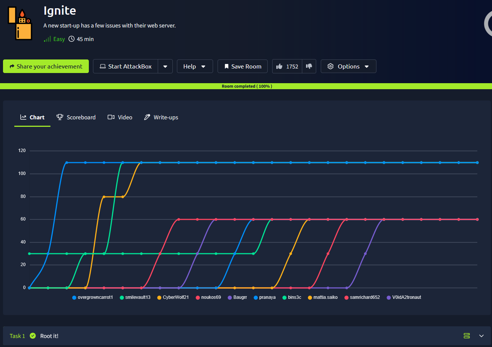
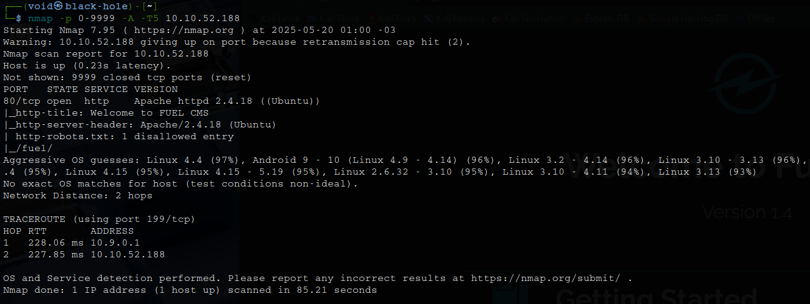
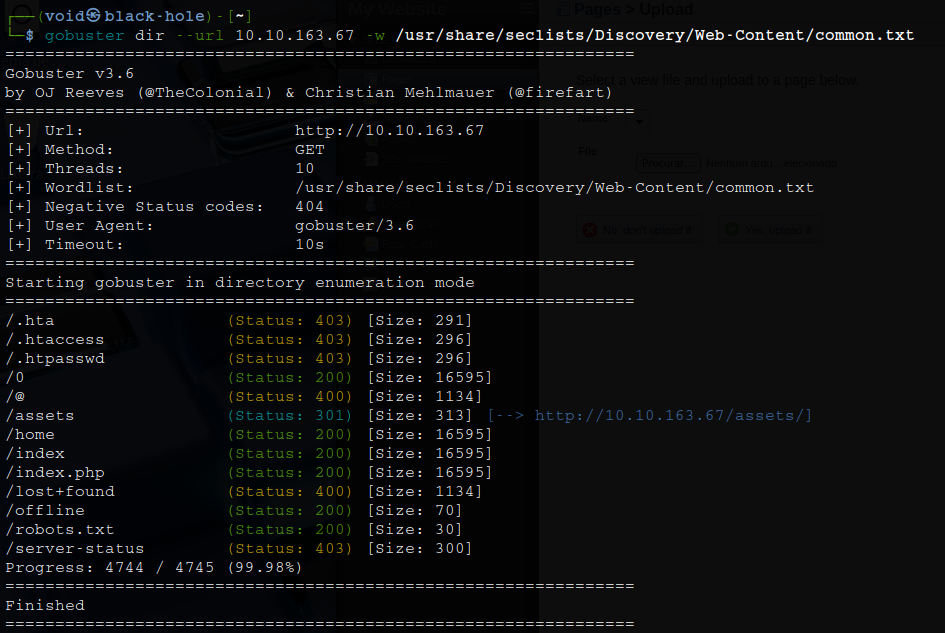
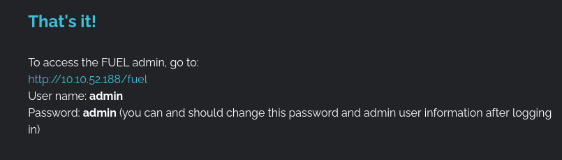
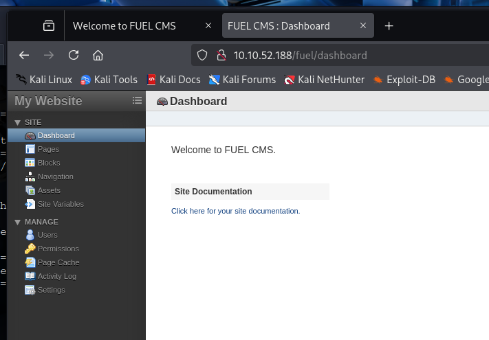

# _**Ignite CTF**_


## _**Enumeração**_
Primeiro, vamos começar com um scan <mark>Nmap</mark>
> ```bash
> nmap -p 0-9999 -A -T5 [ip_address]
> ```


Parece que temos uma página web com _Fuel CMS_  
Vamos realizar um scan com <mark>Gobuster</mark>  
> ```bash
> gobuster dir --url [ip_address] -w ../seclists/Discovery/Web-content/common.txt
> ```


Nosso primeiro passo é investigar a própria página web antes de irmos para os diretórios  
E já de cara encontramos informações importantes a se verificar  
Usuário e senha de _administrador_ padrão e versão do CMS: 1.4  



Conseguimos realizar login com sucesso!  



Vamos por enquanto deixar de lado e ir verificando os outros diretórios descobertos  
Parece que não temos nada tão relevante a primeira vista  
Voltando para a página de _administrador_  

