# _**Biohazard**_


## _**Enumeração**_
Primeiro, vamos começar com um scan de redes com o <mark>Nmap</mark>
* o primeiro, para portas simples
* o segundo, para todas as portas
* o terceiro, para versão de software e serviço em portas descobertas
> ```bash
> nmap [ip_adress]
> nmap -p- -sS -T4 [ip_address]
> nmap -p [ports_discovered] -A [ip_address]
> ```

Encontramos alguns serviços:
* **FTP** na porta 21
* **SSH** na porta 22
* **HTTP** na porta 80

Vamos verificar por acesso anônimo no serviço **FTP**  
Parece que não temos  
Vamos investigar o website  
Temos o seguinte  

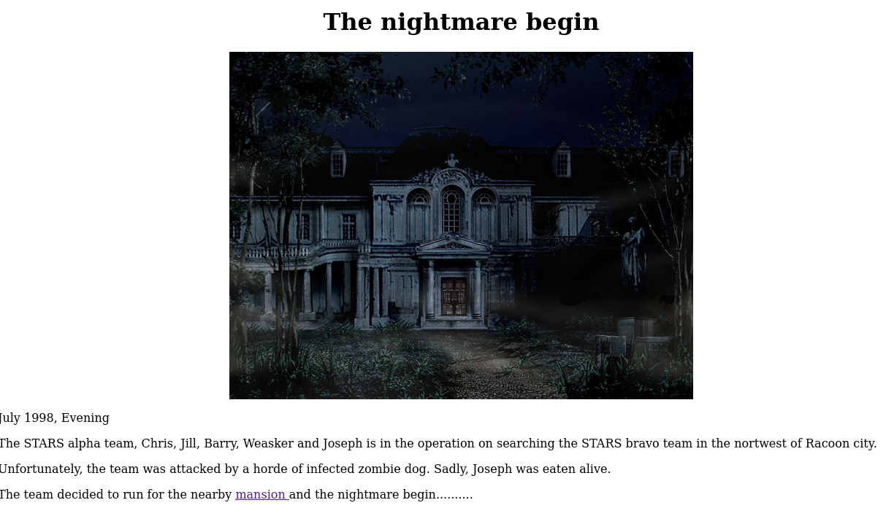

Seguindo o link e lendo a narrativa, precisamos encontrar a próxima sala  
Primeiro, código da página  

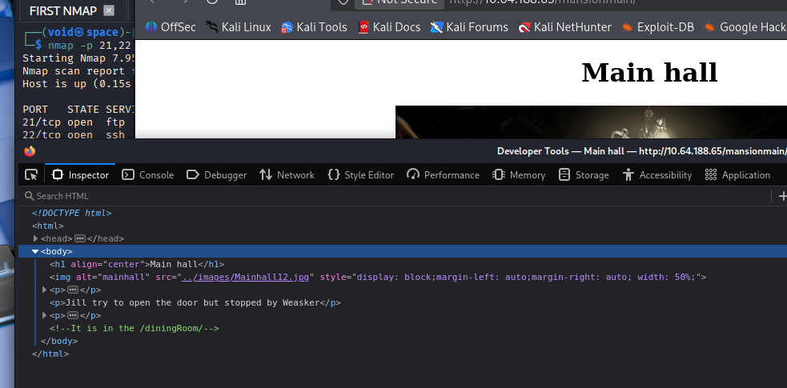

Indo até o diretório mencionado, encontramos outra narrativa  


É possível seguir um link, diz para _pegar o medalhão_  
Ao clicarmos, somos levados a outra página  
Nisso, podemos ver uma string dentro de chaves: **emblem{fec832623ea498e20bf4fe1821d58727}**  
Vamos manter isso  

Agora, é preciso dar um _refresh_ no diretório  
Antes de prosseguirmos, verificamos o código da página e encontramos outra _string_: **SG93IGFib3V0IHRoZSAvdGVhUm9vbS8=**  
Parece ser _base64_  

Mas primeiro, vamos ao emblema  
Atualizando a página e "inserindo" o emblema, nada acontece  

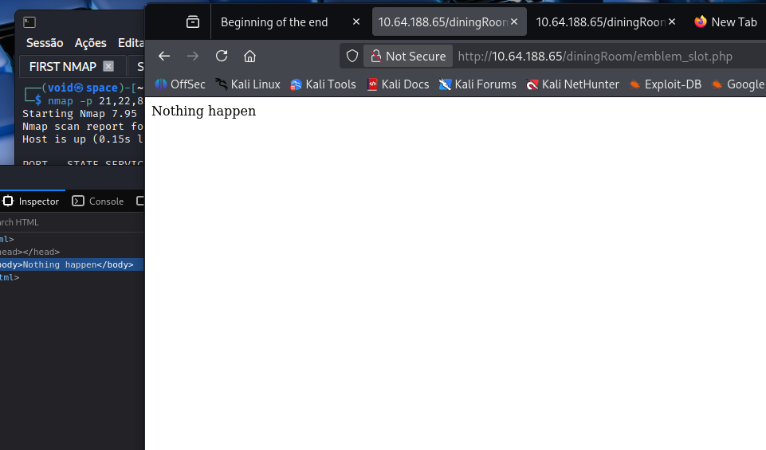

Ao jogar a _string_ jogada no **CyberChef**, temos que é realmente _base64_, e nos leva a outro diretório  
Indo até este diretório, novamente mais uma peça da narrativa  

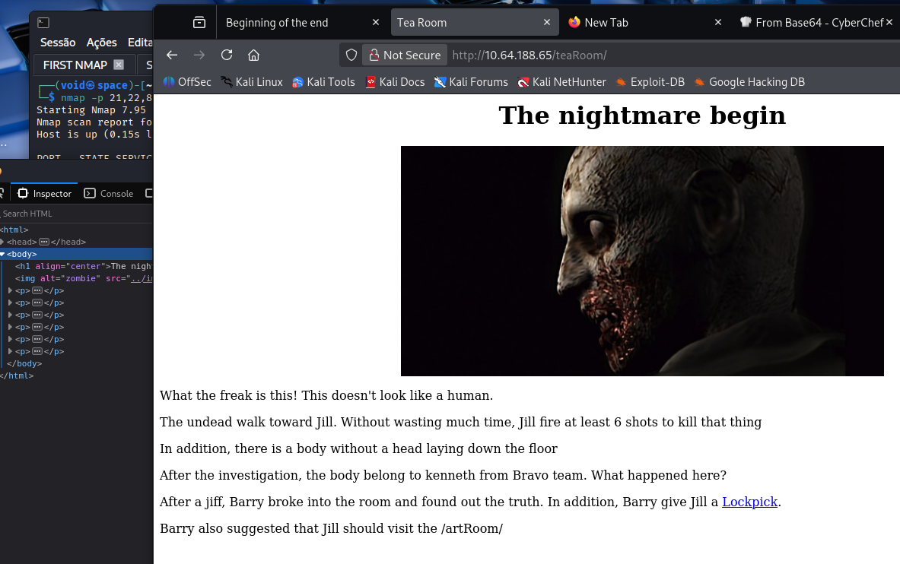

Temos um link e um novo diretório  
Ao visitarmos o link, temos uma nova flag  
Vamos agora, visitar o novo diretório, _/art_room_  

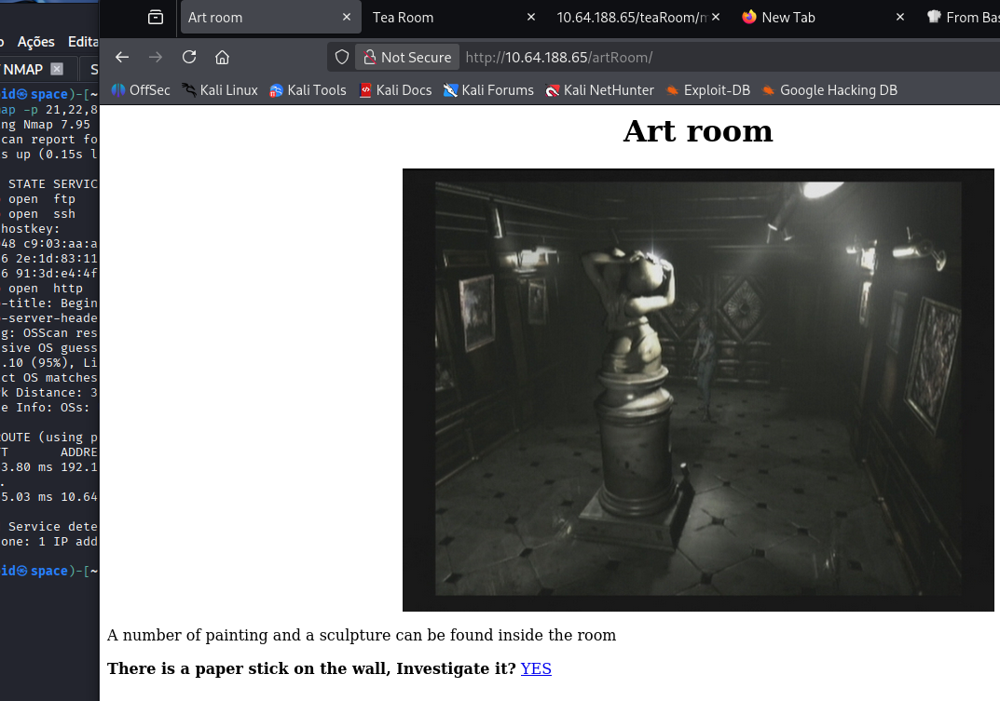

Temos um mapa para a mansão  

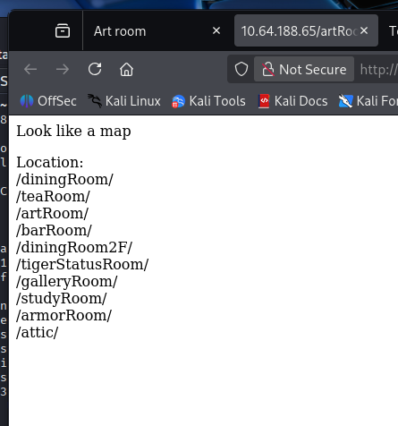

Agora, acredito que podemos explorar com mais tranquilidade  
Vamos investigar por ordem, de ainda não investigados  
Primeiro: _**barRoom**_  

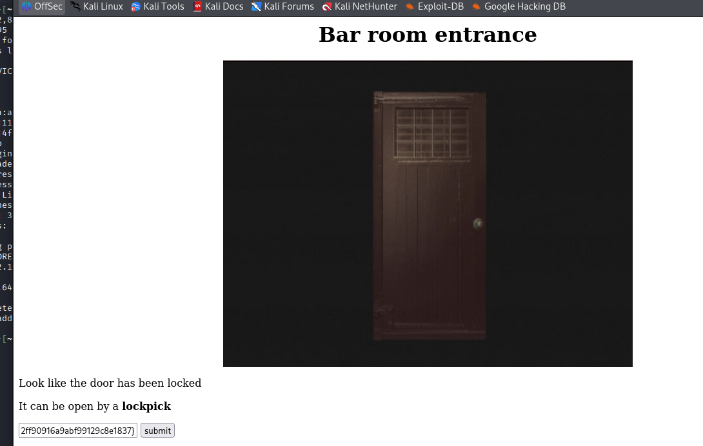

Para entrar, precisamos da flag de _lockpick_, do qual temos  
Entrando, podemos tocar uma música no piano, mas não temos nada além do link  
Acessando, precisamos identificar e decodificar a _string_  
Utilizando novamente o **CyberChef**, temos uma decodificação em **base32**, a flag do piano  
Inserindo, temos uma nova sala  

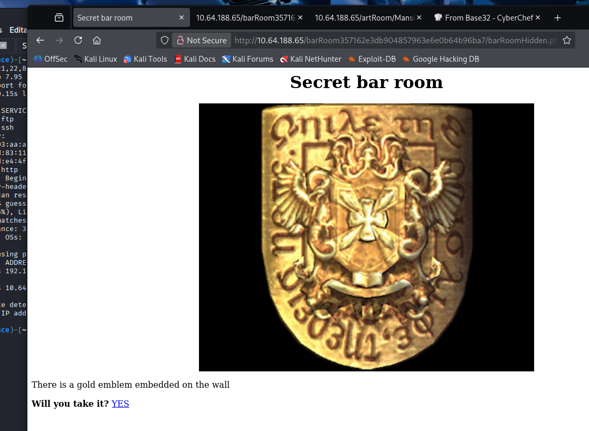

Uma nova flag! Agora de um emblema de ouro  
Vamos continuar nossa investigação sobre os outros diretórios referentes ao mapa  
Investigando a galeria, temos um link que nos leva para algumas dicas  

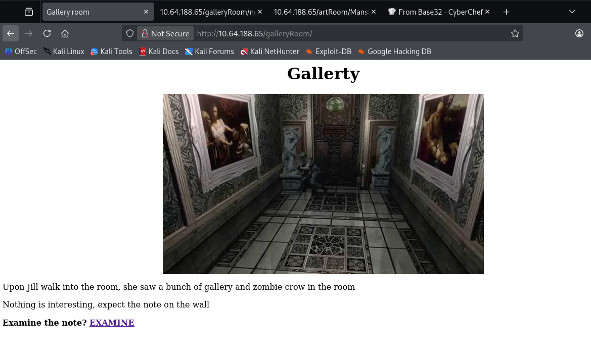

Seguindo a dica, parece que teremos que achar 4 _crests_  
Já encontramos o número 2  
Voltando para a _dinninRoom_ e inserindo o _gold emblem_, temos acesso a uma nova string  

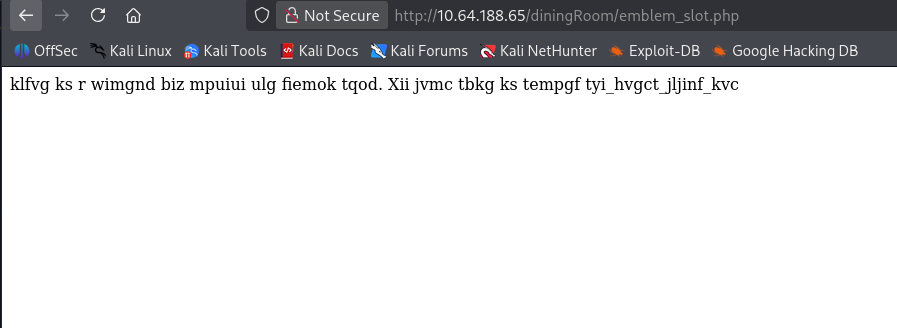

Procuramos identificar essa nova string e tentar decodificar  
Nada foi encontrado e ainda não foi possível decifrar  
Continuando, vamos para _dinningRoom2F_  
Conferindo o código da página, temos outra string  
Vamos tentar decodificar com o Gemini  

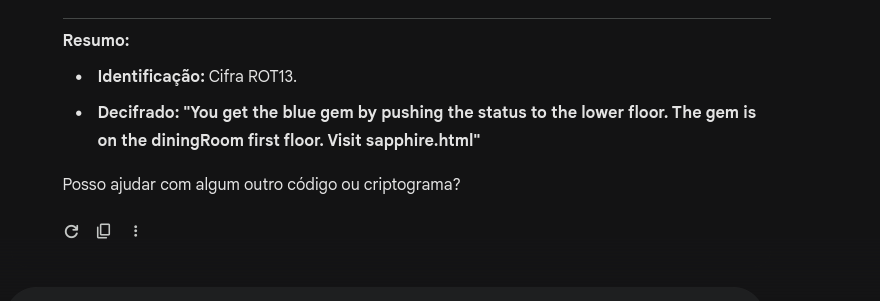

Parece que temos que visitar este novo diretório  
Conseguimos uma nova flag  
Continuando  

Tentamos inserir a _blue gem_ no diretório _/tigerStatueRoom_ e temos _crest 1_  
Voltando para _secret bar room_, parece que deixamos algo passar  
Inserindo o primeiro emblema que encontramos, temos uma palavra: **rebecca**  

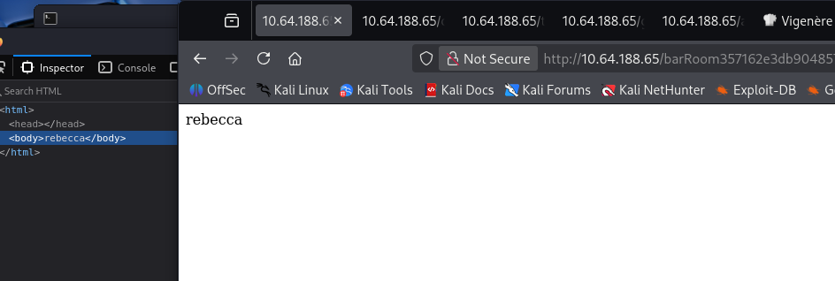

Temos um novo diretório: **the_great_shield_key**  
Vamos visitar o diretório indicado e recuperar a chave  
Agora, primeiro, vamos visitar _attic_  

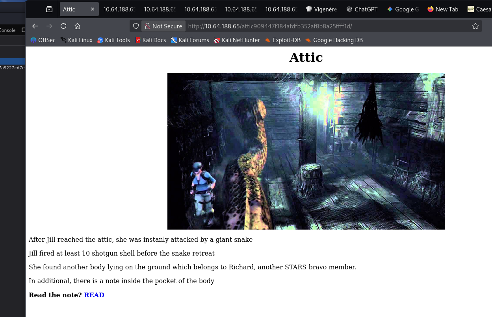

A nota, encontramos _crest 4_  
Vamos visitar os outros 2 diretórios restantes  
Primeiro, _armor room_, onde encontramos uma outra nota  
Encontramos a _crest 3_  
Agora, vamos tentar decodificar as 4 _crests_:
* **crest1**: RlRQIHVzZXI6IG --> primeiro, base64, depois, base32
* **crest2**: h1bnRlciwgRlRQIHBh --> primeiro, base32, depois, base58
* **crest3**: c3M6IHlvdV9jYW50X2h --> primeiro, base64, depois binário, por fim hex
* **crest4**: pZGVfZm9yZXZlcg== --> primeiro, base58, depois hex

Todas são facilmente decodificadas pelo CyberChef  
Juntando todas, novamente, facilmente decodificada pelo CyberChef  
Como temos as credenciais, vamos realizar login no serviço **FTP**  

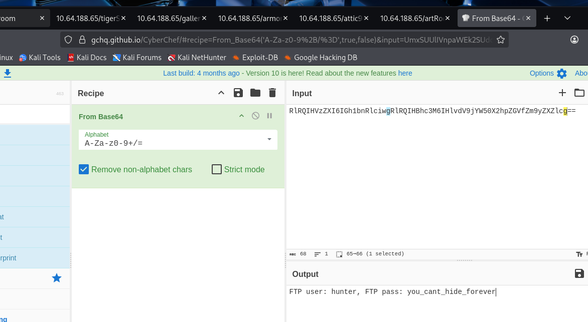

Realizamos login  

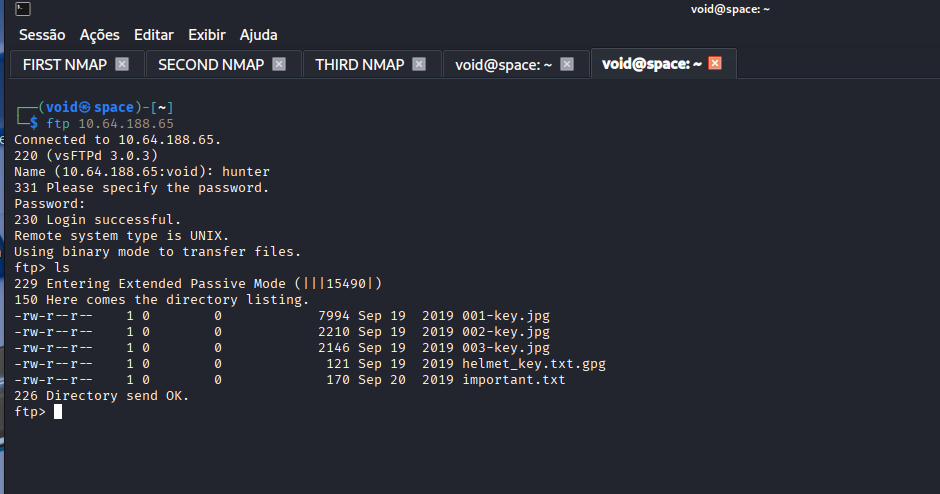

Vamos realizar _download_ de todos os arquivos e investigar cada um  


